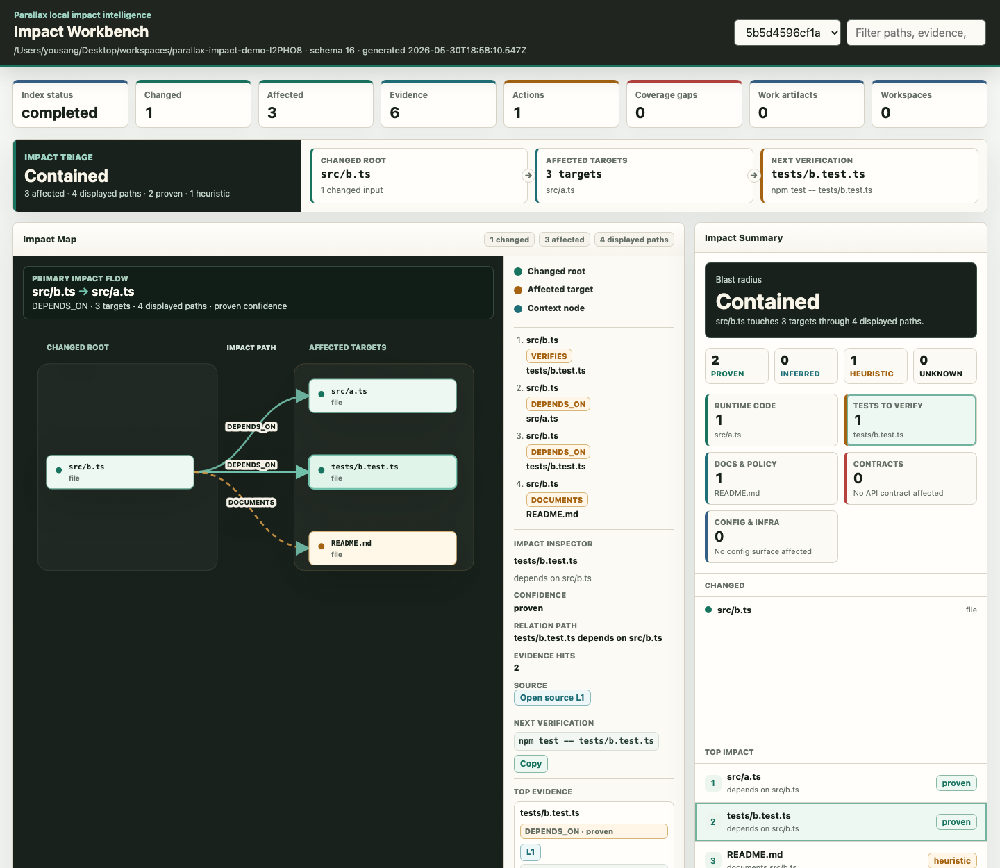

<div align="center">

# 🛰️ Parallax

**Give coding agents a local map of what a change can break.**

Claude Code, Codex, Cursor 같은 에이전트가 코드를 고치기 전에<br/>
저장소를 로컬에서 인덱싱하고, 변경 파일이 건드릴 수 있는 코드·테스트·문서·계약을 증거와 함께 보여주는 impact intelligence 도구.


[English](README.md) · **한국어** · [中文](README.zh.md)

[🚀 빠른 시작](#-빠른-시작) · [✨ 주요 기능](#-주요-기능) · [🧱 핵심 개념](#-핵심-개념) · [🤖 MCP](#-mcp--agents) · [🔒 안전 모델](#-안전-모델) · [🗺️ Roadmap](#%EF%B8%8F-roadmap) · [📚 더 읽기](#-더-읽기)



</div>

---

> **왜 필요한가** — AI coding 도구는 빠르지만, `auth.ts`의 함수 하나를 바꿨을 때 어떤 테스트·consumer·정책 문서가 같이 흔들리는지 매번 추측한다. Parallax는 repo-local `.parallax/impact.db`에 코드 그래프와 agent memory를 저장해, 에이전트가 변경 전에 “무엇이 왜 영향받는지”를 작은 context pack으로 확인하게 만든다.

---

## 🚀 빠른 시작

### 요구사항

| 항목 | 필요 조건 | 비고 |
| :--- | :--- | :--- |
| **Node.js** | `>=24.0.0` | Node built-in `node:sqlite` 사용. experimental warning이 보일 수 있음 |
| **npm** | package-lock 기준 | `npm install`로 개발 환경 구성 |
| **저장소 권한** | 로컬 read/write | `.parallax/` 디렉터리와 SQLite DB 생성 |
| **외부 서비스** | 기본 impact 경로는 불필요 | 모델/LLM 기반 memory 정리는 명시 실행 시에만 사용 |

```bash
# 1. Parallax 빌드
npm install
npm run build

# 2. 현재 checkout의 CLI를 PATH에 연결
npm link

# 3. 분석 대상 repo에서 초기화와 인덱싱
cd /path/to/target-repo
parallax init
parallax index
```

변경 파일 하나를 분석한다.

```bash
parallax analyze --changed src/auth/session.ts --depth 2
```

git diff 범위를 그대로 분석할 수도 있다.

```bash
parallax analyze --base main --head HEAD --json
```

Markdown report는 repo-local 경로에 저장된다.

```text
.parallax/reports/
```

로컬 UI로 최신 report를 바로 열 수 있다.

```bash
parallax ui
parallax ui --report <report-id> --port 3717
```

> 💡 `analyze`는 영향받는 파일이 있으면 exit code `1`을 반환한다. CI나 agent guardrail에서 “영향 있음”을 신호로 쓰기 위한 의도적인 동작이다.

---

## ✨ 주요 기능

### 🔎 Impact analysis

| 기능 | 동작 |
| :--- | :--- |
| **로컬 인덱스** | `.parallax/impact.db`에 파일, entity, relation, evidence, coverage를 저장 |
| **변경 분석** | `--changed` 또는 `--base/--head` 입력을 bounded multi-hop graph traversal로 분석 |
| **증거 중심 report** | `changed`, `affected`, `actions`, `evidence`, `adapterInsights`, `warnings`를 JSON/Markdown으로 출력 |
| **관련 테스트 추론** | import, filename convention, adapter evidence를 이용해 영향 가능성이 높은 테스트를 추천 |
| **Graph export** | 저장된 report를 Mermaid, JSON, DOT으로 export |
| **Coverage 경고** | oversized file skip, stale index, adapter known-gap을 report에 노출 |

### 🧭 Adapter coverage

| 영역 | 현재 상태 |
| :--- | :--- |
| **TypeScript / JavaScript** | parser-backed import, declaration, class/interface heritage, call-site, typed/destructured/named-object receiver, factory-return, constructor/field call span 확대 중 |
| **JVM / Spring Boot** | endpoint, declaration, config, test evidence span v0 |
| **Python / Go / Rust** | declaration/test relation 중심 lightweight adapter |
| **Markdown / work artifacts** | policy, proposal, PRD, decision 문서를 first-class artifact로 분류하고 코드와 연결 |
| **Config / Infra** | shell, YAML, JSON, TOML, Dockerfile, Makefile, Terraform, CODEOWNERS 등 system/config 후보 인덱싱 |
| **Package manifests** | `package.json`, `pom.xml`, `build.gradle(.kts)`, `go.mod`, `Cargo.toml`, `pyproject.toml` manifest graph |

### 🌐 Workspace & contracts

| 기능 | 설명 |
| :--- | :--- |
| **Workspace catalog** | `.parallax/workspace.json`에 사용자가 허용한 local repo만 등록. clone/network 없음 |
| **Cross-repo resolver** | 등록된 repo 사이의 provider endpoint ↔ consumer file link를 저장 |
| **Contract diff** | OpenAPI, GraphQL, Protobuf, AsyncAPI surface diff를 `breaking` / `non-breaking` / `unknown`으로 분류 |
| **Consumer impact** | removed endpoint/operation, field removal/type change, required request field 추가 등을 known consumer와 연결 |
| **Event topology hint** | AsyncAPI producer/consumer 방향과 breaking provenance를 compact payload로 제공 |

```bash
parallax workspace init --name platform --service api
parallax workspace add-repo ../web --name platform --service web
parallax workspace resolve-contracts --name platform --json
parallax workspace contract-diff --contract openapi.yaml --name platform --json
```

### 🧠 Agent memory

같은 SQLite DB 위에서 agent의 결정·관찰·근거를 content-addressable fact로 저장한다.

| 명령 | 역할 |
| :--- | :--- |
| `remember` | entity에 대한 결정/관찰 fact 저장. `--supersedes-fact-ids`로 오래된 fact 대체 |
| `recall` | entity, attribute, keyword, semantic query로 fact 조회 |
| `branch` / `merge` | 여러 plan을 데이터 복사 없이 fork/merge |
| `trace` | fact_provenance edge를 따라 결정의 근거 사슬 추적 |
| `profile` | 한 entity의 static facts, dynamic facts, summary facts를 한 번에 반환 |
| `reflect` | 오래된 facts를 LLM으로 요약해 summary fact로 승격 |

```bash
parallax remember --entity src/auth/session.ts \
  --attribute decision --value "JWT clock skew 60s로 허용"
parallax recall --entity src/auth/session.ts --json
parallax profile --entity src/auth/session.ts
```

---

## 🧱 핵심 개념

| 개념 | 한 줄 설명 |
| :--- | :--- |
| **Impact graph** | 파일/심벌/계약을 잇는 방향 그래프. 변경의 파급을 bounded traversal로 계산 |
| **Evidence** | 모든 관계에 원본 파일·라인·snippet 근거를 붙인 것 |
| **Confidence** | proven / inferred / heuristic 3단계로 evidence 신뢰도를 표기 |
| **Context pack** | 변경 분석 결과를 agent가 먹기 좋은 작은 JSON 묶음으로 제공 |
| **Work artifact** | policy, PRD, decision 같은 문서를 코드와 연결한 1급 객체 |
| **Adapter** | 언어·포맷별 추출기. confidence와 known-gap을 함께 보고 |

---

## 🤖 MCP & agents

Parallax는 MCP stdio 서버를 제공한다.

```bash
parallax mcp serve
```

| MCP tool | 역할 |
| :--- | :--- |
| `parallax_analyze_diff` | 변경 파일을 받아 impact report 반환 |
| `parallax_context_for_change` | 변경에 대한 context pack을 budget에 맞춰 반환 |
| `parallax_search_context` | keyword/path/symbol/relation/evidence로 최신 index 검색 |
| `parallax_contract_diff` | OpenAPI contract를 인덱싱된 workspace baseline과 비교 |
| `parallax_remember` / `parallax_recall` | agent memory fact 쓰기/읽기 |
| `parallax_profile` / `parallax_trace` | entity 프로파일과 근거 사슬 조회 |

전체 18개 tool이 등록되어 있다(`skills/parallax/SKILL.md` 참고). 그래프 export는 tool이 아니라 MCP **resource**다: `parallax://reports/{reportId}/graph/{format}` (`mermaid`, `json`, `dot`)를 읽는다.

> Claude Code, Codex 같은 MCP 클라이언트에 stdio 서버로 등록하면 바로 쓸 수 있다.

---

## 🔒 안전 모델

| 원칙 | 내용 |
| :--- | :--- |
| **Local-first** | 모든 인덱스와 memory는 repo-local `.parallax/`에 저장. 외부 전송 없음 |
| **명시적 workspace** | cross-repo는 사용자가 등록한 local repo만. clone/network 없음 |
| **Redaction** | secret-like 문자열은 저장 전 redaction |
| **Read-only 기본** | MCP는 기본 read-only. write는 명시적 명령으로만 |
| **결정론적 출력** | 같은 입력은 같은 report. CI에서 재현 가능 |

---

## 🧪 개발

```bash
npm run build
npm run check
npm test
npm run docs:lint
```

주요 script:

| Script | 역할 |
| :--- | :--- |
| `npm run build` | TypeScript를 `dist/`로 compile |
| `npm run check` | emit 없이 typecheck |
| `npm test` | Node test runner suite를 `tsx`로 실행 |
| `npm run bench` | multi-language, Spring Boot, contract, package manifest fixture 기반 deterministic bench |
| `npm run docs:lint` | tracked Markdown에서 local metadata와 secret-like content 검사 |
| `npm run test:mcp` | MCP impact/context/memory/telemetry/path validation 검증 |
| `npm run test:security` | path containment와 redaction 검증 |
| `npm run test:ui` | local UI snapshot, server, JSON resource endpoints 검증 |

릴리스 전 권장 체크:

```bash
npm run check
npm test
npm run docs:lint
npm audit --audit-level=high
```

---

## 🗺️ Roadmap

| 축 | 다음 목표 |
| :--- | :--- |
| **Accuracy** | TS/JS parser-backed span을 더 넓은 dynamic dispatch와 advanced type relation으로 확장 |
| **JVM / Python / Go / Rust** | declaration 중심 adapter를 parser-backed call/import resolution으로 승격 |
| **Workspace / Contract** | nested schema diff 안정화, generated-client/event topology resolver depth 확대 |
| **Package / Build** | lockfile, transitive dependency, semver/range 기반 package graph |
| **Agent surface** | context pack budget tuning과 hit/miss 측정 harness |
| **UI Explorer** | changed → affected → evidence → action 흐름을 한 화면에서 더 직접적으로 탐색 |
| **Measurement** | fixture bench delta와 recall 품질 회귀 detection |

자세한 backlog는 [`docs/roadmap.md`](docs/roadmap.md)를 기준으로 관리한다.

---

## ⚠️ 현재 한계

| 영역 | 상태 |
| :--- | :--- |
| **Full semantic analysis** | 모든 언어의 type-aware analysis가 아니다. adapter별 confidence와 known-gap을 확인해야 함 |
| **Contract depth** | GraphQL/Protobuf/AsyncAPI parser/LSP 수준의 full generated-client usage graph는 후속 |
| **Package resolution** | 현재는 manifest 중심. lockfile/transitive/semver 실행 기반 resolver는 후속 |
| **Graph DB** | 기본 제품 범위가 아님. 필요하면 SQLite에서 optional projection으로 확장 |
| **External writes** | Obsidian/GitHub/Jira write sync는 아직 MCP surface에 노출하지 않음 |
| **Code modification** | Parallax는 코드를 직접 수정하지 않는다. agent에게 영향도와 근거를 제공한다 |

---

## 📚 더 읽기

| 문서 | 내용 |
| :--- | :--- |
| [`docs/vision.ko.md`](docs/vision.ko.md) | 프로젝트 비전 |
| [`docs/value-proposition.ko.md`](docs/value-proposition.ko.md) | 가치 제안과 차별성 |
| [`docs/roadmap.md`](docs/roadmap.md) | 현재 backlog와 다음 슬라이스 |
| [`docs/invariants.md`](docs/invariants.md) | local-first, redaction, 권한 모델 같은 불변 원칙 |
| [`docs/glossary.md`](docs/glossary.md) | 용어집 |
| [`skills/parallax/SKILL.md`](skills/parallax/SKILL.md) | Claude Code/Codex 사용자용 skill |

---

## License

MIT License. 자세한 내용은 [`LICENSE`](LICENSE)를 확인해 주세요.
