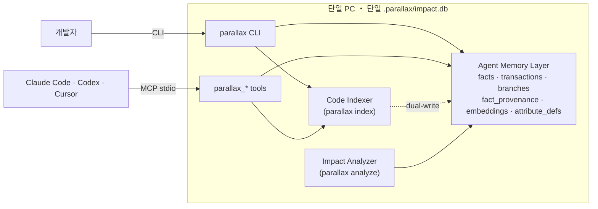

# Parallax

Parallax는 Claude Code, Codex 같은 에이전트 코딩 도구를 위한 로컬 우선
코드 영향도 분석기입니다.

에이전트가 코드를 바꾸기 전에 Parallax가 저장소를 인덱싱하고, 변경 파일이
어떤 파일과 테스트에 영향을 줄 수 있는지 증거와 함께 보여줍니다.

핵심 방향은 명확합니다. 이 프로젝트는 graph DB 프로젝트가 아닙니다. MVP는
로컬 SQLite 인덱스를 사용하고, graph DB, vector search, CodeQL 같은 분석은
나중에 붙일 수 있는 선택 adapter로 둡니다.

핵심 분석 모델은 함수, 변수, 클래스, 파일 같은 코드 구성 요소와 문서, 정책, 업무
산출물을 서로 연결해서 인덱싱하는 것입니다. 변경이 들어오면 그 구성 요소를 참조하거나
호출하거나 import하는 다른 구성 요소를 따라가며 사이드 이펙트, 필요한 테스트, 개선
지점을 찾는 방향입니다.
장기적으로는 한 저장소 안의 코드뿐 아니라 여러 프로젝트가 REST API, gRPC/protobuf,
GraphQL, AsyncAPI/event contract로 연결되는 관계까지 같은 graph로 추적합니다.
더 길게는 사업계획서, PRD, 회의록, 의사결정 기록, KPI 문서, 고객/영업 문서 같은
회사 업무 산출물도 `Entity`와 `Relation`으로 올려서 “코드 변경이 제품/운영/사업 문서에
미치는 영향”과 “문서 변경이 구현/테스트에 요구하는 작업”을 함께 추적하는 방향입니다.

## 현재 상태

MVP 구현이 들어가 있습니다.

현재 되는 것:

- repo-local `.parallax/` 작업 공간 생성
- 언어 중립 report model: `changed`, `affected`, `actions`, `evidence`
- legacy `files/symbols/edges`와 canonical `entities/relations/relation_evidence` 동시 저장
- adapter run, confidence label, known-gap, index coverage metadata 저장
- 기본 registry가 TypeScript/JavaScript, JVM/Spring Boot, Python, Go, Rust v0 adapter를 regex fallback보다 먼저 적용
- Markdown과 system/config/contract 파일은 regex fallback adapter로 인덱싱
- C#, C, C++ 파일은 fallback 휴리스틱으로 기본 symbol/dependency 인덱싱
- shell, YAML, JSON, TOML, Dockerfile, Makefile, Terraform, protobuf, GraphQL, CODEOWNERS 파일을 config/system/contract 후보로 인덱싱
- 분석 시 canonical `relations`를 우선 사용하고 legacy `edges`는 fallback으로 사용
- bounded multi-hop traversal, cycle protection, depth/fan-out 제한
- `--base`, `--head` 기반 git diff 입력
- stale-index warning과 oversized file skip coverage
- 저장된 report에서 Mermaid/JSON/DOT graph export 생성
- TS/JS export symbol 추출
- TS/JS import edge 추출과 parser-backed import, declaration, imported call-site, local identifier call, same-class `this.method()` evidence span 저장
- Spring Boot endpoint/declaration/config/test evidence span 저장
- Python/Go/Rust declaration/test evidence span 저장
- `package.json`, `pom.xml`, `build.gradle(.kts)`, `go.mod`, `Cargo.toml`, `pyproject.toml` manifest-only package graph 저장
- OpenAPI/Swagger/AsyncAPI contract baseline과 구현 코드 reverse-link 저장
- `.parallax/workspace.json` 기반 local workspace catalog와 `workspace init/add-repo/list/resolve-contracts` CLI
- workspace에 등록된 indexed repo 사이의 OpenAPI provider endpoint ↔ HTTP consumer file link 저장
- workspace에 등록된 indexed repo 사이의 GraphQL provider root field ↔ consumer operation document link 저장
- workspace에 등록된 indexed repo 사이의 Protobuf RPC / generated client / AsyncAPI event operation ↔ consumer/producer code/config link 저장
- AsyncAPI event address call-site를 producer/consumer topology hint로 분류해 removed event operation의 downstream 방향을 compact provenance로 제공
- OpenAPI endpoint surface, JSON/YAML request/response nested schema diff, Protobuf service/RPC/message field diff, GraphQL root field/object/input schema diff, AsyncAPI operation/message payload diff를 `breaking`/`non-breaking`/`unknown`으로 분류하고 known consumer impact를 `BREAKS_COMPATIBILITY_WITH` link로 저장
- contract diff가 resolved event topology hint를 impacted consumer와 breaking link provenance까지 보존
- contract diff summary, CLI human output, MCP cross-repo link resource가 event topology hint를 compact field로 노출
- MCP `parallax_contract_diff`와 `parallax://workspaces/{name}` resource로 workspace contract/link 상태를 compact payload로 제공
- import 기반 관련 테스트 추론
- Markdown mention 기반 관련 문서 추론
- Markdown policy/proposal/PRD/decision 파일을 first-class work artifact로 분류하고 `GOVERNS`/`PROPOSES`/`REQUIRES` impact relation 추론
- system/config 파일의 path mention 기반 관계 추론
- 변경 파일 분석 후 JSON 또는 Markdown report 생성
- 공식 MCP SDK 기반 stdio server 제공
- MCP impact tools 제공: `parallax_analyze_diff`, `parallax_context_for_change`, `parallax_search_context`, `parallax_explain_entity`, `parallax_contract_diff`
- health/diagnostic surface 제공: `parallax doctor`, `parallax_doctor`
- opt-in session import 제공: `parallax import-session --file <path> --format codex|claude`
- agent memory MCP tools 제공: `remember`, `recall`, `branch`, `trace`, `reflect` 등은 `.parallax/impact.db` 안에서만 동작
- read-only MCP resources 제공: report, entity, evidence, graph, latest coverage, workspace contract/link resources
- evidence output 전 secret-like 값 redaction
- repo root 밖으로 나가는 path 거절
- workspace, contract, cross-repo link, work artifact 확장용 SQLite schema

중요한 점: Parallax의 목표는 TS/JS 전용 도구가 아닙니다. 현재 v0 adapter pack은
TS/JS, JVM/Spring Boot, Python, Go, Rust를 별도 adapter run으로 라우팅하고,
Markdown/config/system/contract와 아직 깊게 다루지 않는 언어는 regex fallback으로 둡니다.
공개 report model은 언어별 문자열보다 `EntityRef`, `ImpactTarget`, `ImpactAction` 같은
언어 중립 구조를 우선합니다. 이후 Tree-sitter, LSP, CodeQL, package-manager/build adapter depth로 깊이를
더하는 방향입니다.

이번 MVP에 없는 것:

- Obsidian write sync
- graph DB projection
- GraphQL/protobuf/AsyncAPI full parser/LSP depth, full generated-client usage graph, richer event topology inference
- lockfile/transitive/semver/package-manager execution 기반 full package resolution
- web graph explorer
- CodeQL adapter
- 모든 언어의 full semantic analysis
- parser-backed full source-span coverage
- 에이전트가 직접 코드를 수정하는 기능

## Direction: agent memory layer

Parallax의 큰 방향은 *코드 영향도 분석*에 그치지 않습니다. 같은 local-first
SQLite + MCP stdio 위에 **agent의 결정·관찰·근거를 1급 시민으로 저장하는
agent memory 레이어**를 점진적으로 더합니다.

목표:

- agent가 작업 중에 만든 결정과 관찰을 fact로 영속화
- 시간 질의: "이 변경 5턴 전 상태에서는 어떻게 보였는가"
- branching: agent가 여러 plan을 시뮬레이션하고 그중 하나만 commit
- causal trace: 어떤 결정의 근거 사슬을 1쿼리로 추적

이 방향은 프로젝트 정체성(local-first, single .db, privacy, redaction)을 그대로
두고 *증분으로* 더해집니다. 원칙은 [docs/invariants.md](docs/invariants.md)를 기준으로 봅니다.



데이터는 *전부* 사용자 PC 안에 머무르고, 한 `.db` 파일을 백업/공유/git checkin
가능합니다. 외부 네트워크 의존 없음.

**관련 문서:** [docs/vision.ko.md](docs/vision.ko.md) (비전) · [docs/roadmap.md](docs/roadmap.md) (앞으로 할 일) · [docs/invariants.md](docs/invariants.md) (불변 원칙) · [docs/glossary.md](docs/glossary.md) (용어).

## 요구 사항

- Node.js `>=24.0.0`
- npm

현재 구현은 Node의 built-in `node:sqlite`를 사용합니다. Node 24에서는 이 API가
아직 experimental 상태라서 DB를 사용하는 명령에서 experimental warning이 보일
수 있습니다.

## 빠른 시작

이 저장소에서 빌드합니다.

```bash
npm install
npm run build
```

이 checkout 안에서 `parallax` 명령을 바로 쓰고 싶으면:

```bash
npm link
```

분석하고 싶은 저장소에서 실행합니다.

```bash
parallax init
parallax index
parallax analyze --changed src/auth/session.ts --depth 2
parallax analyze --base main --head HEAD --json
```

JSON 출력이 필요하면:

```bash
parallax analyze --changed src/auth/session.ts --json
```

Markdown report는 아래 경로에 생성됩니다.

```text
.parallax/reports/
```

## CLI

```bash
parallax init
parallax index [--max-file-bytes 1000000]
parallax analyze --changed src/file.ts [--depth 2] [--json]
parallax analyze --base main [--head HEAD] [--depth 2] [--json]
parallax graph export --report <id> [--format mermaid|json|dot]
parallax ui [--report <id>] [--port <n>]
parallax mcp serve

# workspace catalog (local allowlist, no clone/network)
parallax workspace init [--name <name>] [--service <service>] [--force]
parallax workspace add-repo <path> [--name <name>] [--service <service>] [--remote <url>]
parallax workspace list [--name <name>] [--json]
parallax workspace resolve-contracts [--name <name>] [--json]
parallax workspace contract-diff --contract <path> [--name <name>]
                                     [--provider <service>] [--provider-path <path>] [--json]

# agent memory
parallax remember --entity <id> --attribute <name> --value <json|string>
                      [--branch <name>] [--agent <id>] [--op assert|retract]
                      [--evidence-fact-ids id1,id2] [--supersedes-fact-ids id1,id2]
parallax retract  --entity <id> --attribute <name> --value <json|string>
                      [--branch <name>] [--agent <id>]
parallax recall   [--query <text> --semantic] [--entity <id>] [--attribute <name>]
                      [--branch <name>] [--k 20] [--as-of-tx <tx-id>] [--current-only]
parallax branch   --name <name> [--from <name>]
parallax merge    --target <branch> --source <branch> [--agent <id>]
parallax reembed  [--model <provider:id>] [--all]
parallax trace    --fact-id <id> [--depth 5]

# agent memory
parallax reflect       [--branch <name>] [--older-than-days 30] [--entity <id>]
                           [--model <provider:id>] [--agent <id>] [--dry-run]
parallax branch        --abandon <name>
parallax gc-branches   [--dry-run] [--max-age <days>]

# agent memory
parallax reflect       --repair [--branch <name>] [--dry-run]
parallax branch        --restore <name>
parallax profile       --entity <id> [--branch <name>] [--k 50] [--as-of-tx <tx-id>]
parallax reindex-vec   [--model <hf-model>]
```

`profile` 명령은 한 entity의 정보를 *세 가지 분류*로 한 번에 반환합니다:
- `staticFacts` — 인덱서가 만든 코드 구조 (imports, calls, depends_on, ...)
- `dynamicFacts` — agent의 결정/관찰 (observed, verified, concern, ...)
- `summaryFacts` — reflective consolidation 결과 (LLM 요약)

이걸 *agent system prompt에 inject*하면 "이 엔티티에 대해 시스템이 알고 있는 것" 한 번에 전달됨.

### `init`

현재 저장소에 Parallax 작업 공간을 만듭니다.

```text
.parallax/
  config.json
  impact.db
```

### `index`

현재 저장소를 스캔해서 로컬 SQLite DB에 저장합니다.

저장하는 정보:

- 파일 목록
- exported symbol
- import edge
- 추론된 test edge
- 추론된 doc edge
- 추론된 config/system/contract reference edge
- skipped file coverage
- redacted evidence snippet

### `analyze`

최신 completed index run을 기준으로 변경 파일의 영향 범위를 분석합니다.

```bash
parallax analyze --changed src/a.ts --depth 2
parallax analyze --changed src/a.ts,src/b.ts --json
parallax analyze --base main --head HEAD --json
```

JSON report에는 아래 정보가 들어갑니다.

- `changedFiles`
- `affectedFiles`
- `changed`
- `affected`
- `actions`
- `testCommands` deprecated: 기존 caller 호환용이며 `actions`를 사용하세요.
- `evidence`
- `adapterInsights`
- `warnings`
- `indexRunId`
- `reportPath`

### `graph export`

저장된 report를 기준으로 관계 그래프를 출력합니다. 이 기능은 별도 graph DB 없이
SQLite의 canonical `entities`와 `relations`에서 파생합니다.

```bash
parallax graph export --report <report-id> --format mermaid
parallax graph export --report <report-id> --format json
parallax graph export --report <report-id> --format dot
```

### Agent memory 명령 (`remember` / `recall` / `branch` / `trace`)

같은 `.parallax/impact.db` 위에서 agent의 결정/관찰을 content-addressable
fact로 영속화합니다. MCP 툴과 1:1 동등하며, 출력은 모두 JSON (stdout).

```bash
# 결정 저장 — value는 JSON 또는 문자열, secret 패턴은 자동 redaction
parallax remember --entity file:src/auth.ts --attribute observed --value '"compiled"'

# 조회 — 구조 필터
parallax recall --entity file:src/auth.ts --attribute observed --k 10

# 분기 — 데이터 복사 없이 main에서 fork
parallax branch --name experiment-1 --from main

# 인과 사슬 — fact_provenance edge를 따라 evidence까지 도달
parallax trace --fact-id <sha256-hex> --depth 5

# 명시적 대체 — 오래된 결정/정책 fact를 current recall/profile에서 숨김
OLD_ID=$(parallax remember --entity policy:checkout --attribute decision \
  --value '"retry twice before fallback"' | jq -r .factId)
parallax remember --entity policy:checkout --attribute decision \
  --value '"retry once before fallback"' \
  --supersedes-fact-ids "$OLD_ID"
```


### `doctor`

현재 저장소의 `.parallax/impact.db`를 read-only로 열어 agent가 쓰기 전에 확인해야 할
상태를 JSON으로 반환합니다. schema version, 최신 index run, coverage, adapter run,
sqlite-vec 상태, embedding rows, context telemetry table/count를 한 번에 보여줍니다.

```bash
parallax doctor
```

`doctor`는 workspace 파일을 만들지 않습니다. database가 없거나 schema가 오래된 경우 stdout에는
진단 JSON을 출력하고 exit code는 1이 됩니다.

### `ui`

현재 저장소의 `.parallax/impact.db`를 read-only로 열고 `127.0.0.1`에 local workbench를 띄웁니다.
첫 화면은 landing page가 아니라 최신 report 기준 Change Set, Impact Paths, Evidence,
Focused Graph, Coverage Gaps, Doctor Findings를 바로 보여줍니다. JSON API는 MCP resource와 같은
shape를 재사용합니다.

```bash
parallax ui
parallax ui --report <report-id> --port 3717
```

기본 포트가 사용 중이면 자동으로 빈 포트로 fallback하고, 터미널에 출력된 URL을 브라우저에서 열면 됩니다.

### `import-session`

Claude/Codex transcript를 사용자가 명시한 단일 파일에서만 가져와 repo-local episodic memory로
저장합니다. v0는 자동 hook이나 directory scan을 하지 않고, raw prompt/tool output 전체를 저장하지 않습니다.
대신 redacted structured summary와 실제 repo 안에 존재하는 referenced file만 `facts`로 남깁니다.

```bash
parallax import-session --file sessions/codex.jsonl --format codex
parallax import-session --file /absolute/path/to/claude.jsonl --format claude
```

저장 계약:

- entity: `session:<format>:<hash>`
- `session_summary`: format, source kind, counts, referenced files, compact summary, `rawContentStored=false`
- `references_file`: `file:<repo-relative-path>`
- 각 `references_file` fact는 `session_summary` fact를 provenance evidence로 참조

외부 절대 경로는 explicit `--file` 값일 때만 단일 파일로 허용되며, persisted value에는 절대 경로를 저장하지 않습니다.
이 기능은 파일 읽기 + memory write를 수행하므로 v0에서는 MCP tool로 노출하지 않습니다.

## MCP

Parallax는 공식 MCP SDK 기반의 stdio server를 제공합니다. stdio는 로컬
프로세스로 실행되기 때문에 Claude Code, Codex 같은 코딩 에이전트가 현재 작업 중인
저장소를 직접 분석하게 만들기 좋습니다. 영향 분석과 context pack tool은 source/report를 변경하지 않고,
agent memory tool과 context telemetry는 현재 저장소의 `.parallax/impact.db`에만 씁니다.
context/analyze/search/explain tool은 source file이나 report를 만들지 않지만, 사용량 측정을 위해
repo-local telemetry row를 append할 수 있으므로 MCP annotation은 write-capable로 표시합니다.

```bash
parallax mcp serve
```

먼저 분석 대상 저장소에서 인덱스를 만들어야 합니다.

```bash
parallax init
parallax index
```

MCP에서 노출하는 주요 tool은 아래와 같습니다.

| Tool | 역할 |
|---|---|
| `parallax_analyze_diff` | 변경 파일을 분석하고 CLI와 같은 report model을 반환합니다. |
| `parallax_context_for_change` | 변경 파일을 기준으로 `brief`/`standard`/`deep` budget에 맞춘 compact context pack을 반환합니다. agent가 전체 report를 받지 않고 top impact paths, body-free work artifact previews, evidence refs, entity/coverage resource link만 받도록 합니다. |
| `parallax_search_context` | keyword/path/symbol/relation/evidence/fact text를 최신 index에서 검색하고 RRF-ranked entity context, stream별 rank signal, match reason, compact evidence, resource link를 반환합니다. |
| `parallax_explain_entity` | entity 하나의 direct relation과 compact evidence를 제한된 payload로 반환하고, full evidence resource link를 제공합니다. |
| `parallax_contract_diff` | workspace의 latest indexed OpenAPI endpoint baseline과 current contract file을 비교하고, removed endpoint의 known consumer impact와 workspace/contract/link resource URI를 반환합니다. |
| `parallax_context_telemetry` | compact context tool run과 resource fetch를 repo-local telemetry로 요약해 context 절감이 실제로 작동했는지 확인합니다. |
| `parallax_doctor` | schema/index/coverage/adapter/vector/telemetry 상태를 read-only JSON report로 반환해 agent가 불필요한 탐색 없이 현재 repo 상태를 파악하게 합니다. |
| `parallax_remember` | agent의 결정/관찰을 content-addressable fact로 저장합니다. `supersedesFactIds`로 오래된 fact를 명시적으로 대체할 수 있습니다. |
| `parallax_recall` | branch/entity/attribute 또는 semantic query로 fact를 조회합니다. superseded fact는 현재 조회에서 제외되고, `--as-of-tx`로 대체 전 시점을 볼 수 있습니다. |
| `parallax_branch` | 새 branch를 기존 branch에서 fork합니다. 데이터 복사 없음. |
| `parallax_merge` | 두 branch의 head를 묶어 새 merge 트랜잭션을 만듭니다. |
| `parallax_trace` | fact_provenance edge를 따라 결정의 인과 사슬과 edge kind(`evidence`/`summary`/`supersedes`)를 반환합니다. |
| `parallax_reflect` | 오래된 facts를 entity별로 LLM이 요약해 summary fact로 승격합니다. |
| `parallax_abandon_branch` | branch state를 `abandoned`로 변경합니다. main은 보호. |
| `parallax_gc_branches` | abandoned branch의 transactions를 soft-delete archive 처리합니다. `maxAgeDays`로 시간 기반 자동 abandon. |
| `parallax_profile` | 한 entity의 facts를 staticFacts/dynamicFacts/summaryFacts 3-bucket으로 한 번에 반환합니다. |
| `parallax_repair_reflections` | orphan summary fact를 보정합니다. |
| `parallax_restore_branch` | abandoned branch의 state + tx archived를 복구합니다. |

`parallax_context_for_change`는 report를 persist하지 않습니다. v0는 `parallax://entities/{entityId}`,
`parallax://evidence/{evidenceId}`, `parallax://coverage/latest` resource link를 반환합니다.
schema v15부터는 compact context pack 자체를 `context_packs`에 content-addressable row로 저장하고,
첫 응답에 `contextPackId`, `resourceUri`, `resources.contextPack`, `reused=false`를 포함합니다.
기본 `reusePolicy='auto'`에서 같은 index/input/content/git snapshot의 반복 호출은
`kind='context_pack_reference'`, `reused=true`, `parallax://context-packs/{contextPackId}`만
반환해 같은 context 배열을 재전송하지 않습니다. full pack이 다시 필요할 때만 해당 resource를 읽습니다.
큰 graph는 JSON resource에서 `?limit=<1..500>&cursor=<nextCursor>`로 page 단위 확장이 가능합니다.
`parallax_search_context` v1은 `k=10`, `includeEvidence=true`, `evidencePerEntity=2`,
`snippetChars=240`을 기본으로 하며, keyword/relation/evidence stream을 RRF로 fuse합니다.
응답의 각 result는 `rankSignals.algorithm='rrf'`, `keywordRank`, `relationRank`, `evidenceRank`,
`rrfScore`를 포함합니다. natural-language entity query는 schema v14 `search_entities_fts`
FTS5/BM25 projection을 우선 사용하고, relation evidence와 non-redacted asserted facts는
schema v11 persistent FTS projection으로 검색합니다. 기존 `fact_embeddings`가 있으면 semantic
lane도 RRF에 fuse되며, sqlite-vec `vec_facts_<model>` table이 있으면 ANN을 먼저 쓰고 없거나
실패하면 brute-force int8 dot product로 fallback합니다. path/literal query는 LIKE fallback을
유지하고, pre-v15 read-only DB는 `schema_outdated`로 `parallax init`을 안내합니다.
`parallax_explain_entity` v0는 `relationLimit=20`을 incoming/outgoing 각각에 적용하고,
`evidenceLimit=10`, `snippetChars=300`으로 선택된 relation 전체의 evidence payload를 제한합니다.
`parallax_context_telemetry` v0는 `context_tool_runs`, `context_resource_accesses`를 읽어
tool run 수, resource fetch 수, 반환 byte, 광고된 resource 수를 요약합니다. query는 저장 전에
secret redaction을 거치며, telemetry write는 외부 시스템이 아니라 현재 repo의 `.parallax/impact.db`
안에서만 append-only로 발생합니다.
`parallax_doctor` v0는 telemetry row를 추가하지 않는 순수 read-only health surface입니다.
database가 없을 때도 `.parallax` 디렉터리를 만들지 않고 `database_missing` finding을 반환합니다.
`parallax_contract_diff` v0는 CLI `workspace contract-diff`와 같은 contract classifier를 MCP로 노출합니다.
OpenAPI YAML/JSON endpoint surface diff와 request/response body compatibility signature에 더해 Protobuf, GraphQL, AsyncAPI compact signature를 current file과 비교합니다.
v0 breaking rule은 removed endpoint/operation, removed response status, response/message field removal, response/message field type change,
added request/message required property, changed request property type입니다.
기본적으로 `BREAKS_COMPATIBILITY_WITH` link를 repo-local workspace DB에 갱신하며, 결과에는
`parallax://workspaces/{workspaceName}`, `/contracts`, `/cross-repo-links` resource URI가 포함됩니다.
agent는 diff payload를 받은 뒤 전체 workspace를 읽지 않고 필요한 contract baseline이나 cross-repo link 목록만 resource로 확장할 수 있습니다.
`workspace resolve-contracts`는 OpenAPI HTTP literal consumer에 더해 GraphQL `query`/`mutation`/`subscription` operation document의 top-level root field를 provider `Query.*`/`Mutation.*`/`Subscription.*` endpoint와 연결합니다.

agent memory 툴(`remember`/`branch`)은 DB에 쓰지만 모두 *현재 저장소의*
`.parallax/impact.db` 안에서만 동작합니다. Obsidian export 같은 외부 시스템
write는 여전히 별도 권한 모델과 리뷰를 거친 뒤 추가합니다.
`import-session`도 의도적으로 MCP `tools/list`에 노출하지 않습니다. session transcript 파일 읽기는
사용자의 explicit CLI action으로만 수행합니다.

MVP에서 노출하는 resource는 read-only입니다.

| Resource | 역할 |
|---|---|
| `parallax://reports/{reportId}` | 저장된 report JSON을 읽습니다. |
| `parallax://entities/{entityId}` | 최신 index의 entity와 incoming/outgoing relation을 읽습니다. |
| `parallax://evidence/{evidenceId}` | relation evidence의 redacted snippet, source span, source/target entity를 읽습니다. |
| `parallax://reports/{reportId}/graph/{format}` | Mermaid, JSON, DOT graph projection을 읽습니다. |
| `parallax://coverage/latest` | 최신 index coverage를 읽습니다. |
| `parallax://workspaces/{workspaceName}` | workspace catalog membership과 contract/link resource URI를 읽습니다. |
| `parallax://workspaces/{workspaceName}/contracts` | workspace repo들의 최신 indexed contract baseline, endpoint count, contract diff hint를 읽습니다. |
| `parallax://workspaces/{workspaceName}/cross-repo-links` | `CONSUMES_HTTP_ENDPOINT`와 `BREAKS_COMPATIBILITY_WITH` 같은 workspace-scoped provider/consumer link를 읽습니다. |

JSON graph resource는 query string을 지원합니다. 예: `parallax://reports/<id>/graph/json?limit=50`.
응답에는 `page.cursor`, `page.nextCursor`, `page.totalNodes`, `page.totalEdges`, `page.returnedNodes`, `page.returnedEdges`가 들어갑니다.
MCP context tool/resource failure는 agent가 복구 경로를 파싱할 수 있도록 `{ error: { code, problem, cause, fix, evidence } }`
JSON envelope를 반환합니다.

외부 시스템 write capability는 의도적으로 `tools/list`에 나오지 않습니다. Obsidian export 같은
repo 밖 write는 별도 권한 모델과 리뷰를 거친 뒤 추가합니다.

### Claude Code 연결

`parallax`를 `npm link`로 PATH에 올린 경우, 분석 대상 저장소에서 아래처럼
추가합니다.

```bash
claude mcp add --transport stdio parallax -- parallax mcp serve
```

PATH에 올리지 않았다면 빌드된 CLI를 직접 지정할 수 있습니다.

```bash
claude mcp add --transport stdio parallax -- node <parallax-checkout>/dist/src/cli.js mcp serve
```

팀 공유가 필요하면 Claude Code의 project scope로 `.mcp.json`을 만들 수 있습니다.

```json
{
  "mcpServers": {
    "parallax": {
      "type": "stdio",
      "command": "parallax",
      "args": ["mcp", "serve"],
      "env": {}
    }
  }
}
```

참고: [Claude Code MCP 공식 문서](https://code.claude.com/docs/en/mcp)는 로컬 도구나
시스템 접근이 필요한 MCP 서버에 stdio transport를 권장하고,
`claude mcp add --transport stdio <name> -- <command>` 형식을 사용합니다.

### Codex 연결

Codex CLI로 추가할 수 있습니다.

```bash
codex mcp add parallax -- parallax mcp serve
codex mcp list
```

또는 `~/.codex/config.toml`이나 신뢰한 프로젝트의 `.codex/config.toml`에 직접
추가합니다.

```toml
[mcp_servers.parallax]
command = "parallax"
args = ["mcp", "serve"]
startup_timeout_sec = 10
tool_timeout_sec = 60
```

PATH에 올리지 않았다면:

```toml
[mcp_servers.parallax]
command = "node"
args = ["<parallax-checkout>/dist/src/cli.js", "mcp", "serve"]
startup_timeout_sec = 10
tool_timeout_sec = 60
```

참고: [Codex MCP 공식 문서](https://developers.openai.com/codex/mcp)는 CLI와 IDE
extension이 MCP 설정을 공유하며, stdio server를 `command`와 `args`로 설정한다고
설명합니다.

### stdio를 먼저 쓰는 이유

MVP의 tool은 긴 토큰 스트리밍이 아니라 “변경 파일 목록 입력 -> 영향도 report 반환”
흐름입니다. 그래서 HTTP/streaming server보다 로컬 stdio server가 단순하고 안전합니다.
나중에 인덱싱 시간이 길어지면 MCP progress notification, task support, HTTP transport를
추가할 수 있습니다.

## 안전 모델

Parallax는 로컬 소스 코드를 읽는 도구이므로, 첫 번째 안전 경계는 파일
접근입니다.

- 모든 file input은 realpath containment check를 거칩니다.
- repo root 밖으로 resolve되는 path는 거절합니다.
- evidence snippet은 output 전에 redaction합니다.
- 영향 분석/context MCP tool은 source/report를 변경하지 않습니다. 단, context 절감 측정을 위해
  repo-local `.parallax/impact.db`에 telemetry row를 best-effort로 append합니다.
- agent memory MCP tool은 repo-local `.parallax/impact.db`에만 씁니다.
- 프로젝트 command 실행은 MVP 범위 밖입니다.
- `.parallax/`는 git ignore 대상입니다.

redaction layer는 OpenAI-style key, Stripe key, GitHub token, AWS access key, Google
API key, npm token, JWT, DB connection URL, Bearer token, private key block 같은 흔한
secret 형태를 가립니다. reflective consolidation에서는 LLM 호출 직전과 직후
모두 같은 redaction을 거치므로 secret이 외부 LLM 제공자에게 전달되거나 summary fact로
echo되지 않습니다 ([invariants.md#i-4-redact-then-embed-zero-row-policy](docs/invariants.md)).
이것은 안전망이지, source file에 secret을 넣어도 된다는 뜻은 아닙니다.

## 개발

```bash
npm test
npm run bench
npm run lint
npm run test:security
npm run test:mcp
npm run test:install-smoke
npm audit --audit-level=high
```

주요 script:

| Script | 역할 |
|---|---|
| `npm run build` | TypeScript를 `dist/`로 compile합니다. |
| `npm run check` | emit 없이 typecheck합니다. |
| `npm test` | Node test runner suite를 `tsx`로 실행합니다. |
| `npm run bench` | multi-language/Spring Boot/contract/package-manifest fixture를 인덱싱하고 deterministic JSON report를 `.parallax/bench/impact-bench-report.json`에 씁니다. |
| `npm run docs:lint` | git tracked Markdown 파일에서 local metadata와 secret-like content를 검사합니다. |
| `npm run test:mcp` | MCP impact/context 응답, repo-local telemetry/memory write 경계, path validation을 검증합니다. |
| `npm run test:security` | path containment와 redaction을 검증합니다. |
| `npm run test:ui` | `parallax ui` snapshot, localhost server, JSON resource endpoints를 검증합니다. |

## 문서

- [docs/vision.ko.md](docs/vision.ko.md) — 프로젝트 방향성
- [docs/roadmap.md](docs/roadmap.md) — 앞으로 할 일
- [docs/invariants.md](docs/invariants.md) — 불변 원칙
- [docs/glossary.md](docs/glossary.md) — 용어집
- [skills/parallax/SKILL.md](skills/parallax/SKILL.md) — Claude Code/Codex 사용자용 스킬

## 기여

기여를 환영합니다. 시작하기 전에 [CONTRIBUTING.md](CONTRIBUTING.md)를 읽어
주세요.

보안 이슈는 공개 issue에 민감한 정보를 올리지 말고 [SECURITY.md](SECURITY.md)의
방식으로 신고해 주세요.

## Roadmap

1. `entities`, `relations`, `relation_evidence`, `adapter_runs`, `index_coverage` 기반 canonical schema 추가
2. running index와 completed index를 분리해 snapshot-safe analysis 보장
3. `--base`, `--head` 기반 git diff 분석과 stale-index detection 추가
4. Java/Kotlin/Spring Boot/Python/Go/Rust/TS/JS adapter v0 라우팅과 ImpactBench coverage 유지
5. parser-backed/lightweight adapter depth pass와 source-span evidence 확대: TS/JS import/declaration/imported call/local identifier call/same-class method call spans, JVM/Spring lightweight spans, Python/Go/Rust lightweight spans, OpenAPI contract baseline, workspace catalog v0, cross-repo contract resolver v0, GraphQL/Protobuf/AsyncAPI consumer resolver v0, generated-client/event topology v0, OpenAPI nested schema contract diff v0, Protobuf contract diff v0, GraphQL contract diff v0, AsyncAPI contract diff v0 landed
6. C#/.NET, C/C++ adapter와 dotnet/CMake/Bazel/deeper package-manager build-system resolver 추가
7. shell, YAML/JSON/TOML, CI, Docker, Kubernetes, Terraform, CODEOWNERS/policy adapter 추가
8. generated Protobuf client usage graph와 AsyncAPI/event topology resolver depth 추가
9. web graph explorer와 더 큰 graph filtering 추가
10. source-span evidence와 parser-level provenance 추가
11. GraphQL/protobuf/AsyncAPI full parser/LSP depth 추가
12. lockfile/transitive/package-manager execution 기반 package graph depth 추가
13. graph DB, vector, CodeQL, Obsidian export는 optional projection으로 추가

## License

MIT License입니다. 자세한 내용은 [LICENSE](LICENSE)를 확인해 주세요.
