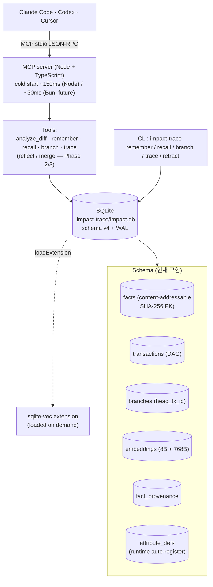

# Agent/AI 특화 DB 탐색 — Impact-trace 맥락에서

> **상태:** **Phase 1 + 1.5 구현 완료, Phase 2 scaffolding 준비 완료** (2026-04-28 세션 기준)
> **출발 질문:** "기존 DB를 써야 하나, 새로 기똥차게 만들 순 없나?"
> **수렴 지점:** 단일 PC에서 도는 MCP server로서, agent의 결정·근거·시간·분기를 1급 시민으로 두는 local-first 시스템.
> **사용 가이드:** [docs/agent-memory-cookbook.ko.md](agent-memory-cookbook.ko.md) — CLI/MCP 흐름, 실전 패턴.

## Implementation Status

| Phase | 무엇 | 커밋 |
|---|---|---|
| 1 | Schema v4 (6 테이블) + WAL + 4 MCP 툴 + 4 1급 attributes | `ffc4bf4` |
| 1.5 | 인덱서 듀얼 라이트 (relations → facts/transactions) | `b543ce3` |
| Q1+Q2 | CLI 4 명령 + tools/list 검증 + init이 ensureRepo 호출 | `51b09b0` |
| M1 | 인덱서 evidence_snippet fact + fact_provenance | `650104f` |
| P1+P2 | sqlite-vec 통합 + embedding 파이프라인 (stub) + redact-then-embed 게이트 | `d0c5cce` |
| M3+M4 | retract 동작 + as_of_tx 시간여행 (recursive CTE) | `4562024` |
| current-only | recall이 ROW_NUMBER 윈도우로 retract 자동 dedup | `34d185c` |

테스트: 38/38 passing. Lint clean. 모두 origin/main에.

```mermaid
gantt
  title Phase 진행
  dateFormat X
  axisFormat %s
  section Phase 1
  schema v4 + 4 MCP 툴      :done, p1, 0, 1
  인덱서 듀얼 라이트          :done, p1_5, after p1, 1
  CLI 4 명령 + tools/list    :done, q12, after p1_5, 1
  evidence_snippet provenance :done, m1, after q12, 1
  sqlite-vec + embedding stub :done, p12, after m1, 1
  retract + as_of_tx          :done, m34, after p12, 1
  current-only recall         :done, co, after m34, 1
  section Phase 2 (계획)
  실제 임베딩 모델 통합        :p2_emb, after co, 2
  semantic recall              :p2_sem, after p2_emb, 2
  branch merge                 :p2_merge, after p2_sem, 2
  section Phase 3 (후순위)
  reflective consolidation     :p3_ref, after p2_merge, 3
  speculative GC               :p3_gc, after p3_ref, 2
```

---

## 0. 한 페이지 요약 (TL;DR)

- **"AI 특화 DB"는 두 개의 결정이 한 단어에 묶여 있음.** (a) 새 storage engine 만들기 = 함정, (b) 기존 엔진 위 *agent-native 추상화 레이어* 만들기 = 가치 있음.
- **"새로 만든다"의 정직한 답:** 엔진은 빌려 쓰고, *데이터 모델 + 질의 모델 + SDK*에서 차별화. Datomic·git이 정확히 이 패턴.
- **agent DB의 5가지 차별화 축:** (#1) 혼합 인덱스, (#2) 시간/버전 1급, (#3) cheap branching, (#4) replay/audit, (#5) query-time redaction. 이 중 **#2 + #3 + #4는 *한 가지* 아키텍처적 선택의 세 얼굴** — content-addressable immutable log + DAG transaction.
- **2020–2026의 4가지 아키텍처적 이동** (object-storage-native, learned+quantized indexes, differential computation, durable execution)을 적용하면 같은 워크로드의 비용이 **10–100× 차이.**
- **HW까지 내려가면:** 진짜 bottleneck은 compute가 아니라 **memory bandwidth.** Quantization은 저장 기법이 아니라 *compute 가속 기법* (AVX-512 VNNI/AMX로 최대 100× throughput).
- **단일 PC 제약을 받으면 design space가 극적으로 좁아짐.** 위 frontier의 80%가 무관, 20%는 더 단순해짐. Impact-trace의 SQLite + MCP stdio + redaction 패턴이 *이미 이 방향에 90% 와 있음.*
- **권장 다음 단계:** Impact-trace 진화(P1) + Bun/TypeScript stack 유지(i). 즉시 시작 가능.

---

## 1. 질문이 어떻게 발전했는가

| 단계 | 질문 | 답의 깊이 |
|---|---|---|
| 1 | "기존 DB를 써야 하나? 새로 만들 순 없나?" | 표면 — 카탈로그 비교 |
| 2 | "agent/AI 특화 DB를 만들 순 없나?" | 카테고리 분리 (engine vs abstraction layer) |
| 3 | "#2 + #3 + #4 다 포함하면?" | **핵심 통찰**: 셋은 한 아키텍처의 세 얼굴 |
| 4 | "더 새로운 것들 / 효율적인 것들?" | Frontier 4 이동 + 7 신영역 |
| 5 | "캐시·반도체·CS 이런 것들 다 고려한 답인가?" | HW-up 재정의 (latency ladder, roofline) |
| 6 | "**일반 PC 로컬에서 돌 수 있는 MCP를 원한다**" | 제약 명시 → design space 결정적으로 좁아짐 |

---

## 2. 핵심 통찰 — 다시 써먹을 것들

### Insight 1 — "AI 특화 DB"는 두 개의 다른 결정

| 해석 | 무엇을 만드는가 | 현실성 |
|---|---|---|
| 새 storage engine | LSM/B-tree 레벨 (RocksDB·SQLite 같은) | 거의 항상 함정. 5+년 풀타임 팀 |
| agent-native 추상화 레이어 | 기존 엔진 위에 *agent 워크로드용* 스키마+API+SDK | 가치 있음. 카테고리 형성 중 |

**"vector DB = AI DB"는 오해.** Pinecone/Weaviate는 *semantic search 인프라*이지 agent memory/planning/replay를 위한 DB가 아님.

### Insight 2 — 5가지 차별화 축, 셋은 사실 한 결정

| 축 | 무엇 | 시장 |
|---|---|---|
| #1 혼합 인덱스 | vector + graph + structured 한 트랜잭션 | 🔴 레드오션 |
| #2 시간/버전 | `as-of` 1급 질의 (Datomic, XTDB) | 🟡 underused |
| #3 Cheap branching | agent가 N개 plan 시뮬레이션, 1개 commit | 🟢 white space |
| #4 Replay/audit | immutable log + evidence chain | 🟡 (Impact-trace 이미 함) |
| #5 Query-time redaction | secret 자동 필터 | 🔴 RLS로 충분 |

**#2 + #3 + #4 = 한 아키텍처의 세 얼굴.**
- Log = 시간순 fact 시퀀스
- #2 = "log를 시점 T까지 읽기"
- #3 = "log를 그래프로, head pointer 둘"
- #4 = "fact의 source tx 따라가기"

이 통찰의 핵심 함의: **셋을 하나씩 더하는 게 아니라, 한 아키텍처를 *제대로* 만들면 셋이 자동으로 따라옴.**

### Insight 3 — 진짜 bottleneck은 memory bandwidth

Vector retrieval의 산술 강도 ≈ 0.5 FLOPs/byte → **bandwidth-bound**.
- DDR5: 50 GB/s → 25 GFLOPs effective (CPU compute 95% idle)
- HBM3: 3 TB/s → 1.5 TFLOPs effective (GPU가 빠른 *진짜* 이유)
- Core 수 늘려도 *공유 자원*이라 scale 안 됨

**Quantization은 *3가지* win:** 저장 32× ↓ + bandwidth 32× ↓ + AVX-512 VNNI/AMX로 compute 4–10× ↑. **합쳐서 throughput 100×.** 단순한 "저장 기법"이 아님.

### Insight 4 — Learned index가 빠른 *진짜* 이유는 cache friendliness

| 알고리즘 | 1B keys lookup | 이유 |
|---|---|---|
| B-tree | ~240ns (8 cache miss) | random pointer chasing |
| ALEX/RMI | ~10ns (1 cache line) | 모델이 L2 fits, predict 1–2 cycles |

같은 이유로 ART, BwTree, FractalTree가 빠름. **알고리즘이 아니라 cache hierarchy 친화가 핵심.**

### Insight 5 — Agent 워크로드는 LSM tree에 정확히 맞음

| 패턴 | LSM 적합도 |
|---|---|
| Append-only fact log (immutable) | ★★★★★ |
| Time-range query (#2 temporal) | ★★★★ |
| Branch fork (CoW) | ★★★★ (SST file immutable, manifest fork) |
| Recent-heavy read | ★★★★★ (block cache + bloom) |

**RocksDB/FoundationDB/TiKV가 정확히 이 모델 — 직접 만들지 말고 storage layer로 임포트.**

### Insight 6 — Local-first가 후퇴가 아니라 진보

Cloud DB의 기능 70%는 *분산을 푸는 데* 쓰임. 단일 PC에선 그 복잡도 0. *agent 워크로드 본질에 더 집중* 가능.
- Branching: cloud는 metadata 조작, local은 *file copy*도 충분
- Privacy: cloud는 RBAC + key management, local은 *프로세스 격리*만으로 끝
- Backup/share/version: cloud는 복잡, local은 *파일 하나*로 trivial

### Insight 7 — 사람 인지 모델과 HW 메모리 계층의 자연스러운 align

| 인지 계층 | HW 계층 | Capacity (PC) |
|---|---|---|
| Working memory ("현재 대화") | L2/L3 cache | ~MB |
| Episodic memory ("이번 주 작업") | DRAM | ~GB |
| Semantic memory ("장기 지식") | NVMe/Object storage | ~TB+ |

**우연이 아닌 *수렴*.** Letta(MemGPT)·Zep 같은 시스템이 이 계층을 사람 인지 모델로 표현했지만, *HW 계층화의 자연스러운 결과*이기도 함.

### Insight 8 — Datomic의 함정과 영광

13년 전(2012)에 정확히 이 답을 했음 (immutable log + as-of + branching). **수학적으로 우아하지만 사용자 천 명대.** 이유:
- 개발자 mental model이 SQL과 너무 다름
- 운영 복잡 (storage 무한 증가, GC 정책)
- 시장 타이밍

**교훈:** 프론티어 답이 *기술적으로* 옳다고 *시장이* 받지는 않음. 단일 신영역에 베팅 + 나머지는 후속.

---

## 3. Frontier Landscape (2020–2026)

### 4가지 아키텍처적 이동

| 이동 | 이전 (2010s) | 현재 (2024+) | Agent DB 함의 |
|---|---|---|---|
| **Storage** | 로컬 디스크 / NVMe 고정 | Object storage primary + SSD cache (Neon, TurboPuffer, Lance, Iceberg, Delta Lake) | Branching이 metadata-only로 *공짜*. cost 10–100× ↓ |
| **Indexing** | B-tree, full-precision HNSW | Learned indexes (RMI/ALEX) + Matryoshka + binary/scalar quantization + DiskANN | Memory 1/10, throughput 100× |
| **Computation** | Query 시 처음부터 계산 | Differential dataflow (Materialize, DBSP, RisingWave). Delta-only 갱신 | Agent의 "현재 state"가 streaming view, ms 갱신 |
| **Execution** | App = state, DB = storage | Durable execution (DBOS, Restate, Temporal). 모든 함수 호출이 row | Replay/audit *공짜*. agent crash → resume from last step |

### 4개의 카테고리 후보 — "agent DB는 사실 ___이다"

| 프레임 | 시스템 | 핵심 통찰 |
|---|---|---|
| A. Storage | Postgres+pgvector, LanceDB | "agent도 결국 row 읽고 쓴다" |
| **B. Memory hierarchy** | Letta(MemGPT), Mem0, Zep, Cognee | "agent는 사람 인지 메모리에 가깝게" |
| **C. Durable execution** | DBOS, Restate, Temporal | "agent의 모든 행위가 journaled execution — DB는 부산물" |
| D. Differential state | Materialize, DBSP | "agent state는 변화의 흐름 — incremental computation 1급" |

**B + C + D가 진짜 frontier 합성.** A는 substrate.

### 7가지 Agent-specific 신영역 (off-the-shelf로는 안 풀림)

| # | 영역 | 현재 상태 |
|---|---|---|
| N1 | **Memory hierarchy** (working/episodic/semantic 자동 계층) | Letta/Mem0/Zep 시작, 표준 없음 |
| N2 | **Speculative branching + GC** | 어디에도 없음 (Iceberg가 가장 가까움) |
| N3 | **Belief states** (확률 분포 fact) | BayesDB prototype, 프로덕션 없음 |
| N4 | **Causal traceability** (decision → retrieval → vector → source) | Impact-trace의 evidence 모델이 *방향은 맞음* |
| N5 | Embedding-native joins | LanceDB가 가장 가까움 |
| N6 | Reflective consolidation (자동 요약 → semantic 승격) | Stanford Generative Agents prototype |
| N7 | Self-modifying schema | Cognee가 시도 중 |

**Impact-trace 자산과 직결되는 건 N4.** 시장 신호도 명확 (EU AI Act 등 컴플라이언스).

---

## 4. HW 현실 — Latency Ladder

### 전체 ladder

| Tier | Latency | Bandwidth | Capacity (PC) | 비용 |
|---|---|---|---|---|
| L1 cache | ~1ns | ~1 TB/s | 32–80 KB/core | — |
| L2 cache | ~3ns | ~500 GB/s | 256 KB–2 MB/core | — |
| L3 cache | ~12ns | ~300 GB/s | 32 MB+ | — |
| DRAM (DDR5) | ~80ns | ~50 GB/s | 8–64 GB | $4/GB |
| CXL.mem (PCIe5) | ~200–400ns | ~25 GB/s | TB pooled | $2/GB (서버) |
| NVMe Gen5 | 20–100µs | 7–14 GB/s | TB | $0.1/GB |
| Local SSD cache | 50–200µs | 2–5 GB/s | TB | — |
| Object storage (S3) | 50–200ms | 0.1–10 GB/s | unlimited | $0.023/GB |
| GPU HBM3 | ~10ns local | ~3 TB/s | 80–192 GB | $200/GB-equiv |
| LLM API call | 0.1–10s | — | — | $/token |

**각 단계 10×–1000× 차이.** 시스템 설계 = 각 working set이 어느 tier에 사느냐 결정.

### HW 결정 (지금까지 도출된 것)

| 결정 | 추천 | 이유 |
|---|---|---|
| Hash function (hot path) | xxHash3 (1 cycle/byte) | SHA256은 8× 느림. content addressing엔 보안 무관 |
| Hash function (signing) | BLAKE3 (1.3 cycles/byte SIMD) | 보안 필요 시 |
| Compression hot | LZ4 (decompress 3 GB/s) | 빠름 |
| Compression cold | Zstd-1 또는 Zstd-19 | 비율 좋음 |
| I/O model (Linux) | io_uring | NVMe Gen4/5에서 throughput 2–3× |
| CRC | Hardware CRC32C | 1 byte/cycle (software 8–16× 느림) |
| Memory allocator | mimalloc | Agent의 short-lived alloc에 25–40% 빠름 |
| Vector layout | < 1M vectors: column + SIMD scan / >1M: HNSW (sqlite-vec) | Brute-force가 작은 N에선 더 빠름 |
| Page size | working memory tier huge pages (2MB, Linux) | TLB pressure ↓ |
| NUMA | working set per-NUMA-node 고정 (multi-socket) | latency 2× ↓ |

### 진짜 next wave (3–5년)

- **CXL.mem:** PCIe5 메모리 풀링. 서버는 의미 있음, 일반 PC는 아직.
- **DPU 오프로드:** 압축/암호화/CRC가 NIC에서. 클라우드 scale, 일반 PC 무관.
- **GPU HBM:** 10M+ vectors real-time이 필요한 use case. 일반 agent엔 과도.

---

## 5. Local-PC 제약 — 진짜 design space

### 일반 PC HW 현실

| 자원 | 일반 노트북 | 가용 (다른 앱 고려) |
|---|---|---|
| RAM | 8–32 GB | **MCP에 100 MB – 2 GB** |
| Disk | NVMe 256 GB – 1 TB | **agent DB에 1–50 GB** |
| CPU | M1/M2/M3 (NEON) 또는 Intel/AMD (AVX-2 보편, AVX-512 일부) | Single-thread 위주 |
| GPU | 없거나 약함 | **기대 안 함** |
| 네트워크 | 보장 없음 | **오프라인 작동 권장** |
| MCP cold start | — | **sub-second 필수** |

### Frontier에서 살아남는 것 / 바뀌는 것

| 축/영역 | Local PC | 변화 |
|---|---|---|
| #1 혼합 인덱스 | ✅ | sqlite-vec (단일 extension), 1M vectors까진 충분 |
| #2 시간/버전 | ✅ | SQLite append-only + WAL |
| #3 cheap branching | ✅ **cloud보다 쉬움** | content-addressable + VACUUM INTO 또는 LMDB snapshot |
| #4 replay/audit | ✅ Impact-trace 이미 함 | content hash + relation_evidence |
| #5 redaction | ✅ Impact-trace 이미 함 | output filter |
| N1 Memory hierarchy | ✅ HW에 자연스럽게 매핑 | working=process, episodic=SQLite cache, semantic=SQLite cold |
| N2 Speculative GC | ✅ cloud보다 쉬움 | local file 삭제 |
| N4 Causal trace | ✅ Impact-trace 강점 | content hash chain |
| N6 Reflective consolidation | ⚠️ | local LLM (Ollama) 또는 remote API 필요 |

**무관해진 것:** CXL.mem, GPU HBM, DPU, S3 tiering, distributed consensus, multi-tenancy.

### 결정적 제약

- **Cold start:** Node ~150ms / Bun ~30ms / Rust ~10ms. **Stack 선택의 주요 변수.**
- **Quantization 필수:** 1M vectors × 768-dim × float32 = 3 GB → 메모리 over. Matryoshka 64-dim × int8 = 64 MB → fits.
- **AVX-512 가정 금지:** Mac은 NEON, 일반 desktop은 AVX-2. 3중 dispatch (sqlite-vec 자동 처리).
- **GPU 가정 금지:** "GPU 있어야 함" → 사용자 절반 잃음.

---

## 6. 제안된 구체적 Stack

> 현재 구현 상태를 반영. `xxHash3` → SHA-256 (`contentHash`)으로 변경, `evidence` 테이블 이름은 충돌 회피로 `fact_provenance`로 결정.

| 자원 | 현재 |
|---|---|
| Cold start | ~150ms (Node + tsx) |
| Idle RAM | ~80 MB |
| Busy RAM | ~500 MB |
| Disk | ~1 GB / 100k facts |
| 외부 의존 | 없음 (전 데이터 로컬) |
| 백업/공유 | `.impact-trace/impact.db` 파일 1개 복사 |

### 기존 MCP들과의 차별

| 기존 MCP | 한계 | 이 시스템의 차별 |
|---|---|---|
| `memory` (Anthropic) | 단순 key-value, no temporal | as-of + branching + causal chain |
| `chroma-mcp`, `qdrant-mcp` | vector만 | vector + structured + graph + provenance |
| `mcp-knowledge-graph` | basic graph | 시간 + 분기 + 인과 native |
| `filesystem`, `git` | 파일/git 래퍼 | agent 사고를 1급으로 저장 |
| Letta, Mem0 | SaaS / 무거움 | 단일 binary, offline-capable |
| Impact-trace | code-specific | general agent memory 추가 |

**진짜 white space:** "agent 결정·근거·시간·분기를 1급으로 두는 *general* local-first MCP" — 어디에도 없음.

---

## 7. 결정 기록 (해결됨 — 모두 코드에 반영)

> 원래는 "미결 결정들"이었으나 모두 구현됨. 보존을 위해 결정과 근거를 그대로 남김.

### 결정 P — 프로젝트 구조

| 옵션 | 무엇 | 권장 시점 |
|---|---|---|
| **P1. Impact-trace 진화** | code 영향도 + agent memory 통합 | **권장: 지금** |
| P2. 자매 프로젝트 | general agent memory MCP | P1 검증 후 |
| P3. 라이브러리 + 두 MCP | 핵심 엔진 추출 | P1, P2 둘 다 60% 겹친 후 |

**근거:** YAGNI + DRY. premature abstraction 회피. P1로 *지금 가치* + 사용자 검증.

### 결정 Stack

| 옵션 | Cold start | 권장 시점 |
|---|---|---|
| **i. Bun + TypeScript + sqlite-vec** | ~30ms | **권장: MVP** (Impact-trace 이어서) |
| ii. Rust + rusqlite + sqlite-vec | ~10ms | scale 단계 또는 처음부터 새 프로젝트 |
| iii. Hybrid | ~30ms | 시작 단계엔 비추 (오버킬) |

### 결정 Attribute 모델

| 옵션 | 무엇 | trade-off |
|---|---|---|
| A. Schema-on-read (EAV) | `attribute=TEXT, value=JSON` | 자유도 ★★★★★ / 무결성 ★★ |
| B. Schema-on-write (typed) | `attribute_id FK, typed columns` | 무결성 ★★★★★ / 자유도 ★★ |
| **C. Hybrid (Datomic 패턴)** | `attribute_defs` 등록 + typed value blob | **모두 ★★★★** |

**권장: C.** Agent가 새 attribute를 *런타임 등록*하면서도 타입 무결성 유지 — 이게 agent-native DB의 핵심 가치.

### 결정 1급 시민 attributes (사용자가 정의해야 함)

이 결정이 *시스템이 무엇을 위한 시스템인지*를 정의함.

| 후보 | 의미 | 적합 persona |
|---|---|---|
| `imports`, `calls`, `affects`, `depends_on` | 코드 관계 | 코드 agent (Impact-trace 자연 연장) |
| `read`, `summarized`, `cited`, `contradicts` | 문서 관계 | 연구자/학습자 |
| `decided`, `because`, `instead_of` | 결정 추적 | PM/기획자 |
| `observed`, `inferred`, `predicted` | episodic | 일반 second brain |

**권장 시작점:** 코드 관계 (Impact-trace의 자산 100% 활용). 추후 확장.

### 결정 베팅 (전체 시스템의 야심)

| 베팅 | 무엇 | Trade-off |
|---|---|---|
| A. 현실주의자 | off-the-shelf 조합 | 빠름 / 차별화 약함 / 학습 가치 중간 |
| **B. Frontier 합성가** | 조합 + Causal Trace Index 1개 직접 (N4) | 8–12개월 / 차별화 명확 / 학습 가치 ★★★★ |
| C. 연구자 | + Speculative GC + Reflection 직접 | 12–18개월 / 가장 야심적 / 학습 가치 ★★★★★ |

**권장: B.** Impact-trace 자산 활용 + EU AI Act 등 시장 신호 + 실현 가능 + cache-aware graph layout 학습 보너스.

### Local-PC 한정 결정

| 결정 | 추천 |
|---|---|
| Vector index residency | quantized: RAM, full: NVMe sequential |
| Hash | xxHash3 (hot), BLAKE3 (signing) |
| Compression | LZ4 (hot), Zstd-1 (cold) |
| I/O | io_uring (Linux) / kqueue (Mac) / IOCP (Win) — 라이브러리로 추상화 |
| Quantization | Matryoshka 64-dim binary (1차) + 768-dim int8 (2차) |
| Memory allocator | mimalloc |
| Cache | in-process LRU, ~100 MB target |

---

## 8. 다음 단계

세션이 멈춘 지점: **결정 P / Stack / Attribute 모델 / 1급 시민 attributes** 4개에 대한 사용자 답이 미수집 상태.

### Immediate (다음 세션 시작 시)

1. 위 4개 결정에 대한 사용자 답 수집.
2. 답이 P1 + Bun + C + 코드 관계로 수렴하면, *작은 PoC*부터:
   - SQLite + sqlite-vec 한 .db 파일에 facts/transactions/branches/embeddings/evidence/attribute_defs 6개 table 생성
   - MCP server에 `remember`, `recall`, `branch`, `trace` 4개 tool만 노출
   - Impact-trace의 `entities`/`relations`/`relation_evidence`에서 데이터 마이그레이션 1회 실행
3. 위 PoC가 *지금 Impact-trace 사용*에 *어떤 가치를 즉시 주는지* 1주일 dogfood.

### Short-term (1–3개월)

- Causal Trace Index (N4) 본격 구현. Cache-aware graph layout (ART/BwTree 친척).
- AVX-2 / NEON quantized vector retrieval native 코드.
- io_uring / kqueue / IOCP 추상화 라이브러리 채택 또는 직접 작성.

### Mid-term (3–9개월)

- 베팅 B 평가: causal trace가 사용자에게 *진짜 가치*를 주는가? 아닌가? data로 결정.
- 가치 있다면: P2 자매 프로젝트 시작 후보 평가.
- 가치 약하다면: 베팅 A로 회귀, off-the-shelf 조합으로 polish.

### Long-term (9+개월)

- P3 라이브러리 추출 (P1 + P2의 60% 겹침 확인 후).
- Speculative GC (N2) — local에선 단순하므로 *추가 베팅* 후보.
- Reflective consolidation (N6) — local LLM (Ollama) 또는 remote API 통합.

---

## 부록 A: 참고 시스템

| 시스템 | 카테고리 | 무엇을 배웠나 |
|---|---|---|
| **Datomic** | Storage + Temporal | immutable log + as-of 1급. 13년 검증된 우아함. 그러나 mental model 함정 |
| **DBOS** | Durable execution | "Postgres가 OS다" — agent의 모든 step이 row, replay 공짜 |
| **Materialize / DBSP** | Differential | Streaming SQL view, delta-only 갱신. agent state에 완벽 |
| **LanceDB** | Storage + Versioning | Lance file format, columnar + vector + 시간여행 |
| **Neon** | Storage | Postgres + S3, page-level CoW branching |
| **TurboPuffer** | Storage + Vector | Vector on S3, pay-per-query, cost 10–100× ↓ |
| **Iceberg / Delta Lake** | Storage | Table format, branching as metadata |
| **Letta (MemGPT)** | Memory hierarchy | working/episodic/semantic 3계층 인지 모델 |
| **Mem0** | Memory | contextual memory layer, agent-friendly API |
| **Zep** | Memory + Temporal | temporal knowledge graph for agents |
| **Cognee** | Memory + Self-modifying | agent가 schema 자동 확장 시도 |
| **RocksDB / FoundationDB / TiKV** | LSM Storage | Agent의 append-heavy 워크로드에 정확히 맞음 |
| **DiskANN / pgvectorscale** | Indexing | Billion-scale vector on SSD, RAM 1/10 |
| **sqlite-vec** | Indexing | SQLite extension, AVX-2/NEON, MVP에 ideal |
| **Restate** | Durable execution | Per-virtual-actor state, journaled execution |
| **HNSW + Matryoshka + binary** | Indexing | 동급 quality에서 storage 100× ↓ |
| **Generative Agents (Stanford 2023)** | Reflection | Reflective consolidation prototype |
| **BayesDB** | Belief states | Probabilistic facts prototype |

## 부록 B: 정량적 efficiency 비교 (cloud 스케일 가정)

같은 워크로드 (1년 agent 워크로드, 1억 facts, 5천만 vectors, 100 branches):

| 기법 누적 | Storage | Query latency | Cost (월) |
|---|---|---|---|
| Postgres + pgvector (naive) | 800 GB | 100ms | $400 (baseline) |
| + pgvectorscale (DiskANN) | 800 GB | 30ms | $250 |
| + binary quantization | 100 GB | 35ms | $100 |
| + Matryoshka 64dim | 80 GB | 25ms | $80 |
| + Object storage tier | 80 GB total, 8 GB hot | 25ms hot, 200ms cold | $25 |
| + Differential views | 80 GB | 5ms (current state) | $30 |
| + Branching metadata | 80 GB (branch share) | 25ms | $30 |
| **누적 효과** | **80 GB (10×↓)** | **5ms (20×↓)** | **$30 (13×↓)** |

**13× 차이는 한 결정이 아닌 5–6개 layer의 누적.** 이게 "엔진 만들지 마라"의 진짜 이유 — frontier 조합은 *off-the-shelf의 합집합*.

---

## 부록 C: 이 문서의 한계

- **결정된 건 *없음*.** 모든 권장은 *조건부* (가정 명시했을 때).
- **시장 검증 안 됐음.** "agent DB" 카테고리가 *진짜 형성 중*인지는 1–2년 더 봐야 분명해짐.
- **HW 추세 빠르게 변함.** CXL.mem, DPU, AMX 등은 6–12개월마다 재평가 필요.
- **Impact-trace의 사용자 데이터 부족.** P1 권장은 "지금 자산 활용"에 기반하지만, 실제 사용자가 가장 원하는 건 dogfood로만 알 수 있음.
- **"심도 깊게" 갔지만 *모든* 깊이가 아님.** AMX 명령 세부, LSM compaction 정책, CRDT 합쳐쓰기, NUMA pinning policy는 *MVP 후* 결정.

---

**이 문서를 다시 쓸 때:** 출발 지점은 §7 미결 결정들. 4개 답 채워지면 자동으로 다음 단계가 명확해짐.
