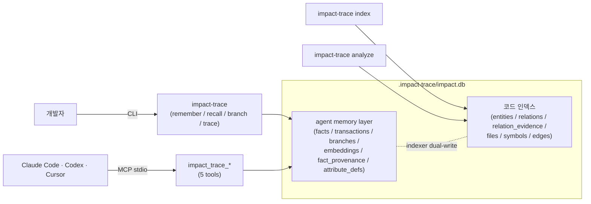
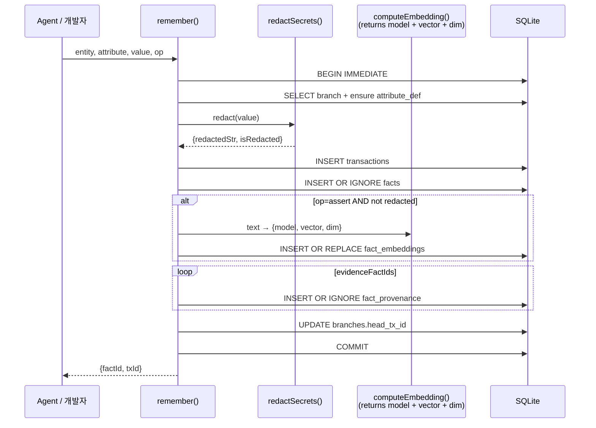
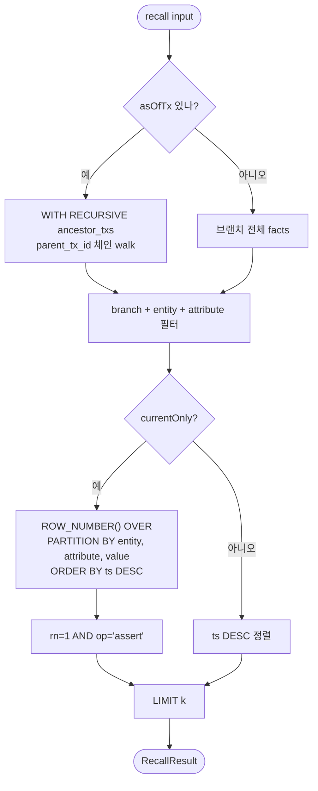
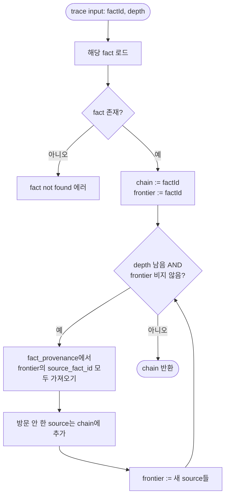

# Agent Memory Cookbook

> **상태:** Phase 1 + 1.5 + 2 + 3 + 4 (P1..P5) 모두 완성 — 2026-05-01, ADR D-001..D-018, 112 tests on main `33c49f0`
> **대상:** Impact Trace의 agent memory 레이어를 *지금 바로* 써보고 싶은 사용자
> **선수 지식:** [README.md](../README.md), [vision.ko.md](vision.ko.md) (한 페이지 비전), 선택적으로 [docs/agent-db-exploration.ko.md](agent-db-exploration.ko.md) · [docs/glossary.md](glossary.md)

이 문서는 *실전 흐름*만 모았습니다. 설계 배경은 exploration 문서, 스키마는 [indexing-model.ko.md](indexing-model.ko.md), 큰 그림은 README를 참고하세요.

---

## 0. 한 페이지 정리

Impact Trace의 agent memory 레이어는 **로컬 SQLite 한 파일에 (a) 코드 관계와 (b) agent의 사고를 함께 저장하는 시스템**입니다. 4개의 1급 동작:

| 동작 | CLI | MCP | 핵심 의미 |
|---|---|---|---|
| 저장 | `impact-trace remember` | `impact_trace_remember` | content-addressable fact 1개 영속화 |
| 조회 | `impact-trace recall` | `impact_trace_recall` | branch + entity + attribute 필터 |
| 분기 | `impact-trace branch` | `impact_trace_branch` | 데이터 복사 없이 head 포인터만 분기 |
| 추적 | `impact-trace trace` | `impact_trace_trace` | fact_provenance를 따라 인과 사슬 반환 |

모든 출력은 JSON. 모든 데이터는 `.impact-trace/impact.db` 한 파일에. 외부 네트워크 의존 없음.

---

## 시스템 한눈에 보기



`remember` → fact 1개 영속화 → 필요할 때 `recall` 또는 `trace`로 회수. 인덱서가 자동으로 코드 관계를 facts에 흘려보내기 때문에 `trace`는 *한 결정 → 사용한 evidence → 코드 라인*까지 한 번에 따라갑니다.

---

## 1. 5분 시작 가이드

```bash
# 1. 워크스페이스 초기화 (한 번만)
cd /path/to/your/repo
impact-trace init
# → .impact-trace/{config.json, impact.db}

# 2. (선택) 코드 인덱싱 — 안 해도 agent memory는 작동하지만,
#    인덱싱하면 코드 관계가 자동으로 facts에 들어가서 trace가 강력해짐
impact-trace index

# 3. 결정 하나 저장
impact-trace remember \
  --entity file:src/auth/session.ts \
  --attribute decided_to \
  --value '"rotate JWT secret quarterly"'
# → {"factId":"<sha256-hex>","txId":"<sha256-hex>"}

# 4. 조회
impact-trace recall --entity file:src/auth/session.ts
# → {"facts":[{"id":"...","entityId":"file:src/auth/session.ts",...}]}

# 5. 인덱서가 만든 코드 관계도 같이 옴
impact-trace recall --attribute imports --k 5
# → {"facts":[{"entityId":"file:src/...","attribute":"imports","value":"file:src/..."}, ...]}
```

---

## 2. CLI 흐름 — 사용자가 직접

### 2.1 결정 저장하기

```bash
# 단순 문자열
impact-trace remember --entity file:src/auth.ts --attribute observed --value '"compiles cleanly"'

# JSON 객체
impact-trace remember \
  --entity file:src/payment.ts \
  --attribute risk_assessment \
  --value '{"level":"high","reason":"PII handling","reviewer":"yousang"}'

# 숫자
impact-trace remember --entity file:src/cache.ts --attribute hit_rate --value 0.93

# 다른 branch에 저장
impact-trace remember \
  --entity file:src/auth.ts \
  --attribute observed \
  --value '"compiles in experimental branch"' \
  --branch experiment-1
```

### 2.2 인과 사슬 만들기

```bash
# 1) source fact
A_RESPONSE=$(impact-trace remember \
  --entity file:src/auth.ts \
  --attribute observed \
  --value '"validateSession returns boolean"')
A_ID=$(echo "$A_RESPONSE" | jq -r .factId)

# 2) derived fact — A가 evidence
impact-trace remember \
  --entity file:src/routes/private.ts \
  --attribute requires \
  --value '"validateSession from auth.ts"' \
  --evidence-fact-ids "$A_ID"

# 3) trace로 연결 확인
impact-trace trace --fact-id <derived-fact-id>
# → {"chain":[{derived fact}, {A fact (source)}]}
```

### 2.3 plan 시뮬레이션

```bash
# 메인에서 분기
impact-trace branch --name try-rate-limiter --from main

# 실험적 결정들을 새 branch에 저장
impact-trace remember \
  --entity file:src/api/handler.ts \
  --attribute will_add \
  --value '"rate limit middleware"' \
  --branch try-rate-limiter

# main에는 영향 없음
impact-trace recall --branch main --entity file:src/api/handler.ts
# → {"facts":[]} (실험은 별 branch에 격리)

# 실험 branch만 조회
impact-trace recall --branch try-rate-limiter --entity file:src/api/handler.ts
# → 실험 fact만 보임
```

### 2.4.1 retract — "이 사실은 더 이상 맞지 않음"

```bash
# 기존 결정을 retract (op=retract fact로 영속)
impact-trace retract \
  --entity file:src/auth.ts \
  --attribute observed \
  --value '"compiles cleanly"'

# 또는 remember 명령으로 같은 효과
impact-trace remember \
  --entity file:src/auth.ts \
  --attribute observed \
  --value '"compiles cleanly"' \
  --op retract

# recall로 둘 다 보임 (Phase 1: 자동 dedup 없음, op 필드로 caller가 구분)
impact-trace recall --entity file:src/auth.ts --attribute observed
# → {"facts":[{...,"op":"retract"},{...,"op":"assert"}]}
```

**중요:** retract된 fact는 *embedding되지 않음* — 의도적 정책. Semantic recall이
"retract됨" 의미를 검색해서 잘못 매칭되는 것을 방지.

### 2.4.2 as_of_tx — 과거 시점 상태로 시간여행

```bash
# 시점 1
TX1=$(impact-trace remember --entity file:src/x.ts --attribute role \
  --value '"primary auth"' | jq -r .txId)

# 시점 2 (이후 변경)
impact-trace remember --entity file:src/x.ts --attribute role \
  --value '"deprecated"'

# TX1 시점의 상태로만 recall
impact-trace recall --entity file:src/x.ts --as-of-tx "$TX1"
# → {"facts":[{...,"value":"primary auth"}]} ← 첫 fact만
# transactions DAG의 ancestor만 포함 (parent_tx_id 체인)
```

### 2.5 trace로 코드까지 따라가기 (인덱서 facts 활용)

```bash
# import 관계 fact 하나 잡기
IMPORT_FACT=$(impact-trace recall --attribute imports --k 1 | jq -r '.facts[0].id')

# trace로 따라가면 evidence_snippet fact까지 옴
impact-trace trace --fact-id "$IMPORT_FACT"
# → {"chain":[
#     {imports fact: source -> target},
#     {evidence_snippet fact: 코드 한 조각, redaction 적용된}
#   ]}
```

---

## 3. MCP 흐름 — Claude Code / Codex가 직접

`.mcp.json`에 등록 (project scope):

```json
{
  "mcpServers": {
    "impact-trace": {
      "type": "stdio",
      "command": "impact-trace",
      "args": ["mcp", "serve"],
      "env": {}
    }
  }
}
```

이후 agent가 다음 툴을 사용 가능:

| MCP tool name | 어노테이션 |
|---|---|
| `impact_trace_analyze_diff` | read-only, idempotent |
| `impact_trace_remember` | write, idempotent (content-hash) |
| `impact_trace_recall` | read-only |
| `impact_trace_branch` | write, NOT idempotent (이름 충돌 시 에러) |
| `impact_trace_trace` | read-only |

agent에게 줄 수 있는 *지시문* 예시:

> "이 PR을 검토하기 전에, `impact_trace_remember`로 검토 가설을 먼저 저장해.
>  검토 후 결과를 `evidence_fact_ids` 인자로 가설에 연결해서 또 한 번 remember 해.
>  그러면 나중에 이 결정의 근거 사슬을 trace로 1쿼리에 볼 수 있어."

---

## 4. 통합 시나리오

### 4.1 코드 PR 검토 + 결정 영속화

```bash
# 1. PR 변경 분석
impact-trace analyze --base main --head HEAD --json > report.json
REPORT_ID=$(jq -r '.id' report.json)

# 2. 영향 받는 파일별 검토 가설 저장
for file in $(jq -r '.affectedFiles[].path' report.json); do
  impact-trace remember \
    --entity "file:$file" \
    --attribute review_hypothesis \
    --value "\"need to verify $file under load\""
done

# 3. 검토 후 결과
impact-trace remember \
  --entity file:src/api/handler.ts \
  --attribute review_outcome \
  --value '{"verdict":"approved","caveat":"add rate limit before launch"}'

# 4. 다음 PR 때 같은 entity의 과거 결정 조회
impact-trace recall --entity file:src/api/handler.ts --attribute review_outcome
```

### 4.2 agent의 다단계 사고 추적

```bash
# 1차 분석: import 관계 파악 (인덱서가 자동으로 facts 작성)
impact-trace index

# 2차 분석: agent가 이 코드의 *역할*을 추론
agent_inference_id=$(impact-trace remember \
  --entity file:src/auth/session.ts \
  --attribute role \
  --value '"primary auth gate"' | jq -r .factId)

# 3차 분석: 보안 우려 — 위 inference가 evidence
impact-trace remember \
  --entity file:src/auth/session.ts \
  --attribute concern \
  --value '{"type":"security","detail":"single point of failure"}' \
  --evidence-fact-ids "$agent_inference_id"

# trace로 보안 우려 → role inference → ... 사슬 확인
impact-trace trace --fact-id <concern-fact-id>
```

---

## 5. 보안 모델 — redact-then-embed 게이트

`remember()`의 `value`가 secret 패턴(OpenAI key, GitHub token, AWS key, private key 등)을 포함하면:

1. **저장 시:** `value_blob = "[REDACTED]"`, `redacted = 1`
2. **임베딩 시:** **0 row** — 임베딩이 secret을 reconstruct할 수 있으므로 *zero-row 정책*
3. **recall 시:** `value: "[REDACTED]"`로 마스킹되어 반환

```bash
# 의도하지 않게 secret 포함된 fact 저장
impact-trace remember \
  --entity file:src/config.ts \
  --attribute observed \
  --value '"loaded sk-test-secret-1234567890 from env"'

# value는 이미 redacted
impact-trace recall --entity file:src/config.ts
# → {"facts":[{...,"value":"[REDACTED]"}]}

# fact_embeddings 테이블엔 row 없음 (검증)
sqlite3 .impact-trace/impact.db \
  'SELECT count(*) FROM fact_embeddings WHERE fact_id = "<the-redacted-fact-id>"'
# → 0
```

---

## 6. 자주 만나는 패턴

| 원하는 것 | 명령 |
|---|---|
| 한 entity의 모든 결정 보기 | `impact-trace recall --entity file:src/X.ts` |
| 한 attribute의 전체 그래프 | `impact-trace recall --attribute imports --k 100` |
| 가장 최근 결정만 | `impact-trace recall --k 5` (recall은 ts DESC 정렬) |
| 새 branch 만들기 | `impact-trace branch --name BR --from main` |
| 결정의 근거 사슬 따라가기 | `impact-trace trace --fact-id ID --depth 10` |
| 결정을 retract | `impact-trace retract --entity ... --attribute ... --value ...` |
| 과거 시점 상태 보기 | `impact-trace recall --as-of-tx <tx-id>` |
| 지금 유효한 결정만 (retract dedup 자동) | `impact-trace recall --current-only` |
| Branch 합치기 | `impact-trace merge --target main --source experiment-1` |
| 합쳐진 후 양 branch facts 보기 | merge 결과의 `mergeTxId`로 `recall --as-of-tx <merge-tx>` |
| 임베딩 모델 변경 | `IMPACT_TRACE_EMBEDDING_MODEL=Xenova/bge-base-en-v1.5 impact-trace remember ...` |
| 임베딩 비활성 (CI/테스트) | `IMPACT_TRACE_EMBEDDING_MODEL=stub-sha256` |
| 임베딩 모델 변경 | `IMPACT_TRACE_EMBEDDING_MODEL=Xenova/bge-base-en-v1.5 impact-trace remember ...` |
| 임베딩 비활성 (CI/테스트) | `IMPACT_TRACE_EMBEDDING_MODEL=stub-sha256` |
| MCP 통해 agent가 같은 동작 | tool call에 `impact_trace_*` 사용 |

---

## 7. Phase 2 진행 상황

대부분 *완료*; semantic recall query path만 남음:

- **실제 임베딩 모델 통합:** 현재 `src/embeddings.ts`의 stub은 SHA-256 chain 기반 deterministic pseudo-vector. 진짜 semantic 의미는 없음. 같은 함수 시그니처로 Ollama / OpenAI / Cohere / Voyage 모델 swap-in 예정.
- **Semantic recall:** `recall(query: "비슷한 결정 찾아줘", k: 10)` — Matryoshka 64-dim binary 1차 + 768-int8 2차 검색.
- ~~**Branch merge:** 두 branch의 facts를 합쳐 새 branch 생성.~~ ✅ 완료 — `impact-trace merge --target ... --source ...` 그리고 `impact_trace_merge` MCP 툴.

---

## 8. 디버깅 팁

| 증상 | 원인 / 해결 |
|---|---|
| `repo is not indexed` | `impact-trace init` 먼저. agent memory 동작은 init만으로 충분 |
| `branch not found: X` | `impact-trace branch --name X` 먼저 또는 main 사용 |
| `fact not found` (trace) | factId가 정확한지 — recall로 확인 |
| `branch already exists` (branch 명령) | 다른 이름 사용 (현재 delete 미지원) |
| recall에 expected fact가 안 보임 | branch가 다를 가능성 — `--branch` 명시 |
| trace 결과가 시작 fact 1개만 | 그 fact에 evidence_fact_ids 또는 indexer가 만든 evidence_snippet 연결 안 됨 |

---

## 부록 A: 데이터 모델 한눈에

```mermaid
erDiagram
  BRANCHES ||--o{ TRANSACTIONS : "txs on this branch"
  BRANCHES ||--o{ BRANCHES : "parent_branch_id"
  TRANSACTIONS ||--o{ TRANSACTIONS : "parent_tx_id (DAG)"
  TRANSACTIONS ||--o{ FACTS : "produces"
  FACTS ||--o{ FACT_EMBEDDINGS : "vectors (assert + non-redacted, multi-model)"
  FACTS ||--o{ FACT_PROVENANCE : "fact_id (target)"
  FACTS ||--o{ FACT_PROVENANCE : "source_fact_id (cause)"
  ATTRIBUTE_DEFS ||--o{ FACTS : "typed by"

  BRANCHES {
    TEXT id PK
    TEXT name UK
    TEXT head_tx_id FK
    TEXT parent_branch_id FK
    TEXT created_at
  }
  TRANSACTIONS {
    TEXT id PK "content hash"
    TEXT parent_tx_id FK
    TEXT branch_id FK
    TEXT ts "ISO-8601"
    TEXT agent
    INT index_run_id FK
  }
  FACTS {
    TEXT id PK "hash(entity,attr,value,op)"
    TEXT entity_id
    TEXT attribute FK
    TEXT value_blob "JSON or [REDACTED]"
    TEXT op "assert / retract"
    TEXT tx_id FK
    INT redacted
  }
  FACT_EMBEDDINGS {
    TEXT fact_id PK_FK
    TEXT model PK "e.g. stub-sha256, multilingual-e5-base"
    BLOB vector "int8, length = dim"
    INT dim "768 / 384 / 1024 etc"
    TEXT created_at
  }
  FACT_PROVENANCE {
    TEXT id PK
    TEXT fact_id FK
    TEXT source_fact_id FK
  }
  ATTRIBUTE_DEFS {
    TEXT name PK
    TEXT value_type "text / entity_ref / json / int / float"
    INT is_code_relation
    TEXT description
  }
```

## 부록 B: 동작 흐름

### B.1 `remember` 트랜잭션 흐름



### B.2 `recall` 시간여행 + current-only 흐름



### B.3 `trace` 인과 사슬 BFS



자세한 SQL DDL: [docs/agent-db-exploration.ko.md §6](agent-db-exploration.ko.md).

---

## C. Phase 3 명령 — reflect / abandon / gc-branches

### C.1 `reflect` — 오래된 episodic facts를 LLM이 entity별로 요약

```bash
# 기본: ollama:gemma2:2b 모델 (사용자가 Ollama 실행 중이어야 함)
impact-trace reflect

# 30일 대신 14일 cutoff
impact-trace reflect --older-than-days 14

# Anthropic API 사용 (env로 키 설정)
ANTHROPIC_API_KEY=sk-ant-... \
IMPACT_TRACE_REFLECTION_MODEL=anthropic:claude-haiku-4-5 \
impact-trace reflect --older-than-days 14

# OpenAI
OPENAI_API_KEY=sk-... \
IMPACT_TRACE_REFLECTION_MODEL=openai:gpt-4o-mini \
impact-trace reflect

# 외부 호출 없이 dry-run으로 후보만 확인
IMPACT_TRACE_REFLECTION_MODEL=stub \
impact-trace reflect --dry-run

# 특정 entity로만 좁히기
impact-trace reflect --entity file:src/auth/session.ts

# 실험 branch에서 reflect
impact-trace reflect --branch experiment-1
```

**동작:** 30일+ 오래된 facts (redacted 제외) 를 entity별로 묶어 LLM에 보내고, 1-2 문장 요약을 받아 `attribute: 'reflection'` fact로 저장합니다. 원본 facts는 *보존*되며, `fact_provenance` 엣지에 `kind='summary'` 표시가 생깁니다. 매 reflect 패스는 `reflections` audit 테이블에 기록됩니다.

**보안:** 모든 LLM input/output은 `redactSecrets()`를 거칩니다. redacted facts는 input set에 *행을 만들지 않음* (zero-row 정책, 참고 [D-004](decisions.ko.md#d-004-redact-then-embed-zero-row-policy)). API 키는 env에서만 읽고 error 메시지에 echo하지 않습니다. Anthropic/OpenAI는 https URL만 허용합니다. 모든 fetch는 30s timeout (env `IMPACT_TRACE_LLM_TIMEOUT_MS`로 조정 가능).

### C.2 `branch --abandon` — 사변(speculative) branch 닫기

```bash
# 새 branch 만들기 (기존)
impact-trace branch --name plan-A
# → {"branchId":"br_...","headTxId":...}

# branch 닫기
impact-trace branch --abandon plan-A
# → {"branchId":"br_...","name":"plan-A","state":"abandoned","alreadyAbandoned":false}

# main은 보호됨
impact-trace branch --abandon main
# → Error: cannot abandon protected branch: main
```

### C.3 `gc-branches` — abandoned branch의 transactions soft-delete

```bash
# 미리보기 (실제 변경 없음)
impact-trace gc-branches --dry-run
# → {"scanned":3,"archivedTransactions":42,"branches":[...],"dryRun":true}

# 실제 archive
impact-trace gc-branches
# → {"scanned":3,"archivedTransactions":42,"branches":[...],"dryRun":false}
```

**중요:** `gc-branches`는 facts를 *절대 삭제하지 않습니다*. abandoned branch에 속한 *transactions*만 `archived=1`로 표시하며, recall과 recallSemantic이 자동으로 `t.archived = 0` 필터로 가립니다. `trace()`도 archived txs를 따라가지 않습니다 (Phase 3 review에서 추가된 일관성, [D-011](decisions.ko.md#d-011-soft-delete-branch-gc-via-transactionsarchived)). content-addressable이라 다른 active branch에서 같은 (entity, attribute, value)를 remember한 적이 있으면 그 fact는 그대로 보입니다.

### C.4 reflective + GC 권장 워크플로우

```bash
# 매월 1회 정도
impact-trace reflect --older-than-days 30
impact-trace gc-branches --dry-run
impact-trace gc-branches  # dry-run 확인 후
```

자세한 설계 근거: [docs/phase3-design.ko.md](phase3-design.ko.md), 누적 결정 로그: [docs/decisions.ko.md](decisions.ko.md).

### C.5 `profile` — 한 entity의 컨텍스트를 한 번에 (Phase 4)

agent의 system prompt에 *"이 entity에 대해 시스템이 알고 있는 것"* 을 한 번에 inject할 때 사용.

```bash
# 기본 — main branch, k=50
impact-trace profile --entity file:src/auth/session.ts

# 응답:
# {
#   "entity": "file:src/auth/session.ts",
#   "branch": "main",
#   "staticFacts":  [{ attribute: "imports",   value: "file:src/db.ts", ... }, ...],
#   "dynamicFacts": [{ attribute: "observed",  value: "compiled",       ... }, ...],
#   "summaryFacts": [{ attribute: "reflection", value: "...LLM 요약...", ... }, ...]
# }

# 다른 branch에서 조회
impact-trace profile --entity file:src/auth.ts --branch experiment-1

# 시간여행 — 특정 tx 시점의 profile
impact-trace profile --entity file:src/auth.ts --as-of-tx <tx-hex>

# bucket 크기 제한
impact-trace profile --entity file:src/auth.ts --k 10
```

**3-bucket 분류 규칙:**

| Bucket | 조건 | 예시 |
|---|---|---|
| `staticFacts` | `attribute_defs.is_code_relation = 1` | `imports`, `calls`, `affects`, `depends_on` |
| `dynamicFacts` | `is_code_relation = 0` AND `attribute != 'reflection'` | `observed`, `verified`, `concern`, ... |
| `summaryFacts` | `attribute = 'reflection'` (Phase 3 reflective consolidation 결과) | LLM이 만든 요약 facts |

**왜 3-bucket인가?** supermemory는 2-bucket (`static` + `dynamic`)이지만 우리 시스템은 *Phase 3에서 reflection을 1급 시민으로 갖고 있음*. agent가 "raw observation은 dynamic에서 보고, LLM 요약은 summary에서 본다"로 명확히 구분 가능.

**성능 가이드:**
- 한 entity의 facts 수가 cap (`--k`, default 50) 이내면 bucket별로 모두 채워짐.
- cap 초과 시 *최신순 (ts DESC)* 으로 자르고 나머지는 노출되지 않음 (응답에 omitted count 표기 없음 — 필요하면 별도 follow-up).
- archived transactions (Phase 3 GC된 것) 자동 제외.
- redacted facts는 `'[REDACTED]'` 그대로 surface (privacy 일관성).

**MCP에서의 사용:**

```json
{
  "jsonrpc": "2.0",
  "method": "tools/call",
  "params": {
    "name": "impact_trace_profile",
    "arguments": {
      "entity": "file:src/auth/session.ts",
      "branch": "main",
      "k": 30
    }
  }
}
```

자세한 설계 근거: [docs/supermemory-adoption.ko.md](supermemory-adoption.ko.md) §2.B, [docs/decisions.ko.md](decisions.ko.md) D-013, D-014.
