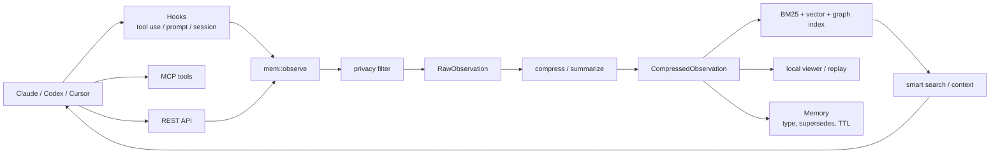
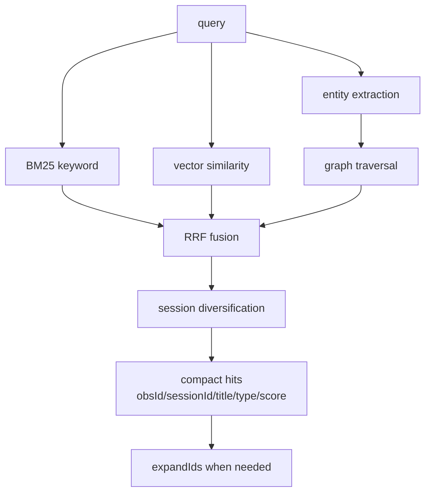
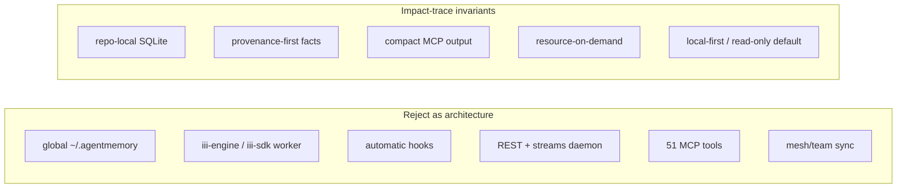
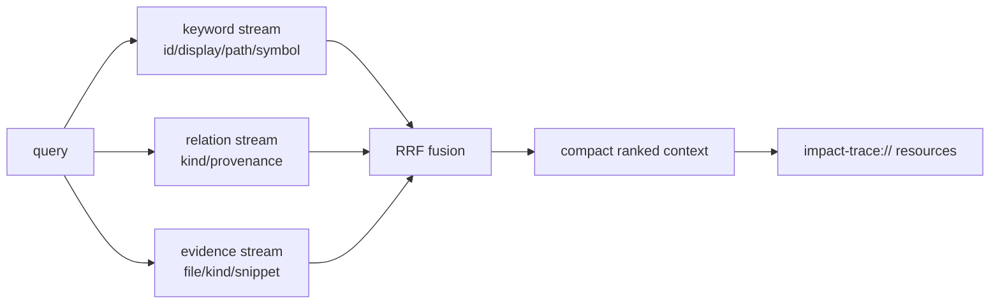

# agentmemory 적용성 분석

> **작성:** 2026-05-10
> **상태:** `$team-builder` 기반 GPT-5.5 4역할 리뷰 + 로컬 코드 확인 결과
> **대상:** [rohitg00/agentmemory](https://github.com/rohitg00/agentmemory) `main` @ `0322da8004dc9f5132d243bca89b5944e51f1f5f`
> **결론:** Impact-trace는 `agentmemory`를 가져오는 프로젝트가 아니라, 그중 **retrieval/lifecycle/UX 패턴만 SQLite + MCP impact context layer에 맞게 재구현**한다.

---

## 0. 최종 판단

`agentmemory`는 Claude Code, Codex CLI, Cursor, Gemini CLI, MCP/REST client가 공유하는 **범용 agent memory platform**이다. hook, REST, viewer, iii-engine worker, 많은 MCP tools, session replay, global memory, team/mesh 기능까지 포함한다.

Impact-trace가 만들려는 것은 더 좁고 선명하다. **코드/문서/정책/제안서 relation graph를 repo-local SQLite에 저장하고, Claude/Codex가 변경 전후에 필요한 impact context만 MCP로 가져가는 local-first evidence layer**다.

따라서 적용 전략은 다음이다.

| 판단 | 내용 |
|---|---|
| **Adopt** | compact-first search, expand-on-demand resource, BM25/vector/graph RRF ranking, access telemetry, memory supersession 개념, session replay/import UX |
| **Adapt** | 4-tier memory lifecycle, session/crystal summary, file history, viewer/timeline, privacy filter, vector diagnostics |
| **Reject** | iii-engine/iii-sdk, global `~/.agentmemory`, REST/streams daemon, 51-tool MCP surface, automatic hook capture, mesh/team sync, arbitrary export/write tools, hard auto-forget |

가장 중요한 제품 원칙은 유지한다: **작게 보내고, 필요할 때 resource로 확장하며, 모든 근거를 SQLite provenance로 남긴다.**

---

## 1. 조사 범위와 근거

| 항목 | 확인 내용 |
|---|---|
| upstream repo | <https://github.com/rohitg00/agentmemory> |
| inspected commit | `0322da8004dc9f5132d243bca89b5944e51f1f5f` |
| package | `@agentmemory/agentmemory` v0.9.5, Node >=20, Apache-2.0 |
| 주요 근거 | `README.md`, `package.json`, `src/types.ts`, `src/index.ts`, `src/state/hybrid-search.ts`, `src/functions/smart-search.ts`, `src/functions/remember.ts`, `src/functions/privacy.ts`, `src/triggers/api.ts`, `.github/security-advisories/*` |
| 리뷰 방식 | GPT-5.5 Open Source Explorer, Integration Architect, Database/Memory Model Reviewer, Security/License/Ops Reviewer |

주요 upstream 소스:

- [README: agents/MCP/REST 및 benchmark claim](https://github.com/rohitg00/agentmemory/blob/0322da8004dc9f5132d243bca89b5944e51f1f5f/README.md)
- [package.json: license/dependencies/bin](https://github.com/rohitg00/agentmemory/blob/0322da8004dc9f5132d243bca89b5944e51f1f5f/package.json)
- [types.ts: Session/RawObservation/CompressedObservation/Memory](https://github.com/rohitg00/agentmemory/blob/0322da8004dc9f5132d243bca89b5944e51f1f5f/src/types.ts)
- [hybrid-search.ts: BM25 + vector + graph RRF](https://github.com/rohitg00/agentmemory/blob/0322da8004dc9f5132d243bca89b5944e51f1f5f/src/state/hybrid-search.ts)
- [smart-search.ts: compact result와 expandIds](https://github.com/rohitg00/agentmemory/blob/0322da8004dc9f5132d243bca89b5944e51f1f5f/src/functions/smart-search.ts)
- [remember.ts: type, supersedes, TTL, sourceObservationIds](https://github.com/rohitg00/agentmemory/blob/0322da8004dc9f5132d243bca89b5944e51f1f5f/src/functions/remember.ts)
- [SECURITY.md](https://github.com/rohitg00/agentmemory/blob/0322da8004dc9f5132d243bca89b5944e51f1f5f/SECURITY.md)
- [security advisories](https://github.com/rohitg00/agentmemory/tree/0322da8004dc9f5132d243bca89b5944e51f1f5f/.github/security-advisories)

---

## 2. agentmemory는 무엇을 잘하는가

### 2.1 제품 문제

`agentmemory`가 푸는 문제는 "에이전트가 매 세션 같은 프로젝트 맥락을 다시 배워야 한다"는 것이다. README는 hook/MCP/REST로 agent activity를 캡처하고, 나중에 관련 context를 다시 주입하는 memory server로 설명한다. 지원 대상은 Claude Code, Cursor, Gemini CLI, Codex CLI, OpenCode, Aider/REST, generic MCP client까지 넓다.

### 2.2 구조

핵심 record는 `Session`, `RawObservation`, `CompressedObservation`, `Memory`다. `Memory`는 `type`, `concepts`, `files`, `sessionIds`, `strength`, `version`, `parentId`, `supersedes`, `sourceObservationIds`, `forgetAfter` 같은 필드를 가진다. 이 모델은 Impact-trace의 fact/provenance 모델과 직접 호환되지는 않지만, **동적 기억의 versioning과 source linking** 아이디어는 쓸 만하다.

### 2.3 검색 방식

`agentmemory`의 가장 가치 있는 부분은 retrieval이다.

Impact-trace의 `impact_trace_search_context`는 v0에서 SQLite `LIKE` 기반 deterministic search와 compact evidence/resource URI 계약을 먼저 닫았다. v1은 이 계약을 유지하면서 keyword/relation/evidence stream을 분리하고 RRF rank signal을 노출한다. 다음 개선은 `agentmemory`처럼 **FTS/BM25, semantic, graph proximity signal까지 확장한 뒤 같은 RRF 계약으로 합치는 것**이다.

---

## 3. Impact-trace에 맞춘 적용 원칙

### 3.1 가져오지 않을 것부터 고정한다

Impact-trace의 source of truth는 `<repo>/.impact-trace/impact.db`다. `agentmemory`의 global `~/.agentmemory`, iii KV scope, REST/streams server, viewer daemon을 core로 가져오면 제품 정체성이 흐려진다.

### 3.2 가져올 것은 platform이 아니라 pattern이다

| agentmemory pattern | Impact-trace 적용 방식 |
|---|---|
| compact-first smart search | `impact_trace_search_context` 결과를 ranked entity hit + resource URI 중심으로 유지 |
| expand-on-demand | full evidence/source span/report/graph는 `impact-trace://...` resource로만 fetch |
| BM25 + vector + graph RRF | SQLite FTS5/BM25, `fact_embeddings`/sqlite-vec, `relations` traversal 결과를 RRF로 fuse |
| access tracking | context pack/resource fetch telemetry로 어떤 evidence가 실제로 쓰였는지 기록 |
| memory supersession | fuzzy overwrite가 아니라 explicit `supersedes`/`replaces` provenance kind로 모델링 |
| 4-tier lifecycle | working context pack, episodic session crystal, semantic fact/reflection, procedural skill/rule로 재해석 |
| session replay | Claude/Codex transcript import를 opt-in으로 제공하고 repo 관련 파일/entity에만 link |
| viewer timeline | Impact UI Explorer의 report timeline/evidence drill-down으로 제한 |

---

## 4. Adopt / Adapt / Reject 상세

### 4.1 Adopt

| 항목 | 이유 | 구현 위치 후보 |
|---|---|---|
| **RRF hybrid ranking** | initial v1은 keyword/relation/evidence stream을 fuse한다. 다음 depth pass에서 "의미상 관련"과 "graph상 가까움"까지 충분히 합쳐야 한다. | 현재 `src/mcp.ts`; 후속으로 `src/search_context.ts` 분리 |
| **compact-first + expand-on-demand 계약 강화** | 사용자의 핵심 요구가 AI context 절감이다. tool 응답은 compact hit와 URI만 보내고, source/evidence는 resource fetch로 늦춘다. | `impact_trace_search_context`, `impact_trace_context_for_change`, resource templates |
| **access telemetry** | 어떤 context가 실제로 agent에 의해 확장됐는지 알아야 ranking과 budget을 개선할 수 있다. | v0: `context_tool_runs`, `context_resource_accesses`, `impact_trace_context_telemetry` |
| **explicit memory supersession** | 지금은 retract/currentOnly가 있지만, "이 summary/decision이 저 fact를 대체한다"를 더 명시적으로 표현할 수 있다. | `fact_provenance.kind='supersedes'` 또는 `fact_supersessions` |
| **session import/replay UX** | Codex/Claude가 이미 수정한 흐름을 영향 그래프와 연결하면 "왜 이 변경이 일어났는가"를 UI에서 볼 수 있다. | landed: `impact-trace import-session --file <path> --format codex|claude` |
| **diagnose/doctor command** | vector dimension, stale vec table, index coverage, resource truncation을 사용자가 확인할 수 있어야 한다. | landed: `impact-trace doctor`, `impact_trace_doctor` |

### 4.2 Adapt

| 항목 | 그대로 쓰면 문제 | Impact-trace식 변환 |
|---|---|---|
| **4-tier consolidation** | `agentmemory`는 raw observation부터 procedural memory까지 범용 memory server 구조다. | `working=context pack`, `episodic=session crystal`, `semantic=fact/reflection`, `procedural=adapter/skill/policy rule`로 정의 |
| **privacy filter** | regex redaction은 항상 불완전하다. upstream advisories도 이 문제를 보여준다. | 기존 redact-then-embed / redact-then-LLM zero-row 정책 유지, fixture 기반 secret regression 추가 |
| **viewer** | captured raw observation을 HTML로 보여주는 viewer는 XSS/secret leak surface가 크다. | read-only local UI, CSP nonce, no inline handler, no raw secret, resource pagination |
| **file history** | 자동 hook/file watcher는 과캡처 위험이 크다. | 명시적 session import와 repo-contained file/entity linking만 허용 |
| **auto-forget/retention** | hard delete는 Impact-trace의 content-addressed provenance와 충돌한다. | `archived`, `hidden_at`, `expires_at` 같은 soft visibility로만 구현 |

### 4.3 Reject / Defer

| 항목 | 이유 |
|---|---|
| iii-engine / iii-sdk | 설치/운영/runtime coupling 증가. Impact-trace는 Node CLI + SQLite + MCP stdio로 충분해야 한다. |
| global `~/.agentmemory` | repo-local auditability와 충돌. multi-repo는 workspace catalog로 풀어야 한다. |
| REST/streams daemon default | auth surface가 커지고 local network exposure 위험이 생긴다. |
| 51-tool MCP surface | agent에게 너무 많은 action surface를 제공하면 UX와 보안이 모두 나빠진다. |
| automatic hooks / filesystem watcher | 사용자가 원치 않는 prompt/tool output/file preview를 저장할 수 있다. |
| mesh/team sync | 현재 목표인 single repo/single agent context layer 이후 문제다. |
| arbitrary export/write/compress tools | Impact-trace MCP는 source/external write 없는 impact context가 기본이어야 한다. repo-local telemetry append만 예외로 둔다. |
| hard auto-forget | provenance와 reproducibility를 해친다. |

---

## 5. 보안/라이선스/운영 경계

### 5.1 보안 경계

`agentmemory` 자체도 viewer XSS, remote shell install, default bind, unauthenticated mesh, export traversal, redaction incomplete 같은 advisory draft를 보유한다. 이 목록은 Impact-trace UI/MCP 설계의 체크리스트로 써야 한다.

Impact-trace에 필요한 guardrail:

| guardrail | 이유 |
|---|---|
| MCP tool allowlist test | `export`, `obsidian`, `compress_file`, `mesh`, `team`, `heal`, `routine`, `signal`, `lease`, `snapshot`, `write_file` 같은 surface가 core MCP에 들어오지 않게 막는다. |
| resource URI traversal test | percent-decoding, null byte, `..`, symlinked `.impact-trace`를 검증한다. |
| redaction regression | SQLite, Markdown, MCP response, graph export, UI JSON에 raw secret이 없어야 한다. |
| viewer CSP | UI가 생기면 nonce-based script, no inline event handler, escaped text rendering을 기본으로 둔다. |
| no background daemon invariant | 기본 실행은 명시적 CLI/MCP stdio. HTTP server는 별도 opt-in과 auth가 필요하다. |
| audit gate | release 전 `npm audit --audit-level=high`를 CI gate로 둔다. 현재 MCP SDK transitive advisory는 release 전 해결해야 한다. |

### 5.2 라이선스 경계

`agentmemory`는 Apache-2.0이고 Impact-trace는 MIT다. 아이디어와 architecture pattern은 가져올 수 있다. 그러나 source code를 복사하면 Apache-2.0 notice/license 보존이 필요하므로, 기본 정책은 **코드 복사가 아니라 재구현**이다.

허용:

- 알고리즘 수준 아이디어: RRF fusion, compact-first search, memory supersession, access telemetry
- 문서화된 product pattern: replay, viewer timeline, 4-tier lifecycle

주의:

- 함수/파일 단위 source copy
- README benchmark claim을 우리 성능 claim처럼 재사용
- Apache-2.0 NOTICE가 필요한 asset/code import

---

## 6. Impact-trace 구현 로드맵

### Slice A: context search ranking v1

목표: `impact_trace_search_context`를 단순 weighted search에서 **multi-signal retrieval**로 바꾼다.

상태: initial v1 landed. 현재 구현은 semantic/vector lane 없이 deterministic SQLite stream만 사용하지만,
agentmemory에서 가져오려던 핵심 계약인 **compact-first result + expand-on-demand resource + RRF rank signal**을
먼저 고정했다.

구현된 것:

1. `impact_trace_search_context` 내부 score를 `keywordRank`, `relationRank`, `evidenceRank`로 분리.
2. RRF 결과를 `rankSignals`로 노출하고 기존 `reasons`/resource URI 계약은 유지.
3. raw RRF score로 정렬하되 응답 `rrfScore`/`score`는 rounded value로 고정.
4. stream top page 밖의 fused winner, display/entity tie-break, rounded-score collision regression test 추가.

후속 depth pass:

1. `entities`, `relation_evidence`, `facts`에 대한 FTS5 projection 추가.
2. semantic recall/sqlite-vec stream을 `semanticRank`로 추가.
3. relation proximity stream을 단순 relation/evidence match에서 graph-distance 기반으로 확장.
4. large index에서 common query가 전체 stream을 materialize하지 않도록 FTS/cap/guard 추가.

### Slice B: context access telemetry

목표: context 절감이 실제로 되는지 측정한다.

상태: v0 landed. agentmemory의 access tracking을 platform daemon 없이 repo-local SQLite에 맞춰 줄였다.

| table | 내용 |
|---|---|
| `context_tool_runs` | context/analyze/search/explain tool, redacted query, changed files, budget, returned bytes, resource count, omitted counts |
| `context_resource_accesses` | resource URI, report/entity/evidence/graph/coverage id, index run, returned bytes, timestamp |
| `context_rank_feedback` | expanded 여부, selected 여부, result rank. 아직 미구현; UI/agent feedback slice에서 추가 |

Metric:

- returned bytes
- omitted evidence count
- resource expansion rate
- repeated query cache hit
- evidence recall@budget

### Slice C: explicit supersession

목표: `retract`보다 의미 있는 "이 결정/summary가 저 결정을 대체한다"를 표현한다.

구현 후보:

1. `fact_provenance.kind`에 `supersedes` 추가.
2. `recall --current-only`가 `(entity, attribute)`의 latest assert뿐 아니라 superseded fact를 제외할 수 있게 option 추가.
3. `trace`가 supersession chain을 별도 섹션으로 보여준다.

주의: `agentmemory`처럼 Jaccard similarity로 자동 supersede하지 않는다. Impact-trace에서는 명시적 evidence와 user/agent action이 있어야 한다.

### Slice D: opt-in session import and crystals

목표: Claude/Codex session log를 repo-local episodic memory로 import하되, privacy와 containment를 지킨다.

구현 상태: v0 landed. 새 schema 없이 agent memory facts를 사용한다.

1. `impact-trace import-session --file <path> --format codex|claude`.
2. relative path는 repo 내부 realpath-contained 파일만 허용하고, absolute path는 explicit 단일 파일일 때만 허용한다.
3. prompt/tool output 원문 전체를 저장하지 않고, bounded/redacted structured summary와 referenced files만 저장한다.
4. import 결과는 `session:<format>:<hash>` entity의 `session_summary` fact와 `references_file=file:<repo-relative-path>` fact로 저장한다.
5. 각 `references_file` fact는 `session_summary` fact를 provenance evidence로 참조한다.
6. MCP tool로는 노출하지 않는다. session transcript file read는 사용자의 explicit CLI action으로만 수행한다.

### Slice E: local UI explorer

목표: agent와 사람이 같은 graph/resource contract를 본다.

첫 화면:

- latest index health
- recent context pack/search runs
- changed entity → affected entity path
- evidence drill-down
- coverage gaps
- session crystal timeline

금지:

- landing page
- raw captured tool output default display
- write/delete/export action

---

## 7. 다음 작업 우선순위

| 순위 | 작업 | 왜 지금 |
|---|---|---|
| 1 | `agentmemory` adoption boundary를 docs에 고정 | platform sprawl을 막고 다음 구현 방향을 명확히 한다. |
| 2 | `impact_trace_search_context` RRF design + tests | 완료. initial v1은 keyword/relation/evidence stream, `rankSignals`, tie-break regression을 고정했다. |
| 3 | context access telemetry schema | 완료. v0는 `context_tool_runs`, `context_resource_accesses`, `impact_trace_context_telemetry`로 "context를 줄인다"는 제품 약속을 측정 가능하게 만든다. |
| 4 | MCP allowlist/security tests | 완료. core MCP `tools/list`에서 destructive/open-world 범위와 agentmemory식 export/write/mesh surface 누수를 테스트로 고정했다. |
| 5 | `doctor` command | 완료. `impact-trace doctor`와 `impact_trace_doctor`가 schema/index/coverage/adapter/vector/telemetry 상태를 read-only JSON으로 반환한다. |
| 6 | opt-in session import spec | 완료. `impact-trace import-session` v0가 redacted session crystal facts와 referenced file provenance를 만든다. |

---

## 8. 한 줄 결론

`agentmemory`에서 배울 것은 "agent memory platform"이 아니라 **context를 작게 찾고, 근거를 나중에 확장하고, 사용된 memory를 측정하고, 오래된 기억을 명시적으로 대체하는 방법**이다. Impact-trace는 이 패턴을 repo-local SQLite, evidence-first graph, telemetry-aware MCP context, local UI explorer로 재구성한다.
