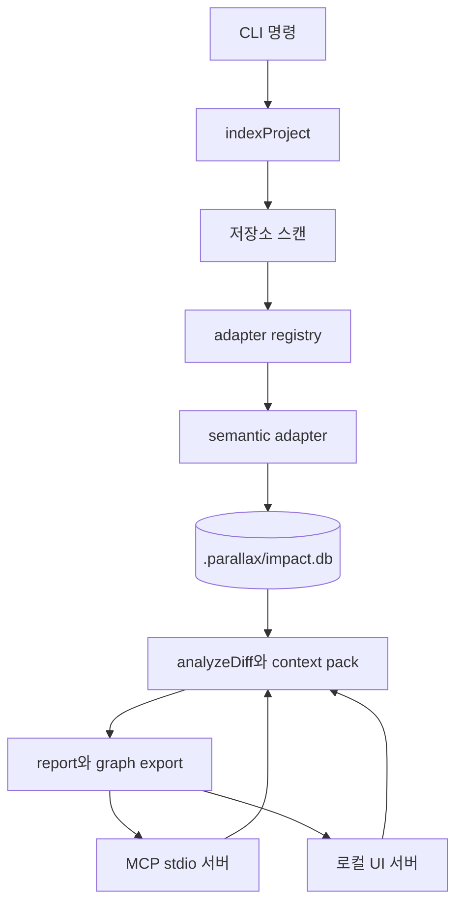

# Parallax — 아키텍처

[English](architecture.md) · **한국어** · [中文](architecture.zh.md)

Parallax는 local-first impact graph다. 단일 SQLite 데이터베이스가 코드 구조, 에이전트 메모리, 검색 projection, context pack, report metadata를 저장한다. 이 문서는 indexer, adapter, analyzer, MCP 서버, UI를 바꾸기 전에 알아야 할 실행 경로를 설명한다.

Source checkout 참고: `src/indexer.ts` 같은 경로는 maintainer source path다. npm package 문서에서는 reference name으로만 쓰이며, 직접 열어보려면 repository checkout이 필요하다.

## 시스템 맵

## 런타임 책임

| 계층 | 주요 파일 | 책임 |
| :--- | :--- | :--- |
| Public API | `src/index.ts` | 지원하는 프로그래밍 표면을 re-export한다. |
| CLI | `src/cli.ts` | 현재 저장소 루트에서 명령을 파싱하고 public API를 호출한다. |
| Indexer | `src/indexer.ts` | 파일을 스캔하고, adapter를 고르고, entity, relation, evidence, coverage, adapter run metadata를 저장한다. |
| Adapter | `src/adapters/**` | 언어 또는 파일 형식별 파일을 graph event로 바꾼다. |
| Store | `src/store.ts` | SQLite schema 생성, additive migration, DB helper를 책임진다. |
| Analyzer | `src/analyzer.ts` | 최신 completed index를 읽고 changed-to-affected impact report를 계산한다. |
| MCP | `src/mcp.ts`, `src/mcp_search.ts`, `src/context_pack.ts` | 분석, 검색, 메모리, doctor, context-pack 기능을 코딩 에이전트에 노출한다. |
| UI | `src/ui.ts`, `src/ui/**` | 로컬 report workbench와 report/coverage API를 제공한다. |

## 인덱싱 경로

1. `indexProject()`가 저장소 루트를 정규화하고 `.parallax/impact.db`를 연다.
2. scanner가 `.git`, `.parallax`, `node_modules`, `dist`, 일반 build cache를 건너뛰며 저장소를 걷는다.
3. `AdapterRegistry`가 스캔된 파일마다 하나의 adapter를 고른다. 선택은 first-match-wins다.
4. indexer는 해당 run에서 indexed 또는 skipped language coverage가 있는 adapter마다 `adapter_runs` row를 만든다.
5. 각 adapter는 `entity`, `relation`, `diagnostic` event를 yield한다.
6. indexer는 file entity, adapter entity, relation, relation evidence, coverage row, canonical scan evidence를 저장한다.
7. adapter가 실패하면 현재 run은 failed가 되고, 직전 completed current-state snapshot이 복구된다.

## Adapter 확장 계약

Adapter는 `src/adapters/types.ts`의 `SemanticAdapter`를 구현한다. 중요한 계약은 다음과 같다.

| 필드 또는 메서드 | 의미 |
| :--- | :--- |
| `id` | 안정적인 고유 식별자. 중복 ID는 등록 시 실패한다. |
| `version` | 추출 버전. 방출되는 graph output이 바뀌면 올린다. |
| `capabilities` | imports, calls, symbols, tests, packages처럼 이 adapter가 만들 수 있는 evidence 종류. |
| `confidence` | 이 adapter run의 기본 신뢰 라벨. 없으면 `unknown`이 된다. |
| `knownGaps` | report와 UI에 표시되는 사람이 읽는 한계 목록. |
| `supports(file)` | 스캔된 파일을 이 adapter가 소유할지 결정한다. |
| `start(ctx, files)` | `process(file)` generator가 graph event를 yield하는 adapter run을 만든다. |

Multi-language regex adapter는 catch-all이므로 기본 registry의 마지막에 있어야 한다. 새로운 정밀 adapter는 이 catch-all 앞에 등록하고, 정밀 adapter가 선택된다는 fixture 테스트를 추가해야 한다.

## 저장 모델

데이터베이스는 서로 연결된 다섯 표면을 저장한다.

| 표면 | 테이블 | 목적 |
| :--- | :--- | :--- |
| Code graph | `files`, `entities`, `relations`, `relation_evidence`, `symbols`, `edges`, `evidence` | 무엇이 무엇에 의존하는지와 그 근거를 설명한다. |
| Index health | `index_runs`, `adapter_runs`, `index_coverage` | freshness, skipped path, adapter confidence, known gap을 설명한다. |
| Agent memory | `facts`, `transactions`, `branches`, `transaction_parents`, `fact_provenance`, `fact_embeddings` | 결정, 관찰, 시간여행, branch merge history, semantic recall을 저장한다. |
| Context surface | `context_tool_runs`, `context_resource_accesses`, `context_packs` | MCP context-pack 재사용과 telemetry를 기록한다. |
| Search | FTS5 projection table | entity, evidence, fact에 대한 keyword search를 지원한다. |

모든 migration은 additive다. 새 DDL은 `src/store.ts`의 allowlist migration 스타일을 따라야 한다.

## 분석 경로

`analyzeDiff()`는 changed file을 읽고, 최신 completed index를 불러오고, changed file entity를 resolve하고, 제한된 depth와 fanout으로 graph relation을 순회한 뒤 다음을 방출한다.

| 출력 | 목적 |
| :--- | :--- |
| `changed` | 사용자 또는 git diff가 직접 지목한 entity. |
| `affected` / `affectedFiles` | confidence, relation path, depth가 붙은 영향 대상. |
| `actions` | 제안된 검증 명령 또는 review action. |
| `evidence` | impact edge를 정당화하는 source snippet과 span. |
| `adapterInsights` | Adapter run confidence, known gap, failure. |
| `warnings` | stale index, 누락된 changed path, coverage gap. |

Confidence는 제품 계약의 일부다. Report는 넓은 heuristic coverage를 parser-grade fact처럼 보이게 하지 말고 불확실성을 드러내야 한다.

## MCP와 UI 표면

MCP 서버와 UI는 같은 로컬 데이터베이스를 읽는다. MCP는 에이전트용 표면이고, UI는 사람이 보는 report workbench다. 두 표면 모두 source file을 수정하지 않는다. 일부 MCP 호출은 context-pack 또는 telemetry row를 저장하므로, 여기서 "read-only"는 source tree read-only를 뜻하며 데이터베이스 side effect가 전혀 없다는 뜻은 아니다.

## 확장 체크리스트

Engine behavior를 바꾸기 전에는 다음을 확인한다.

1. 집중된 unit test를 추가하거나 갱신한다.
2. `npm run check`를 실행한다.
3. `npm test`를 실행한다.
4. indexer, adapter, analyzer, store, graph, cross-repo logic이 바뀌면 `npm run test:dogfood`를 실행한다.
5. relation extraction, ranking, retrieval, adapter output이 바뀌면 `npm run bench`를 실행한다.
6. 확장이 contributor 기대를 바꾸면 `docs/extending-adapters.ko.md`, `docs/verification.ko.md`, 또는 이 architecture 문서를 갱신한다.

## 함께 보기

- [extending-adapters.ko.md](extending-adapters.ko.md) — adapter 작성 가이드
- [verification.ko.md](verification.ko.md) — test, dogfood, bench gate
- [mcp.ko.md](mcp.ko.md) — MCP tool과 resource 표면
- [invariants.ko.md](invariants.ko.md) — load-bearing 설계 규칙
