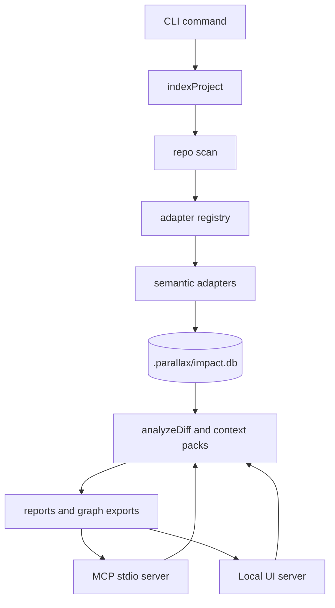

# Parallax — Architecture

**English** · [한국어](architecture.ko.md) · [中文](architecture.zh.md)

Parallax is a local-first impact graph. A single SQLite database stores code structure, agent memory, search projections, context packs, and report metadata. This document explains the runtime path that contributors need before changing the indexer, adapters, analyzer, MCP server, or UI.

Source checkout note: paths such as `src/indexer.ts` are maintainer source paths. They are reference names in the npm package docs and require a repository checkout to inspect directly.

## System map

## Runtime responsibilities

| Layer | Primary files | Responsibility |
| :--- | :--- | :--- |
| Public API | `src/index.ts` | Re-exports the supported programmatic surface. |
| CLI | `src/cli.ts` | Parses commands and calls the public API from the current repository root. |
| Indexer | `src/indexer.ts` | Scans files, chooses adapters, persists entities, relations, evidence, coverage, and adapter run metadata. |
| Adapters | `src/adapters/**` | Convert language or format-specific files into graph events. |
| Store | `src/store.ts` | Owns SQLite schema creation, additive migrations, and database helpers. |
| Analyzer | `src/analyzer.ts` | Reads the latest completed index and computes changed-to-affected impact reports. |
| MCP | `src/mcp.ts`, `src/mcp_search.ts`, `src/context_pack.ts` | Exposes analysis, search, memory, doctor, and context-pack functions to coding agents. |
| UI | `src/ui.ts`, `src/ui/**` | Serves the local report workbench and report/coverage APIs. |

## Indexing path

1. `indexProject()` normalizes the repository root and opens `.parallax/impact.db`.
2. The scanner walks the repository while skipping directories such as `.git`, `.parallax`, `node_modules`, `dist`, and common build caches.
3. `AdapterRegistry` picks one adapter per scanned file. Selection is first-match-wins.
4. The indexer creates an `adapter_runs` row for every adapter that has indexed or skipped language coverage in the run.
5. Each adapter yields `entity`, `relation`, or `diagnostic` events.
6. The indexer persists file entities, adapter entities, relations, relation evidence, coverage rows, and canonical scan evidence.
7. If an adapter fails, the current run is marked failed and the previous completed current-state snapshot is restored.

## Adapter extension contract

Adapters implement `SemanticAdapter` from `src/adapters/types.ts`. The important contract points are:

| Field or method | Meaning |
| :--- | :--- |
| `id` | Stable unique identifier. Duplicate IDs fail registration. |
| `version` | Extraction version. Increase it when emitted graph output changes. |
| `capabilities` | The kinds of evidence this adapter can emit, such as imports, calls, symbols, tests, or packages. |
| `confidence` | Default trust label for this adapter's run. Missing confidence becomes `unknown`. |
| `knownGaps` | Human-readable limitations shown in reports and the UI. |
| `supports(file)` | Decides whether the adapter owns a scanned file. |
| `start(ctx, files)` | Creates an adapter run whose `process(file)` generator yields graph events. |

The multi-language regex adapter is a catch-all and must stay last in the default registry. A new precise adapter should be registered before that catch-all, then tested with a fixture that proves the precise adapter is picked.

## Storage model

The database stores five related surfaces:

| Surface | Tables | Purpose |
| :--- | :--- | :--- |
| Code graph | `files`, `entities`, `relations`, `relation_evidence`, `symbols`, `edges`, `evidence` | Explains what depends on what and why. |
| Index health | `index_runs`, `adapter_runs`, `index_coverage` | Explains freshness, skipped paths, adapter confidence, and known gaps. |
| Agent memory | `facts`, `transactions`, `branches`, `transaction_parents`, `fact_provenance`, `fact_embeddings` | Stores decisions, observations, time travel, branch merge history, and semantic recall. |
| Context surface | `context_tool_runs`, `context_resource_accesses`, `context_packs` | Records MCP context-pack reuse and telemetry. |
| Search | FTS5 projection tables | Supports keyword search across entities, evidence, and facts. |

All migrations are additive. New DDL should follow the allowlisted migration style in `src/store.ts`.

## Analysis path

`analyzeDiff()` reads changed files, loads the latest completed index, resolves changed file entities, traverses graph relations with bounded depth and fanout, then emits:

| Output | Purpose |
| :--- | :--- |
| `changed` | Entities directly named by the user or git diff. |
| `affected` / `affectedFiles` | Ranked impact targets with confidence, relation path, and depth. |
| `actions` | Suggested verification commands or review actions. |
| `evidence` | Source snippets and spans that justify impact edges. |
| `adapterInsights` | Adapter run confidence, known gaps, and failures. |
| `warnings` | Stale index, missing changed paths, or coverage gaps. |

Confidence is part of the product contract. Reports should expose uncertainty instead of presenting broad heuristic coverage as parser-grade fact.

## MCP and UI surfaces

The MCP server and UI both read the same local database. MCP is the agent-facing surface; UI is the human-facing report workbench. Neither surface edits source files. Some MCP calls persist context-pack or telemetry rows, so "read-only" means source-tree read-only, not database side-effect free.

## Extension checklist

Before changing engine behavior:

1. Add or update focused unit tests.
2. Run `npm run check`.
3. Run `npm test`.
4. If the indexer, adapters, analyzer, store, graph, or cross-repo logic changed, run `npm run test:dogfood`.
5. If relation extraction, ranking, retrieval, or adapter output changed, run `npm run bench`.
6. Update `docs/extending-adapters.md`, `docs/verification.md`, or this architecture document when the extension changes contributor expectations.

## See also

- [extending-adapters.md](extending-adapters.md) — adapter authoring guide
- [verification.md](verification.md) — test, dogfood, and bench gates
- [mcp.md](mcp.md) — MCP tool and resource surface
- [invariants.md](invariants.md) — load-bearing design rules
