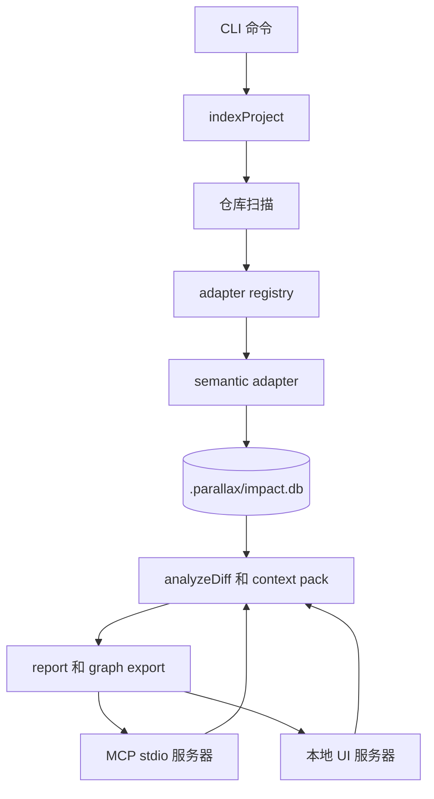

# Parallax — 架构

[English](architecture.md) · [한국어](architecture.ko.md) · **中文**

Parallax 是一个 local-first impact graph。单个 SQLite 数据库存储代码结构、agent memory、搜索投影、context pack 和 report metadata。本文说明在修改 indexer、adapter、analyzer、MCP server 或 UI 之前需要理解的运行路径。

Source checkout 说明：`src/indexer.ts` 等路径是 maintainer source path。在 npm package 文档中它们只是 reference name；若要直接查看，需要 repository checkout。

## 系统地图

## 运行时职责

| 层 | 主要文件 | 职责 |
| :--- | :--- | :--- |
| Public API | `src/index.ts` | 重新导出受支持的编程接口。 |
| CLI | `src/cli.ts` | 在当前仓库根目录解析命令并调用 public API。 |
| Indexer | `src/indexer.ts` | 扫描文件、选择 adapter，并持久化 entity、relation、evidence、coverage 和 adapter run metadata。 |
| Adapter | `src/adapters/**` | 将特定语言或格式的文件转换成 graph event。 |
| Store | `src/store.ts` | 负责 SQLite schema 创建、additive migration 和 DB helper。 |
| Analyzer | `src/analyzer.ts` | 读取最新 completed index，并计算 changed-to-affected impact report。 |
| MCP | `src/mcp.ts`, `src/mcp_search.ts`, `src/context_pack.ts` | 向编码 agent 暴露分析、搜索、memory、doctor 和 context-pack 功能。 |
| UI | `src/ui.ts`, `src/ui/**` | 提供本地 report workbench 和 report/coverage API。 |

## 索引路径

1. `indexProject()` 规范化仓库根目录并打开 `.parallax/impact.db`。
2. scanner 遍历仓库，同时跳过 `.git`、`.parallax`、`node_modules`、`dist` 和常见 build cache。
3. `AdapterRegistry` 为每个扫描到的文件选择一个 adapter。选择规则是 first-match-wins。
4. indexer 为本次 run 中存在 indexed 或 skipped language coverage 的每个 adapter 创建 `adapter_runs` 行。
5. 每个 adapter yield `entity`、`relation` 或 `diagnostic` event。
6. indexer 持久化 file entity、adapter entity、relation、relation evidence、coverage row 和 canonical scan evidence。
7. 如果 adapter 失败，当前 run 会被标记为 failed，并恢复上一个 completed current-state snapshot。

## Adapter 扩展契约

Adapter 实现 `src/adapters/types.ts` 中的 `SemanticAdapter`。关键契约如下。

| 字段或方法 | 含义 |
| :--- | :--- |
| `id` | 稳定的唯一标识符。重复 ID 会在注册时报错。 |
| `version` | 提取版本。当输出的 graph 发生变化时需要递增。 |
| `capabilities` | 此 adapter 可生成的 evidence 类型，例如 imports、calls、symbols、tests 或 packages。 |
| `confidence` | 此 adapter run 的默认置信标签。缺失时为 `unknown`。 |
| `knownGaps` | 在 report 和 UI 中展示给人的限制说明。 |
| `supports(file)` | 判断此 adapter 是否拥有某个扫描文件。 |
| `start(ctx, files)` | 创建 adapter run；其 `process(file)` generator 会 yield graph event。 |

Multi-language regex adapter 是 catch-all，因此必须放在默认 registry 的最后。新的精确 adapter 应注册在 catch-all 之前，并用 fixture 测试证明精确 adapter 会被选中。

## 存储模型

数据库保存五个相互连接的表面。

| 表面 | 表 | 目的 |
| :--- | :--- | :--- |
| Code graph | `files`, `entities`, `relations`, `relation_evidence`, `symbols`, `edges`, `evidence` | 说明什么依赖什么，以及证据是什么。 |
| Index health | `index_runs`, `adapter_runs`, `index_coverage` | 说明 freshness、skipped path、adapter confidence 和 known gap。 |
| Agent memory | `facts`, `transactions`, `branches`, `transaction_parents`, `fact_provenance`, `fact_embeddings` | 保存决策、观察、时间旅行、branch merge history 和 semantic recall。 |
| Context surface | `context_tool_runs`, `context_resource_accesses`, `context_packs` | 记录 MCP context-pack 复用和 telemetry。 |
| Search | FTS5 projection table | 支持对 entity、evidence 和 fact 的 keyword search。 |

所有 migration 都是 additive。新的 DDL 应遵循 `src/store.ts` 中 allowlist migration 的风格。

## 分析路径

`analyzeDiff()` 读取 changed file，加载最新 completed index，解析 changed file entity，以有限 depth 和 fanout 遍历 graph relation，然后输出：

| 输出 | 目的 |
| :--- | :--- |
| `changed` | 用户或 git diff 直接指定的 entity。 |
| `affected` / `affectedFiles` | 带有 confidence、relation path 和 depth 的影响目标。 |
| `actions` | 建议的验证命令或 review action。 |
| `evidence` | 证明 impact edge 的 source snippet 和 span。 |
| `adapterInsights` | Adapter run confidence、known gap 和 failure。 |
| `warnings` | stale index、缺失的 changed path 或 coverage gap。 |

Confidence 是产品契约的一部分。Report 应暴露不确定性，而不是把宽泛 heuristic coverage 表现成 parser-grade fact。

## MCP 和 UI 表面

MCP server 和 UI 读取同一个本地数据库。MCP 是 agent-facing 表面；UI 是 human-facing report workbench。两者都不会修改 source file。部分 MCP 调用会持久化 context-pack 或 telemetry 行，因此这里的“read-only”指 source tree read-only，而不是完全没有数据库副作用。

## 扩展检查清单

修改 engine behavior 之前：

1. 添加或更新聚焦的 unit test。
2. 运行 `npm run check`。
3. 运行 `npm test`。
4. 如果 indexer、adapter、analyzer、store、graph 或 cross-repo logic 发生变化，运行 `npm run test:dogfood`。
5. 如果 relation extraction、ranking、retrieval 或 adapter output 发生变化，运行 `npm run bench`。
6. 如果扩展改变 contributor 预期，更新 `docs/extending-adapters.zh.md`、`docs/verification.zh.md` 或本文档。

## 另请参阅

- [extending-adapters.zh.md](extending-adapters.zh.md) — adapter 编写指南
- [verification.zh.md](verification.zh.md) — test、dogfood 和 bench gate
- [mcp.zh.md](mcp.zh.md) — MCP tool 和 resource 表面
- [invariants.zh.md](invariants.zh.md) — 承重设计规则
