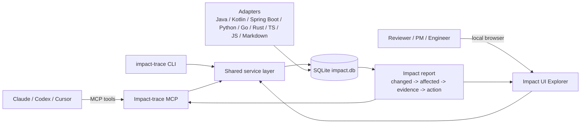
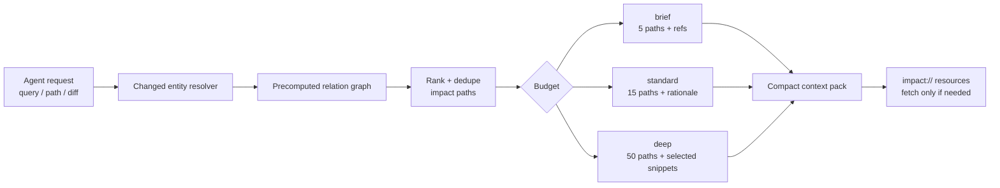
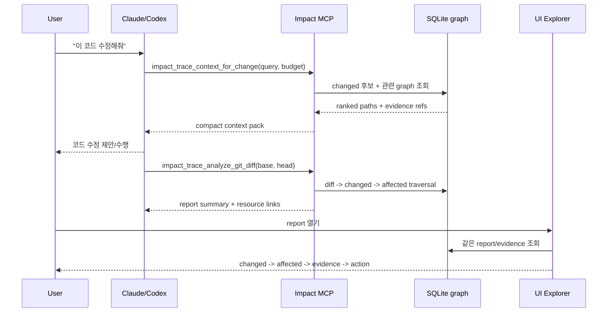
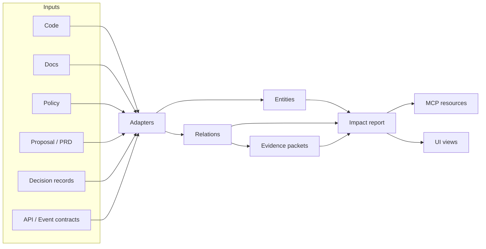
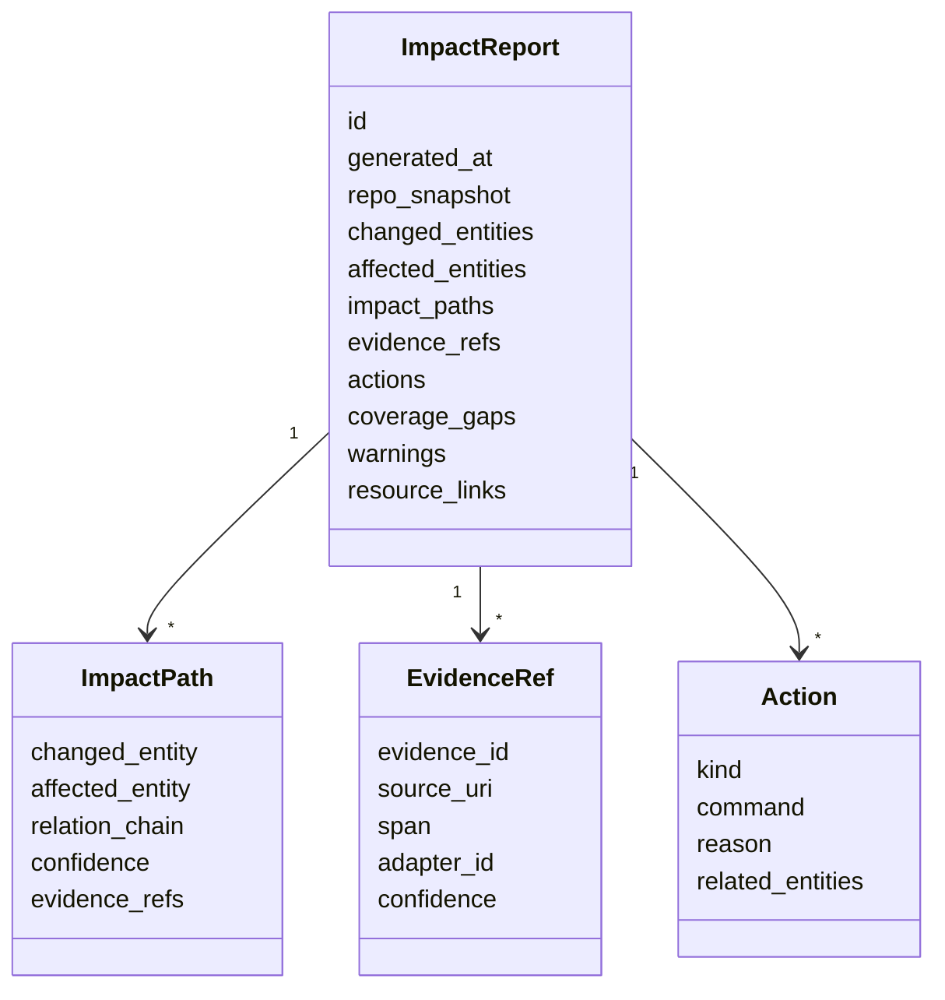
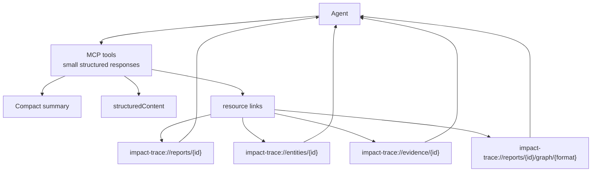
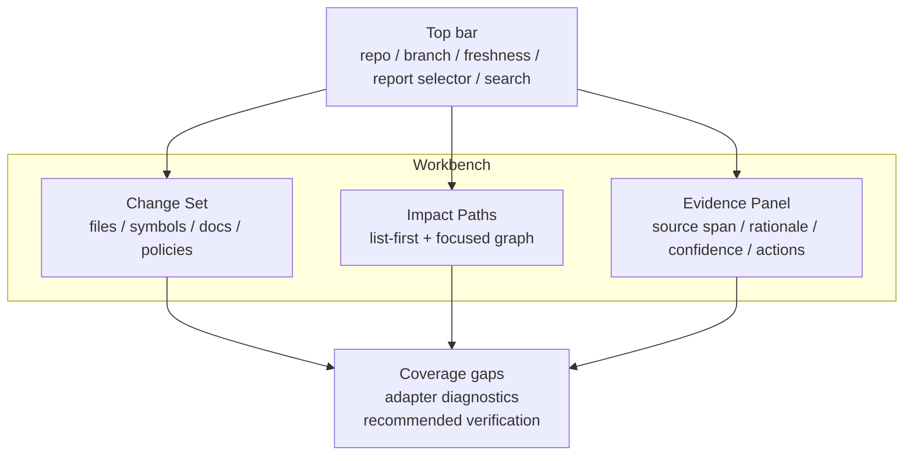
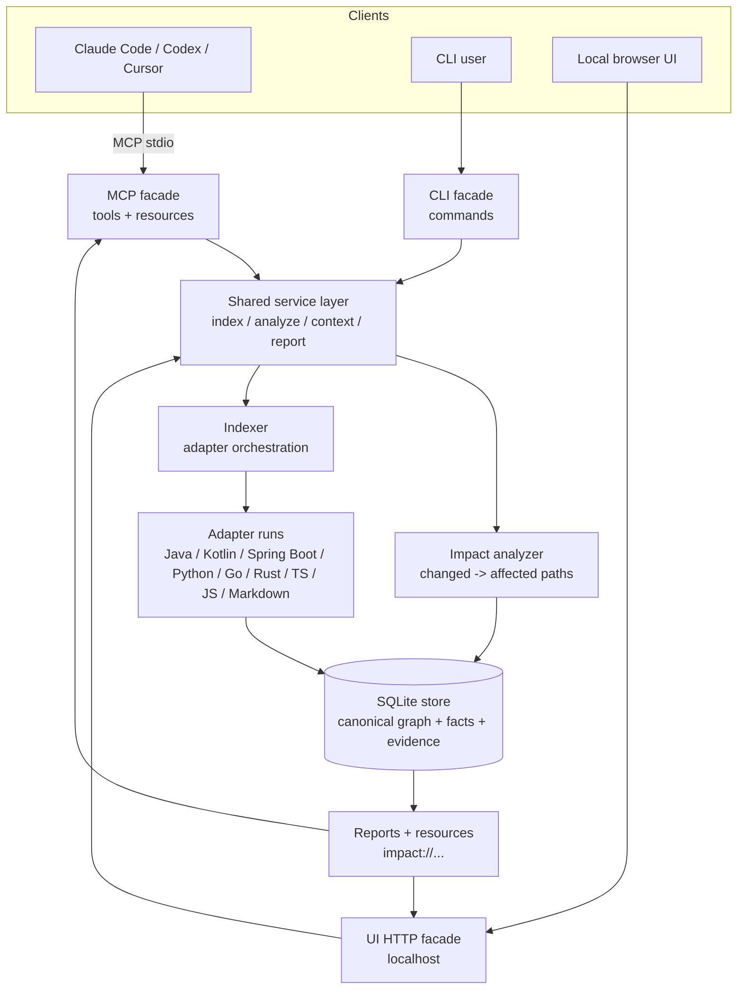
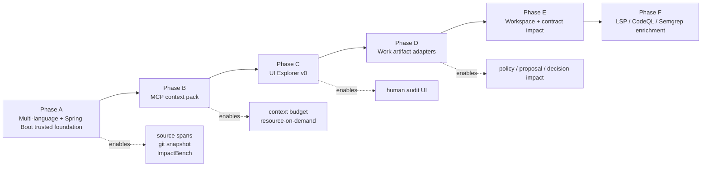

# Impact Context Layer 제품 계획서

> **작성:** 2026-05-09 (`main` @ `3cba0a2`)
> **상태:** `/autoplan` 기준 제품 계획. 기존 [vision.ko.md](vision.ko.md), [impact-trace-plan.ko.md](impact-trace-plan.ko.md), [phase6b-ts-accuracy-plan.ko.md](phase6b-ts-accuracy-plan.ko.md)를 제품 단위로 다시 정렬한다.
> **결론:** Impact-trace는 Claude/Codex 같은 CLI agent에 MCP로 붙고, 사람이 같은 관계 그래프를 UI에서 볼 수 있는 **local-first impact context layer**로 만든다.

---

## 빠른 독해 가이드

| 알고 싶은 것 | 먼저 볼 섹션 |
|---|---|
| 이 제품이 무엇인지 | 0. 제품 한 줄 |
| 왜 context를 줄이는 제품인지 | 5. Context Budget 요구사항 |
| Claude/Codex와 어떻게 붙는지 | 6. 대표 사용자 흐름, 8. MCP 계약 |
| UI가 어떤 모습이어야 하는지 | 9. UI 계획 |
| 실제 구현 순서 | 11. 구현 로드맵, 12. Post-Phase-6B MCP Context Pack Commit Plan |
| 경쟁/참조 프로젝트 | 2. GitHub 조사와 가져올 것 |

---

## 0. 제품 한 줄

Impact-trace는 코드, 문서, 정책, 제안서, 의사결정 기록을 하나의 관계 그래프로 인덱싱하고, Claude/Codex 같은 AI 코딩 agent가 코드를 수정할 때 관련 맥락과 변경 영향도를 MCP로 알려주며, 사람은 같은 결과를 UI에서 검증하게 해주는 도구다.

제품 약속은 네 가지다.

1. **AI가 쓰는 context를 줄인다.** agent가 repo를 매번 다시 읽지 않도록 precomputed graph와 compact context pack을 제공한다.
2. **Agent가 놓치는 맥락을 줄인다.** 변경 전에 관련 코드, 테스트, 정책, 문서, 제안서를 필요한 만큼만 준다.
3. **변경 영향도를 사람이 검증 가능하게 만든다.** "왜 이 파일/문서/정책이 영향받는가"를 evidence path로 보여준다.
4. **모든 근거를 로컬에 남긴다.** source of truth는 `<repo>/.impact-trace/impact.db`이고, MCP/CLI/UI는 같은 store를 읽는다.

이 문서는 제품 전체 계획이다. 바로 다음 구현 slice는 [Phase 6B Multi-language + Spring Boot Adapter Pack v0 + Trusted Evidence](phase6b-ts-accuracy-plan.ko.md)다.



---

## 1. 사용자가 실제로 원하는 것

사용자의 표현을 제품 언어로 바꾸면 다음과 같다.

| 사용자의 말 | 제품 요구사항 |
|---|---|
| Claude, Codex 같은 CLI 도구에 MCP 형태로 붙이고 싶다 | `impact-trace mcp serve`가 agent-friendly tools/resources를 제공해야 한다. |
| 코드베이스, 문서 등 연관성을 가지고 쉽게 볼 수 있는 UI도 있어야 한다 | MCP와 같은 canonical graph를 읽는 local UI explorer가 필요하다. |
| 코드 수정 시 관련 코드나 정책, 제안서를 알려줘야 한다 | diff -> changed entity -> related code/doc/policy/proposal/decision traversal이 필요하다. |
| 변경에 따른 impact를 알려주는 역할 | report가 affected entities, evidence, confidence, recommended actions를 반환해야 한다. |

따라서 이 프로젝트는 "AI가 코드를 대신 고쳐주는 도구"가 아니다. 에이전트와 사람이 같은 변경 맥락을 보게 만드는 **impact context substrate**다.

---

## 2. GitHub 조사와 가져올 것

2026-05-09 기준으로 유사한 프로젝트가 이미 있다. 결론은 "완전히 새 영역"은 아니고, **가장 가까운 경쟁/참조군이 있다**는 쪽이다. 그래서 재발명할 부분과 차별화할 부분을 분리한다.

### 2.1 가까운 프로젝트

2026-05-10에 다시 확인한 결론: 이미 "코드베이스를 MCP로 노출"하는 프로젝트는 많다. Impact-trace는 그들과 같은 category에 있지만, 가져올 것은 **검색/랭킹/그래프/decision/policy 패턴**이고, 그대로 가져오지 않을 것은 **cloud-first 운영, graph DB 필수화, agent editing surface, 라이선스 충돌 코드**다.

| 프로젝트 | 확인한 범위 | 가져올 것 | 그대로 베끼지 않을 것 |
|---|---|---|---|
| [trace-mcp](https://github.com/nikolai-vysotskyi/trace-mcp) / [listing](https://mcpservers.org/servers/nikolai-vysotskyi/trace-mcp) | `get_change_impact`, reverse dependency graph, risk score, decision memory, desktop graph explorer 방향이 Impact-trace와 가장 가깝다. | 변경 중심 framing, decision memory를 code impact와 연결하는 UX, PR comment/report automation. | 프레임워크 수 경쟁과 desktop-first 구현. Impact-trace는 먼저 evidence 신뢰도와 SQLite resource contract를 닫는다. |
| [repowise](https://github.com/repowise-dev/repowise) / [site](https://www.repowise.dev/) | dependency graph, git history, docs, architectural decisions를 4-layer로 묶고 MCP 7 tools와 dashboard를 제공한다. GitHub README 기준 AGPL-3.0 badge가 보인다. | `get_context`/`get_risk`/`get_why` 같은 task-oriented tool 설계, decision staleness, ownership/hotspot/co-change analytics, token efficiency benchmark. | AGPL 코드 복사, auto-doc product 중심성. Impact-trace의 중심은 "변경 순간의 impact report"와 "agent에게 주는 compact context pack"이다. |
| [Serena](https://github.com/oraios/serena) | MCP registry에 semantic code retrieval/editing tools로 등록되어 있고 LSP/IDE backend 방향이 강하다. | 장기 `LspAdapter`: references/definitions/implementations를 직접 재구현하지 않고 LSP 결과를 `entities`/`relations`로 정규화한다. | editing/refactoring tool surface. Impact-trace MCP는 read-only context와 recommendation부터 안정화한다. |
| [CodeGraphContext](https://github.com/CodeGraphContext/CodeGraphContext) / [docs](https://codegraphcontext.github.io/) | codebase를 queryable property graph로 변환하고 CLI/MCP가 graph slice를 제공한다. | graph slice UX, portable graph bundle/export, UI에서 focused graph만 보여주는 방식. | Kuzu/Neo4j/FalkorDB를 source of truth로 요구하는 구조. Impact-trace는 SQLite canonical store를 유지한다. |
| [zilliztech/claude-context](https://github.com/zilliztech/claude-context) | MCP `index_codebase`, `search_code`, `get_indexing_status`를 제공하고 BM25 + dense vector hybrid search, AST chunking, incremental indexing을 강조한다. | `impact_trace_search_context`의 장기 semantic lane, incremental indexing, search result ranking optimization. | Milvus/Zilliz 같은 vector DB 필수화. v0는 deterministic SQLite keyword/path/symbol/evidence search로 시작한다. |
| [Sourcegraph MCP](https://sourcegraph.com/mcp) / [docs](https://sourcegraph.com/docs/api/mcp) | Codex/Claude Code/Cursor 등 MCP-aware agent와 호환되고 keyword/semantic search, history/diff search, file read를 제공한다. docs는 result limits와 pagination을 강조한다. | result limit, pagination, file range resource, repo permissions와 MCP access control 분리. | Sourcegraph product coupling. 장기적으로는 SCIP/LSIF import adapter가 더 이식성 좋다. |
| [aider](https://github.com/Aider-AI/aider) / [repo map docs](https://aider.chat/docs/repomap.html) | repo map으로 중요한 class/function/signature만 LLM에 넣어 큰 repo context를 줄인다. | compact repo map 원리, graph ranking, token-budgeted selection. | pair programmer/auto-commit workflow. Impact-trace는 agent가 수정하기 전후 볼 impact context를 제공한다. |
| [Continue](https://github.com/continuedev/continue) | IDE assistant와 MCP/context provider 생태계, source-controlled checks 방향이 강하다. | `.impact-trace/checks/` 같은 repo-local policy/check projection. | IDE assistant 자체와 check runner를 복제하지 않는다. |
| [narsil-mcp](https://github.com/postrv/narsil-mcp) / [site](https://narsilmcp.com/) | Rust MCP server로 90 tools, 32 languages, semantic search, security scanning, call graph, SBOM, local-first를 표방한다. | CCG(Code Context Graph) 같은 portable code-intelligence export와 security/SBOM adapter ideas. | 90-tool breadth 경쟁. Impact-trace는 small tool surface + resource-on-demand로 context를 줄인다. |
| [RepoRelay](https://github.com/chwoerz/reporelay) / [docs](https://chwoerz.github.io/reporelay/reference/mcp-tools) | self-hosted code context engine, REST API + MCP tools/resources/prompts를 제공한다. | REST/MCP를 같은 service contract 위에 얹는 구조, dashboard 후보. | server stack을 초기에 필수화. v0는 CLI/MCP/SQLite 단순성을 유지한다. |
| [GraphRAG](https://github.com/microsoft/graphrag) | graph-based RAG. docs/README는 indexing cost를 경고한다. | proposal/meeting-note/PRD 같은 비정형 산출물에서 후보 entity/relation을 뽑는 실험 lane. | LLM extraction을 authoritative relation으로 저장하는 것. core relation은 parser/evidence 우선이다. |
| [Semgrep](https://github.com/semgrep/semgrep) / [Opengrep](https://github.com/opengrep/opengrep) | 여러 언어의 source-like static rule ecosystem. | `PolicyRuleAdapter`: rule 결과를 `GOVERNS`, `REQUIRES_REVIEW`, `VERIFIES` evidence로 흡수한다. | engine clone. 라이선스와 업데이트 경계를 위해 subprocess/result import adapter가 안전하다. |
| [SCIP](https://github.com/sourcegraph/scip), [LSIF](https://lsif.dev/), [Kythe](https://github.com/kythe/kythe) | language-server 수준의 definition/reference/implementation graph를 저장·교환하는 포맷/생태계. | optional import adapter. Java/Kotlin/TS/Go/Rust precision을 높이는 길. | core schema를 특정 포맷에 종속시키지 않는다. |

이번 slice에서는 위 조사에서 공통으로 보이는 `search/read only/context budget/resource link` 패턴을 작게 가져와 `impact_trace_search_context` v0로 구현한다.

### 2.2 MCP 표준에서 가져올 것

| 표준/문서 | 적용 결정 |
|---|---|
| [MCP Tools](https://modelcontextprotocol.io/specification/2025-06-18/server/tools) | tool 응답은 작게 유지하고, structured output schema를 둔다. 큰 payload는 resource link로 넘긴다. read-only annotation과 보안 경계를 명확히 한다. |
| [MCP Resources](https://modelcontextprotocol.io/specification/2025-06-18/server/resources) | report, entity, evidence, graph, policy, workspace를 URI resource로 노출한다. `impact://` custom URI를 사용한다. |
| [MCP Apps](https://modelcontextprotocol.io/extensions/apps/overview) | 장기적으로 chat 안에서 graph UI를 렌더링할 수 있다. 단, Claude/Codex CLI 호환성을 고려해 v0 UI는 local web UI로 시작한다. |

### 2.3 White Space

가장 가까운 프로젝트는 `trace-mcp`, `repowise`, `CodeGraphContext`, `claude-context`다. 모두 "코드베이스 이해 + MCP + graph/search" 방향을 이미 보여준다. Impact-trace가 이길 수 있는 자리는 다음이다.

1. **변경 순간 중심:** "repo를 이해한다"보다 "이 diff가 무엇을 깨뜨리고 무엇을 검증해야 하는가"에 집중한다.
2. **정책/제안서/의사결정까지 1급:** code graph뿐 아니라 policy, proposal, PRD, decision, customer promise를 impact path에 넣는다.
3. **agent와 사람이 같은 evidence를 본다:** MCP response와 UI가 같은 report/resource contract를 공유한다.
4. **AI context 절감이 1급 목표:** 반복 파일 읽기, grep, repo 재탐색을 precomputed graph lookup과 resource-on-demand로 대체한다.
5. **read-only 신뢰 레이어:** agent가 코드를 고치는 기능보다, agent가 고치기 전후 알아야 할 맥락을 정확히 주는 기능을 먼저 신뢰시킨다.
6. **local-first SQLite source of truth:** graph DB, cloud, daemon 없이 작동하고, projection은 뒤에 붙인다.

---

## 3. 제품 원칙

| 원칙 | 의미 |
|---|---|
| Evidence first | 모든 relation과 impact conclusion은 evidence id, location, adapter, confidence를 가진다. |
| Context budget first | agent에게 전체 파일을 던지기보다 ranked summary, resource link, progressive disclosure를 기본값으로 둔다. |
| Agent-first, human-auditable | agent가 읽기 쉬운 compact context와 사람이 검증할 UI를 같은 report에서 만든다. |
| Local-first | repo 정보, 문서, 정책, 고객 자료를 외부로 보내지 않는다. 기본은 SQLite다. |
| Read-only before action | MCP는 분석과 추천만 제공한다. command 실행, file write, auto-fix는 별도 제품 단계다. |
| Projection, not source | UI, graph DB, IDE plugin은 canonical SQLite graph의 projection이다. |
| No silent certainty | 모르는 것은 coverage gap, unsupported adapter, unknown confidence로 노출한다. |
| Adapter-driven growth | Java/Kotlin/Spring Boot/Python/Go/Rust/TS/JS parser, LSP, CodeQL, Semgrep, docs parser는 adapter로 붙인다. core store contract를 흔들지 않는다. |

---

## 4. 제품 Surface

| Surface | v0 역할 | v1 역할 |
|---|---|---|
| **MCP server** | `impact_trace_analyze_diff`, report/entity/graph resources | context pack, explain entity, evidence/resource pagination, policy/proposal impact |
| **CLI** | init/index/analyze/graph/export/remember/recall | UI server launch, bench, workspace indexing, contract impact |
| **UI explorer** | 저장된 report/graph를 읽는 read-only local web UI | live filter, entity drill-down, coverage gap, policy/proposal impact path |
| **SQLite store** | canonical entities/relations/evidence/facts | workspace/cross-repo/contracts/work artifacts까지 확장 |
| **Optional MCP App** | 비범위 | host가 지원할 때 chat 안에서 impact graph를 렌더링 |

첫 UI는 landing page가 아니다. 사용자가 `impact-trace ui`를 열면 바로 "현재 repo의 index 상태와 최근 impact report"를 본다.

---

## 5. Context Budget 요구사항

이 제품의 중요한 목적은 AI context 사용량을 줄이는 것이다. agent가 매번 repo를 grep하고 파일을 수십 개 읽는 대신, Impact-trace가 미리 만든 graph에서 필요한 조각만 꺼내준다.



### 5.1 Context를 줄이는 방식

| 방식 | 설명 |
|---|---|
| Precomputed graph | index 단계에서 파일/심볼/문서/정책 relation을 계산해 둔다. agent turn마다 재탐색하지 않는다. |
| Compact context pack | MCP tool은 기본적으로 요약, top impact paths, evidence refs만 반환한다. 전체 파일 내용은 주지 않는다. |
| Resource-on-demand | 큰 report, source span, graph는 `impact://...` resource로 두고 agent가 필요할 때만 fetch한다. |
| Ranked retrieval | changed entity와 query에 가까운 것부터 top-k로 제한한다. |
| Deduped evidence | 같은 파일/문서가 여러 path에 반복돼도 한 번만 보낸다. |
| Progressive disclosure | `brief`, `standard`, `deep` budget을 두고 기본은 `standard`로 둔다. |
| Session reuse | 이전 report/context pack id를 재사용해 같은 질문에서 반복 payload를 보내지 않는다. |

### 5.2 Context pack budget

정확한 token 수는 model/tokenizer마다 다르므로 내부 기준은 byte/section/entity count로 둔다.

| Budget | 기본 제한 | 용도 |
|---|---:|---|
| `brief` | summary 5줄, impact path 5개, evidence ref만 | agent가 작업 시작 전 빠르게 방향 잡기 |
| `standard` | summary 10줄, impact path 15개, short rationale 포함 | 기본 MCP 응답 |
| `deep` | path 50개, selected snippets 포함 | 사용자가 "더 자세히" 요청했을 때 |

MCP tool 기본값은 `standard`다. UI는 같은 report에서 더 많은 내용을 보여줄 수 있지만, MCP로 agent에게 보내는 payload는 제한한다.

### 5.3 측정 지표

| Metric | 목표 |
|---|---|
| `context_pack_bytes` | 기본 응답 크기를 안정적으로 제한한다. |
| `resource_fetch_count` | agent가 실제로 추가 evidence를 얼마나 읽었는지 본다. |
| `deduped_entities` | 반복 context 제거량을 측정한다. |
| `agent_file_reads_avoided` | benchmark fixture에서 기존 탐색 대비 줄어든 파일 read 추정치를 기록한다. |
| `impact_recall_at_budget` | context를 줄여도 필요한 affected entity를 놓치지 않는지 측정한다. |

Context 절감은 "짧게 대답하기"가 아니다. **필요한 정보를 빠뜨리지 않으면서 불필요한 파일 덤프와 반복 탐색을 없애는 것**이다.

### 5.4 Context pack 모양

MCP tool은 기본적으로 "요약 + top impact paths + evidence refs + next actions"만 보낸다.

```text
ContextPack
  budget: brief | standard | deep
  summary[]
  changed_entity_hints[]
  top_impact_paths[]
  evidence_refs[]
  recommended_actions[]
  omitted_counts
  resource_links[]
```

`omitted_counts`는 context를 줄이면서 무엇을 생략했는지 숨기지 않기 위한 필드다. agent가 더 필요하다고 판단하면 resource link를 통해 evidence나 graph를 추가로 읽는다.

---

## 6. 대표 사용자 흐름



### 6.1 Agent pre-change context injection

1. 사용자가 Claude/Codex에 "auth session 로직 고쳐줘"라고 요청한다.
2. agent가 MCP tool `impact_trace_context_for_change`를 호출한다.
3. Impact-trace는 query/file hint를 changed entity 후보로 바꾼다.
4. 관련 코드, tests, docs, policies, proposals, decisions를 budget에 맞춘 top-k context pack으로 반환한다.
5. agent는 수정 전에 영향을 받는 surface와 검증 명령을 알고 작업한다.
6. agent가 더 필요한 경우에만 `impact-trace://evidence/{id}` 또는 `impact-trace://entities/{id}`를 fetch한다.

### 6.2 Agent post-change impact report

1. agent가 코드를 수정한다.
2. agent 또는 사용자가 `impact_trace_analyze_git_diff`를 호출한다.
3. Impact-trace는 git diff를 entity graph에 매핑한다.
4. affected entity, confidence, evidence, recommended actions를 반환한다.
5. 큰 graph와 evidence는 `impact-trace://reports/{id}`, `impact-trace://evidence/{id}`, `impact-trace://reports/{id}/graph/{format}`로 넘긴다.

### 6.3 Human UI impact exploration

1. 사용자가 `impact-trace ui`를 실행한다.
2. UI는 최근 report 또는 현재 diff report를 연다.
3. 화면은 `Changed -> Affected -> Evidence -> Action` 흐름을 기본으로 보여준다.
4. 사용자는 relation kind, confidence, artifact kind, adapter, repo, owner로 필터링한다.
5. reviewer는 "이 정책/제안서/테스트를 봐야 하는 이유"를 evidence panel에서 확인한다.

### 6.4 Policy/proposal trace

1. repo에 `docs/proposals/payment-retry.md`, `policies/security-auth.md`, `docs/decisions/auth-session.md`가 있다.
2. 문서 adapter가 policy/proposal/decision entity를 만들고 code/doc relation을 추출한다.
3. auth 코드를 바꾸면 impact report가 관련 policy와 decision을 함께 보여준다.
4. agent는 "이 변경은 auth session 정책을 건드리므로 보안 리뷰 필요" 같은 action을 받는다.

### 6.5 Cross-repo contract impact

1. producer repo의 OpenAPI/protobuf/GraphQL schema가 바뀐다.
2. workspace catalog가 consumer repo와 generated client relation을 알고 있다.
3. contract adapter가 breaking-change 후보를 만든다.
4. report는 downstream repo, owner, affected tests, migration docs를 함께 반환한다.

---

## 7. Canonical Data Model



### 7.1 Entity kinds

| 그룹 | Entity kind |
|---|---|
| Code | `file`, `symbol`, `module`, `package`, `test`, `build_target` |
| Runtime/system | `config`, `workflow`, `job`, `resource`, `script`, `command` |
| Contract | `endpoint`, `contract`, `event`, `schema`, `client`, `consumer` |
| Governance | `policy`, `owner`, `rule`, `permission`, `review_requirement` |
| Work artifact | `proposal`, `prd`, `requirement`, `decision`, `meeting_note`, `metric`, `customer_artifact`, `task` |
| External | `external_service`, `external_api`, `unmanaged_repo` |

### 7.2 Relation kinds

| Relation | 의미 |
|---|---|
| `DECLARES` | file/module이 symbol/entity를 선언한다. |
| `DEPENDS_ON` | 한 entity가 다른 entity를 필요로 한다. |
| `CALLS` | code/script/command가 다른 callable을 호출한다. |
| `REFERENCES` | symbol, config key, doc anchor, resource name을 참조한다. |
| `VERIFIES` | test/CI/checklist가 entity를 검증한다. |
| `DOCUMENTS` | 문서가 entity를 설명한다. |
| `GOVERNS` | policy/rule/owner가 변경 조건을 정한다. |
| `PROPOSES` | proposal/PRD가 구현해야 할 변경을 제안한다. |
| `REQUIRES` | requirement가 code/contract/test를 요구한다. |
| `IMPLEMENTS` | code가 requirement/contract를 구현한다. |
| `CONSUMES` | consumer/client/service가 contract/event를 사용한다. |
| `PRODUCES` | producer/service가 contract/event/artifact를 만든다. |
| `SUPERCEDES` | 새 결정/문서가 기존 결정을 대체한다. |
| `AFFECTS` | analyzer가 report 안에서 계산한 derived impact relation이다. |

### 7.3 Evidence packet

모든 evidence는 최소한 다음을 가진다.

| 필드 | 설명 |
|---|---|
| `evidence_id` | stable redacted id |
| `entity_id` / `relation_id` | 어떤 결론을 뒷받침하는지 |
| `source_uri` | repo-relative path, `impact://`, `git://`, 또는 외부 resource URI |
| `span` | start/end line/col. 없으면 whole-file 또는 generated evidence로 명시 |
| `adapter_id` / `adapter_run_id` | 어떤 adapter가 만들었는지 |
| `confidence` | `proven`, `inferred`, `heuristic`, `unknown` |
| `rationale` | 짧은 설명. secret redaction 후 저장 |
| `snapshot` | index run id, git commit, branch, dirty state |

### 7.4 Report contract

`ImpactReport`는 UI와 MCP가 같이 쓰는 contract다.



핵심은 `impact_paths[]`다. UI graph와 MCP compact text는 같은 path를 다른 형태로 렌더링한다.

---

## 8. MCP 계약



### 8.1 Tools

| Tool | 목적 | 반환 |
|---|---|---|
| `impact_trace_analyze_git_diff` | `base/head` 또는 현재 worktree diff를 분석 | compact summary, top affected, actions, report resource URI |
| `impact_trace_context_for_change` | agent가 작업 전에 query/path/symbol 기준 context를 요청 | relevant code/docs/policies/proposals/decisions context pack |
| `impact_trace_explain_entity` | entity 하나의 relation/evidence를 설명 | entity summary, incoming/outgoing direct relations, compact evidence, resource links. v0 기본값은 `relationLimit=20` per direction, `evidenceLimit=10` global, `snippetChars=300` |
| `impact_trace_search_context` | keyword/path/symbol/relation/evidence 기반 graph search. v0 landed: deterministic SQLite search, `k=10`, `includeEvidence=true`, `snippetChars=240` | ranked entities, match reasons, compact evidence, entity/evidence resource links |
| `impact_trace_get_graph` | report/entity 주변 graph metadata 요청 | paginated graph resource URI |
| `impact_trace_action_plan` | report 기준 검증 action 생성 | tests/docs/review/security actions, 실행은 하지 않음 |

MVP의 기존 `impact_trace_analyze_diff`는 유지하고, 새 tool은 호환 layer를 두고 점진 추가한다.

### 8.2 Resources

| Resource URI | 내용 |
|---|---|
| `impact-trace://reports/{report_id}` | versioned report JSON |
| `impact-trace://entities/{entity_id}` | entity profile, versions, static/dynamic facts |
| `impact-trace://evidence/{evidence_id}` | redacted evidence detail |
| `impact-trace://reports/{report_id}/graph/{format}` | paginated graph nodes/edges |
| `impact://policy/{entity_id}` | policy/rule impact detail |
| `impact://workspace/{workspace_id}` | workspace repos/contracts/services |
| `impact-trace://coverage/latest` | last index coverage and adapter gaps |

### 8.3 Response shape

Tool 응답은 항상 작다.

```text
summary: 사람이 읽는 5-15줄
structuredContent: machine-readable JSON
resource_links: 큰 report/evidence/graph URI
warnings: stale index, dirty repo, unsupported adapter, redaction notice
next_actions: 실행하지 않는 추천 command/action
```

보안 경계:

- MCP tool은 repo 밖 path를 읽지 않는다.
- 기본 tool은 read-only다.
- command execution은 하지 않는다.
- 문서/정책 내용은 prompt injection 가능 input으로 취급하고, agent에게 "instruction"이 아니라 "evidence"로 전달한다.
- future write/action tool은 별도 ADR과 explicit user confirmation 전에는 만들지 않는다.

---

## 9. UI 계획

### 9.1 UI의 역할

UI는 graph hairball을 보여주는 장난감이 아니다. 변경 검토자가 빠르게 답해야 하는 질문에 답한다.

1. 무엇이 바뀌었나?
2. 무엇이 영향받나?
3. 왜 그렇게 판단했나?
4. 어떤 테스트/문서/리뷰가 필요한가?
5. 어디가 coverage gap인가?

### 9.2 첫 화면

`impact-trace ui`를 열면 바로 Workbench가 보인다.



기본 view는 graph보다 list-first다. graph는 선택한 impact path를 설명하는 보조 시각화로 둔다. 큰 graph를 한 번에 보여주면 사용자는 판단하지 못한다.

### 9.3 Core screens

| Screen | 목적 |
|---|---|
| Project Dashboard | index freshness, coverage, adapter status, recent reports |
| Change Impact Report | changed/affected/path/evidence/action 검토 |
| Entity Explorer | entity 하나의 incoming/outgoing relation, facts, history |
| Evidence Viewer | source span, redacted snippet, adapter diagnostics |
| Coverage Gaps | unsupported language, skipped file, parse error, stale index |
| Settings/Connectors | workspace paths, adapter toggles, redaction policy |

### 9.4 필터와 상호작용

| Control | 이유 |
|---|---|
| Relation kind filter | `DEPENDS_ON`, `VERIFIES`, `GOVERNS`, `PROPOSES`를 나눠 본다. |
| Artifact kind filter | code/doc/policy/proposal/decision/test를 분리한다. |
| Confidence filter | `proven`만 보거나 `heuristic`까지 확장한다. |
| Adapter filter | Spring Boot adapter, TS/JS adapter, Markdown adapter, Semgrep adapter 등 출처를 확인한다. |
| Depth slider | changed entity에서 몇 hop까지 볼지 제한한다. |
| Owner/repo filter | multi-repo와 CODEOWNERS 연결 시 필요하다. |

### 9.5 필수 상태

| 상태 | UI 반응 |
|---|---|
| No repo initialized | `impact-trace init` 안내, 자동 실행 버튼은 만들지 않는다. |
| No index | index 필요 상태와 예상 command 표시 |
| Index stale | 현재 git snapshot과 index snapshot 차이 표시 |
| Indexing failed partially | completed adapter와 failed adapter를 나눠 표시 |
| No diff | report selector와 manual entity search 제공 |
| Huge graph | top paths 먼저, graph는 pagination/depth 제한 |
| Redacted evidence | redaction 이유와 raw 값 미표시 |
| Unsupported file | coverage gap으로 표시하고 confidence 낮춤 |

### 9.6 UI 기술 결정

첫 UI는 local web UI다.

- CLI command: `impact-trace ui [--report <id>] [--port <n>]`
- backend: existing service layer + read-only HTTP on localhost
- frontend: React 또는 repo가 채택한 최소 TS stack
- data: MCP resource contract와 같은 shape를 사용
- e2e: Playwright screenshot + accessibility smoke

MCP App은 v1.5 이후 옵션이다. 이유는 Claude/Codex CLI가 항상 interactive iframe host가 아니기 때문이다.

---

## 10. 아키텍처



핵심 결정:

1. MCP/CLI/UI는 서로 별도 구현이 아니라 같은 service layer를 호출한다.
2. UI가 별도 DB나 graph projection을 source로 삼지 않는다.
3. Analyzer는 저장된 relation을 우선 사용하고, LLM 추론은 core evidence가 아니라 enrichment로 둔다.
4. Adapter 실패는 전체 index 실패가 아니라 coverage gap으로 남긴다.
5. 모든 report는 snapshot id를 가진다.

---

## 11. 구현 로드맵



### Phase A: Multi-language + Spring Boot trusted foundation

현재 [Phase 6B](phase6b-ts-accuracy-plan.ko.md).

| 포함 | 완료 기준 |
|---|---|
| Java/Kotlin/Spring Boot/Python/Go/Rust/TS/JS adapter v0 | 각 언어의 선언/import/test relation이 regex보다 정확 |
| Spring Boot adapter v0 | endpoint/config/persistence/test/client relation을 first-class로 노출 |
| source span persistence | report/MCP evidence가 line/col range를 노출 |
| git snapshot metadata | stale index warning이 commit/branch/dirty state 기준 |
| thin ImpactBench | `npm run bench` deterministic JSON 생성 |

비범위: UI 본구현, full call graph, workspace resolver.

### Phase B: MCP Context Pack

| 포함 | 완료 기준 |
|---|---|
| `impact_trace_context_for_change` | agent가 작업 전 compact context를 받음 |
| context budget options | `brief`/`standard`/`deep` budget이 tool schema에 포함됨 |
| context dedupe and ranking | 반복 file/doc payload 없이 top impact paths 우선 반환 |
| `impact_trace_search_context` | keyword/path/symbol/relation/evidence 검색으로 ranked entities와 resource link를 반환. v0 landed: deterministic SQLite search, `k=10`, `includeEvidence=true`, entity/evidence resource-on-demand |
| `impact_trace_explain_entity` | entity 주변 relation/evidence resource 제공. v0 landed: incoming/outgoing direct relation을 direction별 cap으로 반환하고 evidence는 선택된 relation 전체에서 global cap을 적용 |
| `impact-trace://evidence/{id}` | source span과 redacted snippet fetch 가능. v0 landed: context pack evidence id에서 resource-on-demand로 읽는다. |
| `impact-trace://reports/{id}/graph/{format}` pagination | 큰 graph를 tool payload에 넣지 않음 |
| typed error envelope | problem/cause/fix/evidence id 구조화 |

이 단계가 UI보다 먼저 오면 UI가 같은 resource contract를 재사용할 수 있다.

### Phase C: UI Explorer v0

| 포함 | 완료 기준 |
|---|---|
| `impact-trace ui` | local web UI 실행 |
| report workbench | changed/affected/evidence/action list 검토 |
| focused graph | 선택한 path 중심 graph 렌더 |
| coverage gap view | adapter/skipped/stale 상태 표시 |
| Playwright QA | desktop/mobile screenshot에서 nonblank, overflow 없음 |

비범위: cloud dashboard, auth, team sharing, graph DB 필수화.

### Phase D: Work Artifact Adapters

| 포함 | 완료 기준 |
|---|---|
| Markdown proposal/PRD parser | headings/frontmatter/links/code refs 추출 |
| policy adapter | CODEOWNERS, security policy, rule files를 `GOVERNS`로 연결 |
| decision adapter | ADR/meeting decision을 `decision` entity로 연결 |
| document freshness | governed code 변경 시 stale doc/decision 후보 표시 |

이 단계에서 사용자가 말한 "정책, 제안서"가 first-class가 된다.

### Phase E: Workspace and Contract Impact

| 포함 | 완료 기준 |
|---|---|
| workspace catalog | 여러 repo/service local path 등록 |
| OpenAPI/protobuf/GraphQL adapter | producer/consumer relation 추출 |
| breaking-change classifier | contract diff가 downstream risk를 생성 |
| UI owner/repo filter | cross-repo impact를 사람이 추적 |

### Phase F: Enrichment Adapters

| Adapter | 목적 |
|---|---|
| LSP | multi-language symbol/reference lookup |
| CodeQL | security/data-flow enrichment |
| Semgrep | policy/rule-based `GOVERNS`/risk relation |
| GraphRAG-style docs extraction | 비정형 문서에서 candidate relation 제안 |

이 단계의 원칙은 "신뢰 가능한 adapter를 붙인다"이지 "core를 복잡하게 만든다"가 아니다.

---

## 12. Post-Phase-6B MCP Context Pack Commit Plan

Phase 6B가 끝난 뒤 바로 이어갈 수 있는 **Phase B(MCP context pack) 작업**의 commit 단위다.

1. `feat(mcp): add context-for-change tool contract`
   - query/path/symbol input schema
   - `budget: brief|standard|deep` option
   - compact context pack output schema
   - stale/coverage warnings
   - 현재 v0 landed: `changedFiles` input으로 시작하고, entity/coverage resource link만 반환한다. query/path/symbol resolver와 persisted context pack id는 다음 slice로 둔다.

2. `feat(context): rank and dedupe context packs`
   - changed entity proximity scoring
   - repeated entity/evidence collapse
   - payload byte cap and truncation warnings
   - 현재 v0 landed: affected/evidence top-k, snippet cap, omitted counts, confidence/depth/path priority 기반 thin ranking.

3. `feat(mcp): add explain-entity resource flow`
   - entity profile service 재사용
   - incoming/outgoing relation pagination
   - evidence link 포함
   - 현재 v0 landed: `relationLimit=20` per direction, `evidenceLimit=10` global, `snippetChars=300` compact payload와 evidence resource link를 반환한다.

4. `feat(resources): add evidence and graph pagination`
   - `impact-trace://evidence/{id}`
   - `impact-trace://reports/{report_id}/graph/{format}?cursor=...`
   - huge graph guard

5. `feat(reports): persist context packs`
   - report id와 snapshot id 연결
   - context pack id로 같은 payload 재전송 방지
   - UI 재사용 가능한 JSON contract

6. `test(mcp): cover context pack and resource links`
   - MCP wire tests
   - budget별 payload cap
   - path validation
   - read-only mutation 0

7. `docs: document agent integration recipes`
   - Claude Code/Codex setup
   - "before change"와 "after change" 프롬프트 패턴

8. `feat(ui): add local report workbench`
   - `impact-trace ui`
   - report selector
   - changed/affected/evidence/action panels

9. `test(ui): add Playwright smoke for workbench`
   - nonblank
   - viewport overflow
   - stale/no-index/error states

---

## 13. 테스트와 품질 게이트

### 13.1 기본 게이트

| Command | 목적 |
|---|---|
| `npm run check` | type/lint/build equivalent |
| `npm test` | unit/integration/MCP regression |
| `npm run docs:lint` | git tracked Markdown 파일의 local metadata와 secret-like content 점검 |
| `npm audit --audit-level=high` | release 전 high severity 확인 |
| `npm run bench` | Phase 6B 이후 multi-language/Spring Boot accuracy fixture |

### 13.2 Fixture matrix

| Fixture | 검증 |
|---|---|
| TS/JS advanced imports | re-export, path alias, type-only import, dynamic import |
| Spring Boot app | `@RestController`, mapping annotations, service/repository/config/test/client relation |
| Java/Kotlin/Python/Go/Rust basics | declarations, imports, tests, module/package relation |
| Mixed docs repo | code/doc/policy/proposal/decision relation |
| Redaction repo | secret-like text가 SQLite/MCP/UI 어디에도 raw leak 없음 |
| Stale index repo | commit/dirty mismatch warning |
| Huge graph repo | pagination/depth/fanout guard |
| Workspace repo | producer/consumer contract impact |
| Prompt injection docs | 문서 내 instruction이 agent instruction으로 승격되지 않음 |
| Context budget repo | `brief`/`standard`/`deep` payload cap과 impact recall |

### 13.3 UI QA

UI가 들어오면 완료 전에 반드시 확인한다.

- desktop 1440px screenshot
- mobile 390px screenshot
- focused graph nonblank pixel check
- text overflow/overlap check
- keyboard navigation smoke
- empty/error/stale/partial states screenshot

---

## 14. 보안과 신뢰 경계

| 위험 | 대응 |
|---|---|
| repo path escape | repo root containment, symlink escape test |
| secret leak | redact-before-store, redact-before-MCP, redact-before-UI |
| prompt injection from docs | docs/policies/proposals는 evidence로만 취급, instruction으로 전달 금지 |
| stale index | git snapshot metadata와 UI/MCP warning |
| false confidence | confidence enum, coverage gaps, adapter attribution |
| MCP mutation risk | read-only tools first, future write tools는 별도 ADR |
| unbounded graph | depth/fanout/page size limit |
| third-party tool drift | LSP/CodeQL/Semgrep adapter는 optional enrichment |

---

## 15. 실패 모드 Registry

| 실패 모드 | 사용자에게 보이는 문제 | 우선 대응 |
|---|---|---|
| relation이 틀림 | agent가 엉뚱한 파일/문서를 본다 | source span + adapter attribution + confidence 표시 |
| relation이 없음 | 영향받는 테스트/정책을 놓친다 | coverage gap과 unsupported adapter 표시 |
| UI가 graph만 보여줌 | 사용자가 판단하지 못한다 | list-first impact path, focused graph |
| MCP payload가 너무 큼 | agent context가 오염된다 | compact summary + resource links |
| context를 줄이다가 중요한 근거 누락 | agent가 잘못된 수정 방향으로 간다 | `impact_recall_at_budget` benchmark와 coverage warning |
| 문서가 agent를 조종 | 악성 instruction이 실행된다 | evidence-only framing, redaction, prompt boundary |
| index가 오래됨 | 이전 commit 기준 report를 믿는다 | snapshot warning, re-index action recommendation |
| 경쟁 프로젝트와 차별 없음 | "또 하나의 code graph MCP"가 된다 | 정책/제안서/decision impact와 report UX에 집중 |

---

## 16. Autoplan Decision Audit Trail

| # | 결정 | 분류 | 원칙 | 이유 | 거부한 대안 |
|---|---|---|---|---|---|
| D1 | 제품을 "impact context layer"로 정의 | Mechanical | 명확성 | 사용자가 MCP + UI + 관련 코드/문서/정책 impact를 원한다고 설명했다. | 단순 code graph tool |
| D2 | source of truth를 SQLite로 유지 | Mechanical | local-first | 기존 ADR과 구현이 모두 SQLite 중심이고, 민감 repo에 cloud/graph DB 필수화는 부담이 크다. | Neo4j/hosted DB first |
| D3 | Phase 6B를 즉시 다음 slice로 유지 | Mechanical | 신뢰 우선 | UI/MCP가 좋아도 실제 stack evidence가 부정확하면 제품 신뢰가 없다. | UI부터 크게 만들기 |
| D4 | MCP resource contract를 UI보다 먼저 안정화 | Taste | 재사용 | UI가 MCP와 같은 report/resource shape를 쓰면 중복 API가 줄어든다. | UI 전용 API 먼저 |
| D5 | 첫 UI는 local web UI | Taste | 호환성 | Claude/Codex CLI가 항상 MCP Apps host가 아니므로 가장 넓게 작동한다. | MCP Apps first |
| D6 | trace-mcp/repowise를 경쟁 겸 reference로 본다 | Mechanical | search before building | 같은 문제를 이미 푸는 프로젝트가 있어 제품 차별점을 명시해야 한다. | 유사 프로젝트 없음으로 가정 |
| D7 | LSP/CodeQL/Semgrep은 enrichment adapter로 둔다 | Mechanical | explicit over clever | core parser를 끝없이 직접 구현하기보다 검증된 도구를 선택적으로 붙인다. | 모든 semantic 분석 직접 구현 |
| D8 | agent write/action tool은 비범위 | Mechanical | 보안 | 현재 사용자의 핵심 요구는 context와 impact이며, write tool은 신뢰 경계가 다르다. | MCP auto-fix tool |
| D9 | context 절감을 제품 목표로 승격 | Mechanical | 사용자 요구 반영 | 사용자가 AI에 쓰이는 context를 줄이고 싶다고 명시했다. 이 목표는 MCP response shape와 benchmark에 직접 반영되어야 한다. | 단순히 더 많은 context 제공 |

---

## 17. 아직 열어둘 질문

이 질문들은 지금 구현을 막지 않는다. Phase B/C 진입 전에 다시 결정한다.

| 질문 | 추천 기본값 |
|---|---|
| UI를 MCP Apps로 먼저 만들 것인가, local web UI로 먼저 만들 것인가 | local web UI first |
| 첫 문서 adapter는 Markdown repo docs인가, Notion/Google Docs connector인가 | repo-local Markdown first |
| policy adapter의 첫 입력은 CODEOWNERS인가, Semgrep/Rego인가 | CODEOWNERS + Markdown policy first |
| graph 렌더링은 custom SVG/Canvas인가, 기존 graph lib인가 | 기존 graph lib, focused graph만 |
| work artifact relation은 LLM extraction을 쓸 것인가 | v0는 deterministic links/frontmatter/mentions, LLM은 suggestion-only |

---

## 18. 바로 다음 액션

1. Phase 6B를 이어서 Java/Kotlin/Spring Boot/Python/Go/Rust/TypeScript/JavaScript 변경 영향 답변의 신뢰도를 올린다.
2. 이미 들어간 `impact_trace_context_for_change` v0의 `brief`/`standard`/`deep` budget, dedupe/ranking, omitted counts를 실제 agent loop에서 검증한다.
3. 이미 들어간 `impact-trace://evidence/{id}`를 실제 agent loop에서 검증하고, `impact-trace://reports/{id}/graph/{format}` pagination으로 큰 graph payload를 필요할 때만 읽게 만든다.
4. 그 resource contract를 그대로 읽는 `impact-trace ui` workbench v0를 만든다.
5. Markdown policy/proposal/decision adapter를 붙여 사용자가 말한 "정책, 제안서 impact"를 실제 report에 넣는다.
6. workspace/contract resolver는 단일 repo + 문서 impact가 작동한 뒤 확장한다.

이 순서가 가장 짧은 검증 경로다. "멋진 UI"보다 "agent와 사람이 같은 근거를 믿고 보는 report"가 먼저다.
