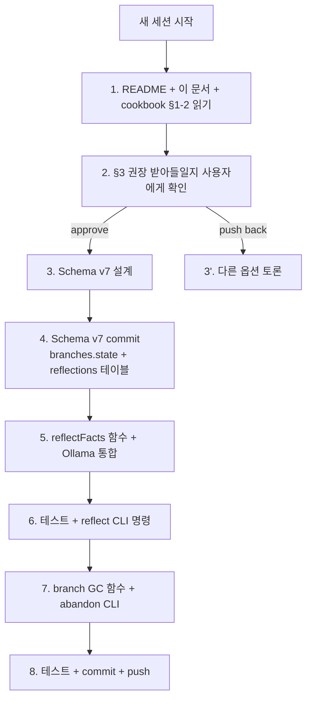

# Phase 3 Handoff — Reflective Consolidation + Speculative GC

> **목적:** 이 문서는 *새 세션*에서 Phase 3를 시작하는 Claude/Codex/사람이 *지금까지 무엇이 있고 어디서 시작할지* 5분 만에 파악할 수 있게 합니다.
> **작성:** 2026-04-29 세션 종료 시점 (Phase 1+2 완성 직후)
> **참고:** [agent-db-exploration.ko.md](agent-db-exploration.ko.md) (큰 그림) · [agent-memory-cookbook.ko.md](agent-memory-cookbook.ko.md) (사용 가이드) · [indexing-model.ko.md](indexing-model.ko.md) (스키마 전체)

---

## 1. 현재 위치 — 한 페이지 요약

**19 commits push됨. 43 tests passing. Phase 1 + Phase 2 모두 완성.**

### 작동하는 것

- **Schema v6 SQLite single .db file**: facts (content-addressable), transactions (DAG via transaction_parents), branches (head pointer + parent_branch), fact_provenance (causal chain), fact_embeddings (model-agnostic), attribute_defs (typed registry).
- **MCP tools (5개):** `impact_trace_analyze_diff` (read-only, 코드 영향도), `impact_trace_remember`, `impact_trace_recall`, `impact_trace_branch`, `impact_trace_merge`, `impact_trace_trace`.
- **CLI 명령 (12개):** `init`, `index`, `analyze`, `graph`, `mcp serve`, `remember`, `retract`, `recall`, `branch`, `merge`, `trace`, `reembed`.
- **Recall 모드:**
  - 구조 필터 (entity/attribute/branch)
  - `--as-of-tx` 시간여행 (recursive CTE walks transaction_parents DAG)
  - `--current-only` retract 자동 dedup (window function)
  - `--query --semantic` 의미 검색 (transformers.js + int8 dot product)
- **Embedding pipeline:** `@huggingface/transformers` ONNX in-process. 기본 `Xenova/multilingual-e5-base` (768-dim, 한국어 OK). `IMPACT_TRACE_EMBEDDING_MODEL` env로 swap. `impact-trace reembed [--model X] [--all]`로 일괄 재계산.
- **Indexer 듀얼라이트:** 모든 코드 관계(imports/declares/verifies/...)가 `relations` + `facts` + `evidence_snippet` fact + `fact_provenance` edge로 동시 저장.
- **보안:** redact-then-embed 게이트 — secret 패턴 facts는 `[REDACTED]` 저장 + 임베딩 row 생성 안 함 (zero-row 정책).

### 작동하지 *않는* / Phase 3로 넘긴 것

- **Reflective consolidation:** 오래된 episodic facts를 LLM이 자동 요약해 semantic 계층으로 승격. *없음*.
- **Speculative branch GC:** 버려진(abandoned) branch의 fact/tx 정리. *없음*.
- 추가로 사실상 thin spot 두 개:
  - sqlite-vec virtual table ANN 인덱스 (10M+ facts에서 brute-force 한계 만나면 필요). *수요 기반 — Phase 3 범위 밖*.
  - Reembed cleanup 옵션 (구모델 row drop). *Phase 3 범위 밖, 별도 follow-up*.

---

## 2. Phase 3 목표 — 무엇을 만드는가

### B1. Reflective Consolidation

agent의 **episodic memory가 무한정 쌓이는 문제**를 해결. 사람의 hippocampus → cortex 이전과 동형:

- **수면(sleep) consolidation**: 하루치 raw episode들을 *주제·인물·entity별로 묶어 요약* → semantic memory로 승격.
- 본 시스템에선: 오래된 facts (예: 30일 이상 안 본 entity의 facts)를 LLM이 *요약 fact*로 만들고, *원본 facts는 그대로 둔 채* `summary_of` provenance edge로 연결. 또는 — *원본을 retract*하고 요약만 남기는 더 공격적 정책.

**참고 문헌:**
- Park et al. 2023 *Generative Agents* (Stanford) — periodic reflection mechanism, importance score
- Letta (MemGPT) — hierarchical memory (working / episodic / semantic) + auto-archival
- Mem0 — contextual memory layer with consolidation

### B2. Speculative Branch GC

agent가 *plan 시뮬레이션을 위해 branch를 마구 만들고 버린다*는 패턴. 한 달이면 abandoned branch가 100개 누적될 수 있음. 이 branch들의 fact/tx를 정리:

- **Mark phase:** branch에 `state` 컬럼 추가 (`active` | `abandoned` | `merged`). 사용자 또는 정책이 abandoned로 표시.
- **Sweep phase:** abandoned branch *전용* fact (다른 branch에서 reference 안 됨)를 찾아 삭제. content-addressable이라 다른 branch와 공유되는 fact는 자동으로 보존.
- **GC 정책 옵션:**
  - 시간 기반: head_tx_id가 N일 동안 안 움직이면 자동 abandoned
  - 명시 기반: `impact-trace branch --abandon <name>`
  - merge된 branch: `impact_trace_merge` 후 source는 자동 abandoned 후보

---

## 3. 설계 공간 — 결정해야 할 것

### B1 결정 4개

| 결정 | 옵션 | trade-off |
|---|---|---|
| **LLM 선택** | (a) local: Ollama / llama.cpp / 로컬 작은 모델 (b) API: Claude / GPT-4 / Gemini | local=privacy + offline ↔ API=품질 + 운영 단순. 본 프로젝트 *local-first 정체성* 감안하면 (a) 우선. |
| **Trigger 방식** | (1) 시간 기반 (예: 매일 0시 cron) (2) 카운트 기반 (예: 1000 facts마다) (3) 명시 호출 (`impact-trace reflect`) | 본 프로젝트 *daemon-less* 사상에 (3) 가장 잘 맞음. (1)은 외부 cron 필요. |
| **요약 단위** | (i) entity별 (ii) attribute별 (iii) topic 클러스터링 | (i)이 가장 단순. (iii)은 embedding 클러스터링 필요. (i) → (iii)으로 진화. |
| **원본 처리** | (A) 보존 + summary fact 추가 (B) retract + summary만 (C) 별도 archive 테이블로 이동 | (A) 가장 안전 (소급 검색 가능). (B) storage 절약. (C) 가장 복잡. (A)로 시작. |

**권장:** local Ollama (기본은 작은 model, 예: `gemma2:2b` 또는 `qwen2.5:1.5b`) + 명시 `impact-trace reflect` 명령 + entity별 요약 + 원본 보존. *최소 viable*.

### B2 결정 3개

| 결정 | 옵션 | trade-off |
|---|---|---|
| **Branch state 표현** | (1) `branches.state TEXT` 컬럼 (2) 별도 `branch_lifecycle` 테이블 (3) 메타데이터 fact | (1)이 가장 단순. schema v7. |
| **abandoned 판정** | (i) 시간만 (ii) 명시만 (iii) 시간 + 명시 OR | (iii) 가장 유연. 기본 *명시*만 + `--auto-abandon` 옵션으로 시간 기반 추가. |
| **Sweep 안전망** | (A) 즉시 DELETE (B) `archived` flag만 (soft-delete) (C) export 후 DELETE | (B) 가장 안전. (A) 데이터 영구 손실. *(B) 권장.* |

**권장:** `branches.state` 컬럼 (schema v7) + 명시 abandon + soft-delete (archived flag).

---

## 4. 첫 30분에 시작할 구체적 작업



### Phase 3 첫 commit 후보

**Commit 1: schema v7 + reflective scaffolding**
- `branches.state TEXT NOT NULL DEFAULT 'active'` 추가
- 새 테이블 `reflections (id, summary_fact_id, source_fact_ids JSON, model, created_at)`
- 또는 — 기존 `fact_provenance`에 `kind TEXT` 컬럼 추가해 `kind='summary'` edge 표현 (더 단순)
- migration v7 + tests

**Commit 2: reflectFacts + Ollama 통합**
- 새 모듈 `src/reflection.ts`
- `reflectFacts(repoRoot, options): Promise<ReflectionResult>` — 30일 이상 facts를 entity별로 묶어 LLM 요약
- LLM 호출: 기본 Ollama HTTP API (`http://localhost:11434/api/generate`, model `gemma2:2b`), env로 swap
- CLI: `impact-trace reflect [--older-than 30d] [--entity X] [--model gemma2:2b]`
- *Privacy 게이트:* redacted facts는 absolutely 요약 input으로 사용 안 함

**Commit 3: branch GC + abandon**
- `impact-trace branch --abandon <name>` (state 변경)
- `impact-trace gc-branches [--soft] [--max-age 60d]` — abandoned branch의 *exclusive* facts/tx soft-delete
- *exclusive* 판정: `SELECT COUNT(DISTINCT t.branch_id) = 1` 같은 쿼리

**Commit 4: 문서 업데이트**
- cookbook에 reflect/gc-branches 사용법
- exploration doc Implementation Status에 commit refs

---

## 5. 진입에 필요한 컨텍스트 (file:line 정확히)

| 무엇 | 어디 |
|---|---|
| Schema 마이그레이션 패턴 | `src/store.ts:78-...` `migrate()` 함수 안 |
| 새 테이블/컬럼 추가 위치 | `migrate()` exec 블록 끝 부분 (현재 v6 row 직전) |
| Agent memory 함수 패턴 | `src/agent_memory.ts` — 기존 `remember`, `mergeBranches`, `recallSemantic`이 좋은 reference |
| Async wrapper 패턴 | `src/agent_memory.ts` `rememberOnRepo`, `recallOnRepo`, `reembedFacts` — *embedding 계산을 SQLite tx 바깥에서 하는 디자인* |
| MCP tool 등록 | `src/mcp.ts:18+` `server.registerTool` — 위치마다 readOnly/destructive 어노테이션 다름 |
| CLI 명령 추가 | `src/cli.ts` — 기존 if-chain에 새 분기 추가 + `valueFlags` Set + `printHelp` 갱신 |
| 테스트 패턴 | `tests/impact-trace.test.ts` — `makeFixtureRepo()` + `withAgentMemoryDb` 또는 `runCli()` 헬퍼 |
| Embedding 모델 abstraction | `src/embeddings.ts` — 같은 패턴으로 LLM client abstraction 만들면 됨 |

---

## 6. 새 세션이 사용자에게 물어볼 질문 4개

1. **LLM 선택:** Ollama 기본 모델 무엇? (`gemma2:2b` / `qwen2.5:1.5b` / `llama3.2:3b` / 사용자가 이미 깐 모델). 또는 API (Claude/GPT) 가능?
2. **Reflection trigger:** 명시 명령(`impact-trace reflect`)으로 시작? 아니면 자동 후크(매 N개 facts 후)도?
3. **Reflection 보존 정책:** 원본 facts 보존 (A) vs retract (B) vs archive (C)?
4. **Branch GC 정책:** 명시 abandon (i) vs 시간 기반 자동 (ii) vs 둘 다 (iii)?

이 답이 모이면 Schema v7 + 코드 변경이 자동으로 결정됨.

---

## 7. *지금 바로* 새 세션에서 사용할 프롬프트 템플릿

다음을 복붙하면 새 세션이 즉시 컨텍스트를 잡습니다:

```text
이 저장소(Impact-trace)는 agent memory MCP 시스템입니다. Phase 1+2가
2026-04-29까지 완성됐고 main 브랜치 ffc4bf4..a9c8a92에 19 commit이 있어요.
이제 Phase 3 (reflective consolidation + speculative branch GC)를
시작합니다. 다음을 먼저 읽어주세요:

  1. docs/phase3-handoff.ko.md — 이번 세션 시작용 handoff
  2. docs/agent-db-exploration.ko.md (전체 설계 노트, 큰 그림)
  3. docs/agent-memory-cookbook.ko.md §0-2 (현재 동작)
  4. README.md "Direction: agent memory layer" 섹션

handoff §6의 4개 질문에 제가 답하면 진행합니다.
```

---

## 8. 마지막 점검 — 새 세션이 작동 확인할 명령

```bash
# 환경 동작 확인
npm install
npm run check     # typecheck 통과해야 함
npm test          # 43 tests passing
npm run lint      # clean

# 진짜 임베딩 모델 작동 확인 (선택, 첫 호출 시 ~278 MB 다운로드)
cd /tmp && mkdir test-impact-trace && cd test-impact-trace
git init
echo "console.log('hello');" > a.js
impact-trace init
impact-trace remember --entity file:a.js --attribute observed --value '"compiled"'
# 30s 후 응답: {factId, txId}

# Stub 모드로 즉시 테스트
IMPACT_TRACE_EMBEDDING_MODEL=stub-sha256 impact-trace remember \
  --entity file:a.js --attribute observed --value '"compiled"'
# 즉시 응답
```

---

## 부록 A: 19개 commit 요약

```
a9c8a92  feat: reembed CLI for model swap                     # P2 cap
7e86f83  feat: semantic recall query path (Phase 2 cap)
43418ec  feat: real embedding pipeline via transformers.js
cb50bc3  feat: schema v6 model-agnostic fact_embeddings table
0289cc7  feat: branch merge with multi-parent transaction DAG
2a97e64  test: CLI round-trip for branch, trace, retract
95ceb8b  docs: indexing model adds agent memory layer schema
6693d0b  docs: progress log catches up
4aadaf2  docs: add mermaid diagrams
34d185c  feat: recall --current-only auto-dedups retracts
4562024  feat: add retract op and as_of_tx temporal recall
4423743  docs: agent memory cookbook + status updates
d0c5cce  feat: enable sqlite-vec and embedding pipeline
650104f  feat: indexer evidence_snippet provenance
51b09b0  feat: surface agent memory tools via CLI
b543ce3  feat: dual-write canonical relations to facts
ffc4bf4  feat: add agent memory layer phase 1
```

## 부록 B: 새 세션이 *피해야 할* 함정

- **Schema 마이그레이션 시 destructive op 주의** — 기존 데이터를 DROP하지 말고 ADD only로 진행. 본 프로젝트엔 `IF NOT EXISTS` 패턴이 표준.
- **embedding 계산은 *반드시* SQLite tx 바깥에서.** sync transaction 안에 async 작업 넣으면 db.close가 너무 일찍 fire됨. `rememberOnRepo`/`recallOnRepo` 패턴 참고.
- **Redaction 게이트는 모든 LLM input에도 적용.** `redactSecrets` 통과시킨 후에만 LLM에게 보내기. *임베딩에서 적용한 zero-row 정책의 LLM 버전.*
- **`db.exec()`는 SQLite — 보안 hook이 child_process로 오인할 수 있음.** narrow substring 매칭으로 회피하거나 `prepare().run()` 사용.
- **Test 안정성:** 새 LLM 통합 추가 시 `IMPACT_TRACE_REFLECTION_MODEL=stub` 같은 sentinel 추가해 CI에서 외부 호출 없이 테스트 가능하도록.

---

**이 문서를 다시 쓸 때:** 첫 시작은 §6 4개 질문 답으로. 답이 모이면 §4 흐름이 자동.
