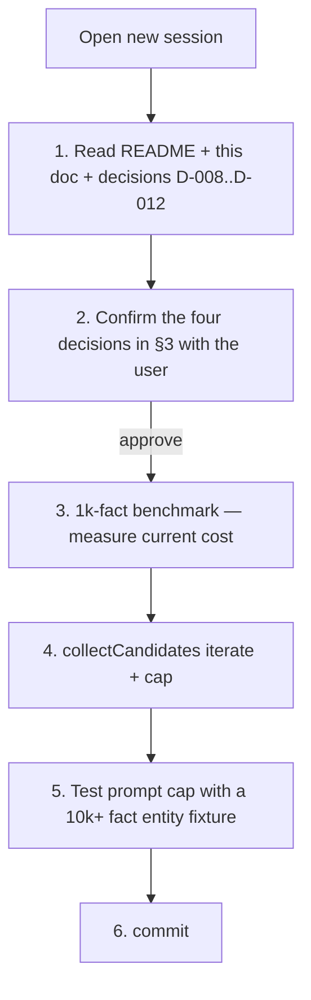

# Phase 4 Handoff — Five-minute pickup for the next session (English)

> **Purpose:** Allow a *fresh session* (Claude / Codex / human) starting Phase 4 to grasp *what exists and where to begin* in five minutes.
> **Authored:** 2026-04-29, immediately after Phase 3 completion + push.
> **Korean original:** [phase4-handoff.ko.md](phase4-handoff.ko.md). The Korean is the working copy; this English version is a parallel translation.
> **References:** [phase3-design.ko.md](phase3-design.ko.md) (Phase 3 design) · [decisions.en.md](decisions.en.md) (D-001..D-014 cumulative ADRs) · [agent-memory-cookbook.ko.md](agent-memory-cookbook.ko.md) (usage guide).

---

## 1. State of the repo — one-page summary

**22 commits on `main` (`ffc4bf4..60a9fe1`). 76 tests passing. Phase 1 + 2 + 3 complete.**

### What works

- **Schema v7 (single `.db` file):** facts (content-addressable), transactions DAG (parent_tx_id + transaction_parents + archived flag), branches (head pointer + parent_branch + state), fact_provenance (kind = evidence | summary), fact_embeddings (model-agnostic), reflections (audit), attribute_defs (typed registry).
- **MCP tools (8):** `impact_trace_analyze_diff`, `impact_trace_remember`, `impact_trace_recall`, `impact_trace_branch`, `impact_trace_merge`, `impact_trace_trace`, `impact_trace_reflect` (Phase 3), `impact_trace_abandon_branch` (Phase 3), `impact_trace_gc_branches` (Phase 3).
- **CLI commands (14):** `init`, `index`, `analyze`, `graph export`, `mcp serve`, `remember`, `retract`, `recall`, `branch [--name | --abandon]`, `merge`, `trace`, `reembed`, `reflect`, `gc-branches`.
- **Recall modes:** structured filter / `--as-of-tx` time travel / `--current-only` / `--query --semantic` (transformers.js + int8 dot product).
- **Embedding pipeline:** `@huggingface/transformers` ONNX in-process. Default `Xenova/multilingual-e5-base` (Korean OK). Swap via env. `reembed [--model X] [--all]` for bulk re-embed after a model swap.
- **Reflection:** 4-provider LLM (`stub` / `ollama:*` / `anthropic:*` / `openai:*`) per-entity summarisation + summary fact + `kind='summary'` provenance + `reflections` audit row. SAVEPOINT atomicity. Redact-then-prompt gate + 30 s timeout + HTTPS-required for cloud providers.
- **Branch GC:** `branch --abandon` + `gc-branches` soft-delete via `transactions.archived = 1`. Recall / recallSemantic / trace all filter `archived = 0`. `main` is protected.
- **Indexer dual-write:** every code relation lands as a `relations` row + a `facts` row + an `evidence_snippet` fact + a `fact_provenance` edge.
- **Security:** redact-then-embed/prompt gate — secret-pattern facts store `value_blob='[REDACTED]'` and zero embedding/LLM-input rows. 11 secret families (OpenAI / Stripe / GitHub / Slack / AWS / Google API / npm / JWT / Bearer / DB URL / Private key).

### What's *not* working / deferred to Phase 4

Ranked by influence (the prerequisites first):

1. **Scaling cap** — `collectCandidates` loads all candidate facts into memory. Multi-GB at 1M facts. `renderUserPrompt` has no per-entity bound. **Prerequisite for the rest.**
2. **Topic-cluster reflection** — current reflection is per-entity only. Embedding clustering for *topical* summaries (Park 2023 / Letta MemGPT style).
3. **Time-based auto-abandon** — currently only explicit `branch --abandon`. `head_tx_id` idle for N days → auto `abandoned`.
4. **`branch --restore` (archived → active)** — currently a one-way transition. The point of soft-delete is reversibility; needs the inverse path.
5. **`reflect --repair`** — `persistReflections` SAVEPOINT atomicity does not cover the *summary fact itself* (it is committed by `remember` first). A mid-failure can leave an orphan summary fact without provenance kind / audit row. A repair sweep finds and fixes those.
6. **Multi-layer reflection (reflection-of-reflections)** — first-pass summary facts feed a second pass for long-term semantic hierarchy.
7. **sqlite-vec virtual-table ANN** — current is brute-force int8 dot product. 10M+ facts will hit the wall. `sqlite-vec` is already a dependency; only the virtual-table wiring is missing.
8. **Concurrent reflect lock** — two processes summarising the same entity simultaneously would write two summaries with different text. Not catastrophic but a defined policy is missing.
9. **Reembed cleanup** — option to drop old-model vector rows after a swap.

---

## 2. Phase 4 priorities — recommended order

| Rank | Candidate | Reason |
|---|---|---|
| **P1** | Scaling cap (#1) — `collectCandidates` streaming + prompt cap | Prerequisite for everything else. Reflection breaks on real prod data without it. ~1 day. |
| **P2** | `reflect --repair` (#5) | Closes the SAVEPOINT atomicity gap. Data-integrity dimension. ~half day. |
| **P3** | `branch --restore` (#4) | Actual implementation of "you can undo" — the soft-delete pillar. One new command, no recall impact. ~half day. |
| **P4** | Time-based auto-abandon (#3) | `gc-branches --max-age 60d` partial automation. ~half day. |
| **P5** | sqlite-vec ANN (#7) | Virtual-table wiring + recallSemantic SQL change. Dependency already in. ~1 day. |
| **P6** | Topic clustering (#2), multi-layer reflection (#6), concurrent reflect lock (#8), reembed cleanup (#9) | Larger changes. Phase 5 candidates. |

**Minimum-viable Phase 4:** P1 + P2 + P3. ~2 days. Directly tied to user-facing safety.

---

## 3. Design space — decisions to make

### D-013. Phase 4 scope

| Option | Content | Trade-off |
|---|---|---|
| (a) **P1 only** | Scaling cap | Smallest surface, safest |
| (b) **P1 + P2 + P3** | Scaling + repair + restore | Greater completeness, ~1 week |
| (c) **P1..P5** | + auto-abandon + ANN | Ambitious, 2-3 weeks |
| (d) custom | Pick freely | Maximum flexibility |

**Recommendation:** (b). Same *completeness* deal as Phase 3. (c)'s ANN is over-engineering without measured workload data.

### D-014. Scaling cap policy

| Option | Content |
|---|---|
| (1) | `collectCandidates` → `iterate()` streaming + per-entity cap N=50 (keep first N + omitted count footer) |
| (2) | (1) + LLM call concurrency (3-way parallel) |
| (3) | (1) only; concurrency for Phase 5 |

**Recommendation:** (3). Concurrency benefit is limited because Ollama is single-threaded; only API providers benefit and that's a low-priority gain.

### D-015. `--repair` trigger

| Option | Content |
|---|---|
| (a) Standalone option | `impact-trace reflect --repair` (isolated from other reflect operations) |
| (b) Default in `reflect` | Run automatically at the start of every `reflect` call |
| (c) Separate `repair` command | `impact-trace repair-reflections` |

**Recommendation:** (a). Explicit and free of conflict with normal reflect operations.

### D-016. Semantics of `branch --restore`

| Option | Content |
|---|---|
| (i) State only | Set `branches.state = 'active'`. Leave archived txs alone. |
| (ii) State + tx unarchive | State + clear `transactions.archived = 0`. |
| (iii) State only + separate `gc-branches --un` | Split unarchive into its own command. |

**Recommendation:** (ii). User mental model "I restored the branch = I see it again" matches. Forgetting tx unarchive means *the restore did not really restore*.

---

## 4. Concrete first 30 minutes (P1 only)



### Phase 4 first commit candidate (P1 only)

**Commit 1: scaling cap — streaming candidates + per-entity prompt cap**
- `src/reflection.ts` `collectCandidates` switches to `db.prepare(sql).iterate()` (the Map build remains but caps with sentinels).
- `renderUserPrompt` adds an entity-level cap N=50 (env-tunable); past N, append a footer like `(... and X more observations)`.
- `tests/reflection.test.ts` adds a 100+-fact fixture for cap behaviour.
- `docs/phase4-design.ko.md` (new) — same dual-voice consensus shape as Phase 3.

Constants: `MAX_FACTS_PER_ENTITY` constant + `IMPACT_TRACE_REFLECT_MAX_FACTS_PER_ENTITY` env override.

---

## 5. Context for navigation (file:line landmarks)

| Topic | Where |
|---|---|
| Schema migration pattern (v7 ADD-only) | `src/store.ts:78-...` `migrate()` + `tryAddColumn` (allowlist) |
| Reflection main path | `src/reflection.ts:reflectFacts` — collect → summarize → persist (SAVEPOINT) |
| Reflection candidate loading (P1 hotspot) | `src/reflection.ts:collectCandidates` — memory-load location |
| Reflection prompt build (P1 hotspot) | `src/reflection.ts:renderUserPrompt` — concatenates all facts |
| LLM provider dispatch | `src/llm.ts:summarize` + `callProvider` |
| Branch GC | `src/branch_gc.ts:abandonBranch` + `gcBranches` |
| Soft-delete filter (recall + semantic + trace) | `src/agent_memory.ts:recall`, `recallSemantic`, `trace` — `t.archived = 0` |
| MCP tool registration pattern | `src/mcp.ts:server.registerTool` (8 tools, three new in Phase 3) |
| CLI command registration pattern | `src/cli.ts` if-chain + `valueFlags` Set + `printHelp` |
| async-outside-tx pattern | `src/agent_memory.ts:rememberOnRepo`, `recallOnRepo`, `reembedFacts` + `src/reflection.ts:reflectFacts` |
| Test fixture pattern | `tests/reflection.test.ts:makeRepo` + `ageAllTransactionsToFar` |
| Schema test + v6→v7 upgrade verification | `tests/store.test.ts:'migrate upgrades a synthetic v6 schema...'` |
| Cumulative decisions log | `docs/decisions.en.md` — D-001..D-014 |

---

## 6. Four questions a fresh session should ask the user

1. **D-013 scope** — (a) P1 only / (b) P1+P2+P3 / (c) P1..P5 / (d) pick freely?
2. **D-014 scaling approach** — (1) streaming + cap only / (2) + concurrency / (3) (1) only first?
3. **D-015 repair trigger** — (a) `reflect --repair` / (b) default in `reflect` / (c) separate command?
4. **D-016 restore semantics** — (i) state only / (ii) state + tx unarchive / (iii) separate unarchive command?

Once these four are answered, §4's flow is determined automatically.

---

## 7. Copy-paste prompt template for the next session

```text
This repo (Impact-trace) is an MCP-based agent memory system. Phase 1+2+3
shipped through 2026-04-29; main has 22 commits in ffc4bf4..60a9fe1.
We're starting Phase 4 now. Please read these first:

  1. docs/phase4-handoff.en.md (or .ko.md) — this handoff
  2. docs/decisions.en.md — D-001..D-014 cumulative decisions
  3. docs/phase3-design.ko.md — recent Phase design pattern
  4. README.md "Direction: agent memory layer" section

Then ask me the four questions in handoff §6 and we'll go from there.
```

---

## 8. Final smoke-test commands

```bash
# Verify environment (Phase 3 baseline)
npm install
npm run check     # typecheck passes
npm test          # 76 tests passing
npm run lint      # clean

# Verify reflection (optional, requires Ollama)
ollama pull gemma2:2b
cd /tmp && mkdir test-impact-trace && cd test-impact-trace
git init
echo "console.log('hello');" > a.js
impact-trace init
impact-trace remember --entity file:a.js --attribute observed --value '"compiled"'
impact-trace remember --entity file:a.js --attribute verified --value '"tests pass"'
# To meet the 30-day cutoff, either UPDATE transactions.ts directly or use stub mode:
IMPACT_TRACE_REFLECTION_MODEL=stub impact-trace reflect --older-than-days 0 --dry-run

# New commit workflow
impact-trace branch --name plan-A
impact-trace remember --branch plan-A --entity test --attribute x --value '"y"'
impact-trace branch --abandon plan-A
impact-trace gc-branches --dry-run
```

---

## Appendix A: 22-commit summary (Phase 1+2+3)

```
60a9fe1  docs: Phase 3 design rationale, decisions log, doc updates
31ef658  feat: reflective consolidation + speculative branch GC (Phase 3)
8ee5010  feat: schema v7 + multi-provider LLM abstraction (Phase 3 foundation)
563fddc  docs: Phase 3 handoff for fresh-session pickup
a9c8a92  feat: reembed CLI for model swap                     # P2 cap
7e86f83  feat: semantic recall query path (Phase 2 cap)
43418ec  feat: real embedding pipeline via transformers.js
cb50bc3  feat: schema v6 model-agnostic fact_embeddings table
0289cc7  feat: branch merge with multi-parent transaction DAG
2a97e64  test: CLI round-trip for branch, trace, retract
95ceb8b  docs: indexing model adds agent memory layer schema
6693d0b  docs: progress log catches up
4aadaf2  docs: add mermaid diagrams
34d185c  feat: recall --current-only auto-dedups retracts
4562024  feat: add retract op and as_of_tx temporal recall
4423743  docs: agent memory cookbook + status updates
d0c5cce  feat: enable sqlite-vec and embedding pipeline
650104f  feat: indexer evidence_snippet provenance
51b09b0  feat: surface agent memory tools via CLI
b543ce3  feat: dual-write canonical relations to facts
ffc4bf4  feat: add agent memory layer phase 1
```

## Appendix B: Pitfalls a fresh session should avoid

- **Schema migration: never destructive.** No DROP. ADD-only. New columns must be added to the `tryAddColumn` allowlists.
- **embedding/LLM compute must run *outside* SQLite transactions.** `reflectFacts` is a good reference — every async call resolves before the sync `withAgentMemoryDb` opens.
- **Redaction gate applies to all LLM input/output.** `redactSecrets` runs on system prompt + user prompt + LLM raw output. Zero-row policy: redacted facts are excluded from input set entirely.
- **SQLite control flow is not shell.** Security hooks may misread `db.exec('BEGIN')` as a `child_process` call. Prefer `db.prepare(...).run()` for production code; reserve raw exec for `BEGIN` / `COMMIT` / `SAVEPOINT` control flow.
- **Test stability:** new LLM integrations should add `IMPACT_TRACE_REFLECTION_MODEL=stub` paths so CI never makes outbound calls. Mock HTTP server pattern is in `tests/llm.test.ts:startMockServer`.
- **`trace()` must keep filtering `t.archived = 0`.** A leak was caught in the Phase 3 architect-review. New fact-walking functions should apply the same invariant.
- **Branch GC *never* deletes facts.** Content-addressable means another branch may reference the same fact. Only `transactions.archived` is set.
- **`tryAddColumn` allowlist** in `src/store.ts` (`ALLOWED_TABLES` / `ALLOWED_COLUMNS` / `ALLOWED_DEFINITIONS`) — when adding a new column, *all three* sets must be extended or the migration throws.
- **SAVEPOINT inside ROLLBACK TO + RELEASE order.** See `src/reflection.ts:persistReflections`. Both must run for the SAVEPOINT to be cleaned up.

---

**When rewriting this doc:** start from §6's four questions, then §4's flow follows automatically.
