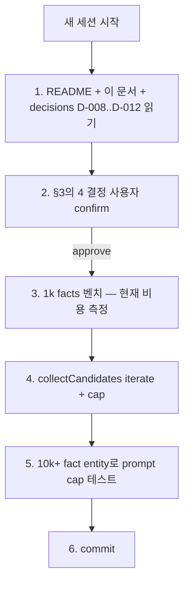

# Phase 4 Handoff — 다음 세션이 5분 만에 컨텍스트 잡기

> **목적:** *새 세션*에서 Phase 4를 시작하는 Claude/Codex/사람이 *지금까지 무엇이 있고 어디서 시작할지* 5분 만에 파악할 수 있게 한다.
> **작성:** 2026-04-29 — Phase 3 완료 + push 직후
> **참고:** [phase3-design.ko.md](phase3-design.ko.md) (Phase 3 설계) · [decisions.ko.md](decisions.ko.md) (D-001..D-012 누적 결정) · [agent-memory-cookbook.ko.md](agent-memory-cookbook.ko.md) (사용 가이드)

---

## 1. 현재 위치 — 한 페이지 요약

**22 commits on main (`ffc4bf4..60a9fe1`). 76 tests passing. Phase 1 + 2 + 3 모두 완성.**

### 작동하는 것

- **Schema v7 (single .db file)**: facts (content-addressable), transactions DAG (parent_tx_id + transaction_parents + archived flag), branches (head pointer + parent_branch + state), fact_provenance (kind=evidence | summary), fact_embeddings (model-agnostic), reflections (audit), attribute_defs (typed registry).
- **MCP tools (8개)**: `impact_trace_analyze_diff`, `impact_trace_remember`, `impact_trace_recall`, `impact_trace_branch`, `impact_trace_merge`, `impact_trace_trace`, `impact_trace_reflect` (Phase 3), `impact_trace_abandon_branch` (Phase 3), `impact_trace_gc_branches` (Phase 3).
- **CLI 명령 (14개)**: `init`, `index`, `analyze`, `graph export`, `mcp serve`, `remember`, `retract`, `recall`, `branch [--name | --abandon]`, `merge`, `trace`, `reembed`, `reflect`, `gc-branches`.
- **Recall 모드**: 구조 필터 / `--as-of-tx` 시간여행 / `--current-only` / `--query --semantic` (transformers.js + int8 dot product).
- **Embedding pipeline**: `@huggingface/transformers` ONNX in-process. 기본 `Xenova/multilingual-e5-base` (한국어 OK). swap via env. `reembed [--model X] [--all]`로 일괄 재계산.
- **Reflection**: 4-provider LLM (`stub`/`ollama:*`/`anthropic:*`/`openai:*`) entity별 요약 + summary fact + `kind='summary'` provenance + reflections audit row. SAVEPOINT atomicity. redact-then-prompt 게이트 + 30s timeout + HTTPS-required for cloud providers.
- **Branch GC**: `branch --abandon` + `gc-branches` soft-delete via `transactions.archived = 1`. recall/recallSemantic/trace 모두 `archived = 0`만 surface. main 보호.
- **인덱서 듀얼라이트**: 모든 코드 관계가 `relations` + `facts` + `evidence_snippet` fact + `fact_provenance` edge로 동시 저장.
- **보안**: redact-then-embed/prompt 게이트 — secret 패턴 facts는 `[REDACTED]` 저장 + 임베딩/LLM input/output 모두 zero-row. 11종 secret 패턴(OpenAI / Stripe / GitHub / Slack / AWS / Google API / npm / JWT / Bearer / DB URL / Private key).

### 작동하지 *않는* / Phase 4로 넘긴 것

ranked by 영향도/대전제 우선:

1. **Scaling cap** — `collectCandidates`가 모든 후보 facts를 메모리에 로드. 1M facts에서 multi-GB. `renderUserPrompt`도 entity당 무제한 — 핫 entity 10K row면 prompt overflow. **다른 Phase 4 후보의 대전제**.
2. **Topic 클러스터링 reflection** — 현재는 entity별만. embedding 클러스터링으로 *주제별* 요약. Park 2023 / Letta MemGPT 방식.
3. **시간 기반 자동 abandon** — 현재는 명시 `branch --abandon`만. `head_tx_id`가 N일 안 움직이면 자동 abandoned로 표시.
4. **`branch --restore` (archived → active)** — 현재는 한 방향. soft-delete의 핵심 가치(되돌릴 수 있음)를 살리려면 필요.
5. **`reflect --repair`** — `persistReflections`의 SAVEPOINT atomicity는 *summary fact 자체*는 못 막음 (remember가 이미 commit). 중간 실패 시 orphan 발생. reflections audit row가 없는 summary fact를 찾아 provenance kind와 audit row 보정.
6. **다층 reflection (reflection-of-reflections)** — 1차 summary fact 자체가 다음 reflect의 input이 되는 hierarchy. long-term semantic 계층화.
7. **sqlite-vec virtual table ANN** — 현재는 brute-force int8 dot product. 10M+ facts에서 한계. sqlite-vec는 이미 dependency로 들어와 있음 — virtual table만 wiring하면 됨.
8. **동시 reflect 락** — 두 프로세스가 같은 entity를 동시 reflect하면 두 summary가 다른 텍스트로 들어감. 큰 손해는 아니지만 표준 정책 결정 필요.
9. **Reembed cleanup** — 구모델 vector 행 drop 옵션. 모델 swap 후 storage 회수.

---

## 2. Phase 4 우선순위 — 추천 순서

| 순위 | 후보 | 이유 |
|---|---|---|
| **P1** | Scaling cap (#1) — `collectCandidates` 스트리밍 + 프롬프트 cap | 다른 후보들의 *대전제*. 이걸 안 하면 reflection이 prod 데이터에서 깨짐. ~1일. |
| **P2** | `reflect --repair` (#5) | SAVEPOINT atomicity 보완. data integrity 차원. ~반나절. |
| **P3** | `branch --restore` (#4) | 사용자가 *되돌릴 수 있다*는 정책의 actual 구현. 새 명령 1개 + recall 영향 없음. ~반나절. |
| **P4** | 시간 기반 자동 abandon (#3) | `gc-branches --max-age 60d`처럼 부분 자동화. ~반나절. |
| **P5** | sqlite-vec ANN (#7) | virtual table wiring + recallSemantic SQL 변경. 의존성은 이미 in. ~1일. |
| **P6** | Topic 클러스터링 (#2), 다층 reflection (#6), 동시 reflect 락 (#8), reembed cleanup (#9) | 큰 변경. Phase 5 후보. |

**최소 viable Phase 4**: P1 + P2 + P3. ~2일치 작업. 실제 사용자 안전성과 직결.

---

## 3. 설계 공간 — 결정해야 할 것

### D-013. Phase 4 범위

| 옵션 | 내용 | trade-off |
|---|---|---|
| (a) **P1만** | Scaling cap | 가장 작은 surface, 가장 안전 |
| (b) **P1+P2+P3** | Scaling + repair + restore | 완성도 ↑, 1주 |
| (c) **P1..P5** | + 자동 abandon + ANN | 야심, 2-3주 |
| (d) 사용자 정의 | 직접 골라서 | 자유도 |

**권장:** (b). Phase 3와 같은 *완결성*을 가져가는 deal. (c)는 ANN이 실측 데이터 없으면 over-engineering.

### D-014. Scaling cap의 정책

| 옵션 | 내용 |
|---|---|
| (1) | `collectCandidates`를 `iterate()` 스트리밍 + entity당 N=50 fact cap (선두 N개 + 뒤 잘림 카운트) |
| (2) | (1) + LLM 호출 *concurrent* (3-way 병렬) |
| (3) | (1)만, concurrency는 Phase 5 |

**권장:** (3). concurrency는 ollama가 single-thread라 효과 제한적. API provider만 의미 있는데 우선순위 낮음.

### D-015. `--repair` 트리거

| 옵션 | 내용 |
|---|---|
| (a) 별도 명령 | `impact-trace reflect --repair` (다른 동작과 격리) |
| (b) `reflect`에 default | 매 reflect 호출 시작 시 자동 |
| (c) 별도 `repair` 명령 | `impact-trace repair-reflections` |

**권장:** (a). 명시적이고 다른 reflect 동작과 충돌 없음.

### D-016. `branch --restore` 의 의미

| 옵션 | 내용 |
|---|---|
| (i) state만 | `branches.state = 'active'`로 되돌림. archived txs는 그대로. |
| (ii) state + tx unarchive | state + `transactions.archived = 0` 회수. |
| (iii) state만 + `gc-branches --un` | 별도 명령으로 unarchive 분리. |

**권장:** (ii). 사용자 mental model "branch를 되돌렸다 = 보인다"와 일치. tx unarchive를 잊으면 *복구가 복구가 아님*.

---

## 4. 첫 30분에 시작할 구체적 작업 (P1만 진행 시)



### Phase 4 첫 commit 후보 (P1만)

**Commit 1: scaling cap — streaming candidates + per-entity prompt cap**
- `src/reflection.ts` `collectCandidates`를 `db.prepare(sql).iterate()`로 변경 (Map 빌드는 유지하되 sentinel cap)
- `renderUserPrompt`에 entity당 최대 N=50 fact cap (env로 조정), N개 초과 시 "(... and X more observations)" footer
- `tests/reflection.test.ts`에 100+ fact entity fixture로 cap 동작 검증
- `docs/phase4-design.ko.md` 신규 문서 (Phase 3와 같은 dual-voice consensus 형식)

`MAX_FACTS_PER_ENTITY` 상수, `IMPACT_TRACE_REFLECT_MAX_FACTS_PER_ENTITY` env 추가.

---

## 5. 진입에 필요한 컨텍스트 (file:line 정확히)

| 무엇 | 어디 |
|---|---|
| Schema 마이그레이션 패턴 (v7 ADD-only) | `src/store.ts:78-...` `migrate()` + `tryAddColumn` (allowlist) |
| Reflection 메인 로직 | `src/reflection.ts:reflectFacts` — collect → summarize → persist (SAVEPOINT) |
| Reflection candidate 로딩 (P1 hotspot) | `src/reflection.ts:collectCandidates` — 메모리 로드 위치 |
| Reflection prompt 빌드 (P1 hotspot) | `src/reflection.ts:renderUserPrompt` — fact 모두 concat |
| LLM provider dispatch | `src/llm.ts:summarize` + `callProvider` |
| Branch GC | `src/branch_gc.ts:abandonBranch` + `gcBranches` |
| Soft-delete 필터 (recall + semantic + trace) | `src/agent_memory.ts:recall`, `recallSemantic`, `trace` — `t.archived = 0` |
| MCP tool 등록 패턴 | `src/mcp.ts:server.registerTool` (8개 tool, Phase 3 새것 3개) |
| CLI 명령 등록 패턴 | `src/cli.ts` if-chain + `valueFlags` Set + `printHelp` |
| async outside SQLite tx 패턴 | `src/agent_memory.ts:rememberOnRepo`, `recallOnRepo`, `reembedFacts` + `src/reflection.ts:reflectFacts` |
| Test fixture 패턴 | `tests/reflection.test.ts:makeRepo` + `ageAllTransactionsToFar` (synthetic v6→cutoff) |
| Schema 테스트 + v6→v7 upgrade 검증 | `tests/store.test.ts:'migrate upgrades a synthetic v6 schema...'` |
| Decisions 누적 로그 | `docs/decisions.ko.md` — D-001..D-012 |

---

## 6. 새 세션이 사용자에게 물어볼 질문 (4개)

1. **D-013 범위** — (a) P1만 / (b) P1+P2+P3 / (c) P1..P5 / (d) 직접?
2. **D-014 scaling 방식** — (1) streaming + cap만 / (2) + concurrency / (3) (1)만 우선?
3. **D-015 repair trigger** — (a) `reflect --repair` / (b) 매 reflect 시 default / (c) 별도 명령?
4. **D-016 restore 의미** — (i) state만 / (ii) state + tx unarchive / (iii) 별도 unarchive 명령?

답이 모이면 §4 흐름이 자동으로 결정됨.

---

## 7. *지금 바로* 새 세션에서 사용할 프롬프트 템플릿

다음을 복붙하면 새 세션이 즉시 컨텍스트를 잡습니다:

```text
이 저장소(Impact-trace)는 agent memory MCP 시스템입니다. Phase 1+2+3가
2026-04-29까지 완성됐고 main 브랜치 ffc4bf4..60a9fe1에 22 commit이 있습니다.
이제 Phase 4를 시작합니다. 다음을 먼저 읽어주세요:

  1. docs/phase4-handoff.ko.md — 이번 세션 시작용 handoff (이 문서)
  2. docs/decisions.ko.md — D-001..D-012 누적 결정
  3. docs/phase3-design.ko.md (직전 phase 설계 — 패턴 참고)
  4. README.md "Direction: agent memory layer" 섹션

handoff §6의 4개 질문에 제가 답하면 진행합니다.
```

---

## 8. 마지막 점검 — 새 세션이 작동 확인할 명령

```bash
# 환경 동작 확인 (Phase 3까지)
npm install
npm run check     # typecheck 통과
npm test          # 76 tests passing
npm run lint      # clean

# 진짜 reflect 작동 확인 (선택, Ollama 필요)
ollama pull gemma2:2b
cd /tmp && mkdir test-impact-trace && cd test-impact-trace
git init
echo "console.log('hello');" > a.js
impact-trace init
impact-trace remember --entity file:a.js --attribute observed --value '"compiled"'
impact-trace remember --entity file:a.js --attribute verified --value '"tests pass"'
# 30일 cutoff을 만족시키려면 직접 transactions.ts UPDATE 또는 stub 모드:
IMPACT_TRACE_REFLECTION_MODEL=stub impact-trace reflect --older-than-days 0 --dry-run

# 새 commit 워크플로우
impact-trace branch --name plan-A
impact-trace remember --branch plan-A --entity test --attribute x --value '"y"'
impact-trace branch --abandon plan-A
impact-trace gc-branches --dry-run
```

---

## 부록 A: Phase 1+2+3 commit 요약 (22개)

```
60a9fe1  docs: Phase 3 design rationale, decisions log, doc updates
31ef658  feat: reflective consolidation + speculative branch GC (Phase 3)
8ee5010  feat: schema v7 + multi-provider LLM abstraction (Phase 3 foundation)
563fddc  docs: Phase 3 handoff for fresh-session pickup
a9c8a92  feat: reembed CLI for model swap                     # P2 cap
7e86f83  feat: semantic recall query path (Phase 2 cap)
43418ec  feat: real embedding pipeline via transformers.js
cb50bc3  feat: schema v6 model-agnostic fact_embeddings table
0289cc7  feat: branch merge with multi-parent transaction DAG
2a97e64  test: CLI round-trip for branch, trace, retract
95ceb8b  docs: indexing model adds agent memory layer schema
6693d0b  docs: progress log catches up
4aadaf2  docs: add mermaid diagrams
34d185c  feat: recall --current-only auto-dedups retracts
4562024  feat: add retract op and as_of_tx temporal recall
4423743  docs: agent memory cookbook + status updates
d0c5cce  feat: enable sqlite-vec and embedding pipeline
650104f  feat: indexer evidence_snippet provenance
51b09b0  feat: surface agent memory tools via CLI
b543ce3  feat: dual-write canonical relations to facts
ffc4bf4  feat: add agent memory layer phase 1
```

## 부록 B: 새 세션이 *피해야 할* 함정

- **Schema 마이그레이션 시 destructive op 주의** — 기존 데이터를 DROP하지 말고 ADD only로 진행. `tryAddColumn` allowlist에 추가해야 새 컬럼 ADD 가능 (의도적 제약).
- **embedding/LLM 계산은 *반드시* SQLite tx 바깥에서.** `reflectFacts`가 좋은 reference: 모든 async를 select 후 / persist 전에 끝낸 다음 sync `withAgentMemoryDb`로 write.
- **Redaction 게이트는 모든 LLM input/output에도.** `redactSecrets`를 system prompt + user prompt + LLM raw output 모두에 적용. zero-row 정책 (redacted facts는 input set에서 제외).
- **`db.exec()`는 SQLite — 보안 hook이 child_process로 오인.** `db.prepare(...).run()` 패턴이 표준이며 프로덕션 코드에서 권장. control flow (BEGIN / COMMIT / SAVEPOINT) 만 `db.exec` 사용.
- **Test 안정성:** 새 LLM 통합 추가 시 `IMPACT_TRACE_REFLECTION_MODEL=stub` sentinel 추가해 CI에서 외부 호출 없이 테스트 가능하도록. mock HTTP server는 `tests/llm.test.ts`의 `startMockServer` 패턴 참고.
- **`trace()` 도 `t.archived = 0` 필터 유지.** Phase 3 architect 리뷰에서 발견된 leak. 새 fact-walking 함수 추가 시 같은 invariant 적용.
- **Branch GC는 facts를 *절대* 삭제 안 함.** content-addressable이라 다른 branch가 같은 fact 참조 가능. transaction archive만 한다.
- **`tryAddColumn` allowlist** (`src/store.ts:ALLOWED_TABLES`/`ALLOWED_COLUMNS`/`ALLOWED_DEFINITIONS`) — 새 컬럼 추가 시 *반드시* 세 set에 추가. 그렇지 않으면 throw.
- **SAVEPOINT 안에서 ROLLBACK TO + RELEASE 순서 주의** — `src/reflection.ts:persistReflections` 패턴 참고. 둘 다 호출해야 SAVEPOINT가 정리됨.

---

**이 문서를 다시 쓸 때:** 첫 시작은 §6 4개 질문 답으로. 답이 모이면 §4 흐름이 자동.
