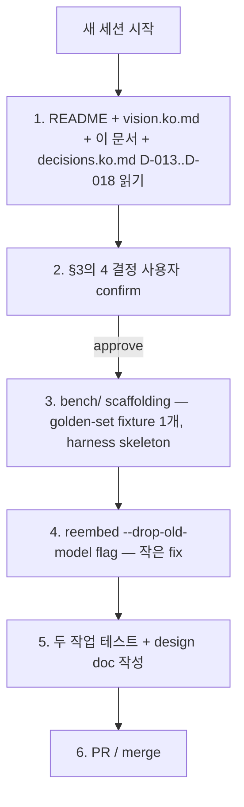

# Phase 5 Handoff — 다음 세션이 5분 만에 컨텍스트 잡기

> **목적:** *새 세션*에서 Phase 5를 시작하는 Claude/Codex/사람이 *지금까지 무엇이 있고 어디서 시작할지* 5분 만에 파악할 수 있게 한다.
> **작성:** 2026-05-01 — Phase 4 P1..P5 완료 + push 직후
> **참고:** [phase4-handoff.ko.md](phase4-handoff.ko.md) (Phase 4 시작 시점 snapshot, 동결) · [decisions.ko.md](decisions.ko.md) (D-001..D-018 누적 결정) · [vision.ko.md](vision.ko.md) (전체 비전) · [roadmap.md](roadmap.md) (통합 로드맵) · [agent-memory-cookbook.ko.md](agent-memory-cookbook.ko.md) (사용 가이드)

---

## 1. 현재 위치 — 한 페이지 요약

**main `33c49f0` (`ffc4bf4..33c49f0`). 112 tests passing. Phase 1 + 2 + 3 + 4 (P1+P2+P3+P4+P5) 모두 완성.**

### 작동하는 것 — 에이전트 메모리 축

- **Schema v7 (single .db file)**: facts (SHA-256 content-addressable), transactions DAG (parent_tx_id + transaction_parents + archived flag), branches (head pointer + parent_branch + state), fact_provenance (kind=evidence | summary), fact_embeddings (model-agnostic), reflections (audit), attribute_defs (typed registry), `vec_facts_<model_slug>` virtual tables (sqlite-vec int8[N]).
- **MCP tools (12개)**: `analyze_diff`, `remember`, `recall`, `branch`, `merge`, `trace`, `reflect`, `abandon_branch`, `gc_branches`, `restore_branch` (P3), `repair_reflections` (P2), `profile` (P1).
- **CLI 명령 (16개)**: `init`, `index`, `analyze`, `graph export`, `mcp serve`, `remember`, `retract`, `recall`, `branch [--name | --abandon | --restore]`, `merge`, `trace`, `reembed`, `reflect [--repair]`, `gc-branches [--max-age <days>]`, `profile`, `reindex-vec`.
- **Recall 모드**: 구조 필터 / `--as-of-tx` 시간여행 / `--current-only` / `--query --semantic` (sqlite-vec ANN → brute-force fallback).
- **Embedding pipeline**: `@huggingface/transformers` ONNX in-process. 기본 `Xenova/multilingual-e5-base`. swap via env. `reembed [--model X] [--all]` + `reindex-vec` for ANN backfill.
- **Reflection**: 4-provider LLM (`stub`/`ollama:*`/`anthropic:*`/`openai:*`), entity별 요약, SAVEPOINT atomicity, `reflect --repair`로 orphan 보정, scaling cap (default 50/entity, env override).
- **Branch GC**: `branch --abandon` + `gc-branches` soft-delete, `branch --restore` 역방향 복구, `gc-branches --max-age N` time-based 자동 abandon.
- **Profile API**: `profileEntity()` 3-bucket (static / dynamic / summary) + `factLifecycle()` 헬퍼.
- **ANN**: per-model `vec_facts_<model_slug>` lazy-create, dual-write from remember/reembed, `recallSemantic` ANN path → silent brute-force fallback when extension absent.
- **보안**: redact-then-embed/prompt 게이트 — 11종 secret 패턴, zero-row 정책, LLM input/output 게이트, HTTPS-required.

### 작동하지 *않는* / Phase 5로 넘긴 것 (영향 분석 축은 별도)

ranked by leverage:

1. **MemoryBench harness 부재** — Phase 4 architect review가 HIGH로 평가. 다른 모든 P5 후보 (clustering / multi-layer / 새 모델)가 *정말 더 나은지 측정*할 도구 없음. **다른 Phase 5 후보의 대전제**. ETA 1+ week (design doc 선행).
2. **Topic clustering reflection** — 현재 reflect는 entity별만. embedding clustering으로 *주제별* 요약 (Park 2023 / Letta MemGPT). 3-5일.
3. **다층 reflection** (reflection-of-reflections) — summary fact가 다음 reflect input으로 hierarchy 형성. 3일.
4. **동시 reflect 락** — 두 프로세스가 같은 entity 동시 reflect 시 두 다른 summary. policy 결정 + lock 구현. 반나절.
5. **Reembed cleanup** — 모델 swap 후 `fact_embeddings` + `vec_facts_<old>` drop. `reembed --drop-old-model` flag. 반나절.

---

## 2. Phase 5 우선순위 — 추천 순서

| 순위 | 후보 | 이유 |
|---|---|---|
| **B1** | MemoryBench harness | 후속 모든 P5 작업의 대전제. golden-set fixture + recall@k metric + cross-model harness. 측정 없으면 P5 후보 셋 중 어느 것이 가치 있는지 알 수 없음. ~1주. |
| **B2** | Reembed cleanup (#5) | 가장 작은 작업. 모델 swap을 자주 하는 사용자에게 직접 도움. 반나절. |
| **B3** | 동시 reflect 락 (#4) | 정책 결정만 하면 구현은 간단. multi-agent 환경 진입을 위한 작은 invariant. 반나절. |
| **B4** | Topic clustering reflection (#2) | MemoryBench가 있어야 효과 측정 가능. 그 후 진행. 3-5일. |
| **B5** | 다층 reflection (#3) | 더 큰 변경. clustering 다음 단계. 3일. |

**최소 viable Phase 5**: B1 + B2 + B3. ~1.5주. 측정 도구 + 작은 안전성 두 개.

---

## 3. 설계 공간 — 결정해야 할 것

### D-019. MemoryBench의 형태

| 옵션 | 내용 | trade-off |
|---|---|---|
| (a) **별도 repo** | `Impact-trace-bench` repo에 fixture + harness 분리 | 본 repo dep 0, 그러나 cross-repo dependency loop |
| (b) **`bench/` 하위 디렉터리** | 본 repo의 `bench/` 디렉터리에 fixture + runner | 단일 repo, eval 결과가 main 빌드를 막지 않음 |
| (c) **새 npm script `npm run bench`** | 기존 `tests/`와 분리, CI 미통합 | 가장 가벼움, 사용자 명시 trigger |

**권장:** (b) + (c) — `bench/` 디렉터리에 fixture, `npm run bench` script로 trigger, 결과 JSON으로 report.

### D-020. Topic clustering 알고리즘

| 옵션 | 내용 |
|---|---|
| (1) k-means on int8 embeddings | 결정적, 단순, k 선택 어려움 |
| (2) HDBSCAN | density 기반, k 자동 결정, 외부 dep 필요 |
| (3) hierarchical agglomerative | tree 형태, 임계 distance로 cut |

**권장:** (1) — 첫 버전. dep 0, deterministic.

### D-021. 다층 reflection 깊이 정책

| 옵션 | 내용 |
|---|---|
| (i) 무제한 | summary가 또 다른 summary의 source가 됨 — *infinite recursion risk* |
| (ii) **고정 깊이 max=2** | level-1 reflection (entity별), level-2 reflection (cluster of level-1) |
| (iii) 사용자 지정 | `reflect --depth N` flag |

**권장:** (ii) — 첫 버전. (iii)으로 확장은 후속 ADR.

### D-022. 동시 reflect 락 정책

| 옵션 | 내용 |
|---|---|
| (α) entity-level pessimistic | reflect 시작 시 entity_id 별 lock 행 INSERT, 끝나면 DELETE |
| (β) optimistic + last-write-wins | 두 reflect 모두 진행, 마지막이 이김 (현재 사실상 이 동작) |
| (γ) advisory lock | branch_id + entity_id로 SQLite advisory lock (`PRAGMA locking_mode`) |

**권장:** (α) — 명시적 락 테이블, 충돌 시 두 번째 호출자에게 명확한 에러.

---

## 4. 첫 30분에 시작할 구체적 작업 (B1 + B2 진행 시)



### Phase 5 첫 commit 후보

**Commit 1: bench scaffolding — fixture + runner skeleton**
- `bench/fixtures/<scenario>/` 디렉터리, JSON으로 expected recall results
- `bench/runner.ts` — fixture 로드 + recall 호출 + recall@k 계산
- `package.json:scripts.bench` 추가
- `docs/phase5-design.ko.md` 신규 (Phase 4 P2-P3 design과 같은 dual-voice consensus 형식)

**Commit 2: reembed --drop-old-model**
- `src/agent_memory.ts:reembedFacts` — `dropOldModel?: string` 옵션 → `DELETE FROM fact_embeddings WHERE model = ?` + `DROP TABLE IF EXISTS vec_facts_<old>`
- CLI `reembed --drop-old-model <name>`
- 테스트 +2

---

## 5. 진입에 필요한 컨텍스트 (file:line 정확히)

| 무엇 | 어디 |
|---|---|
| 통합 비전 | `docs/vision.ko.md` (한 페이지 thesis) |
| 통합 로드맵 | `docs/roadmap.md` (두 축 + Phase 5 후보) |
| 두 축의 어휘 | `docs/glossary.md` |
| Schema 마이그레이션 (v7 ADD-only) | `src/store.ts:78-...` `migrate()` + `tryAddColumn` allowlist |
| sqlite-vec 헬퍼 (P5 D-018) | `src/store.ts:54-93` — `loadVectorExtension`, `isVectorExtensionLoaded`, `vecTableName`, `ensureVecTable`, `hasVecTable` |
| Reflection 메인 | `src/reflection.ts:reflectFacts` — collect → summarize → persist (SAVEPOINT) |
| Reflection cap (P1) | `src/reflection.ts:collectCandidates` (iterate streaming + per-entity cap) |
| Repair (P2) | `src/reflection.ts:repairReflections` |
| Branch GC + auto-abandon (P4) | `src/branch_gc.ts:gcBranches` + `restoreBranch` |
| Recall ANN path (P5) | `src/agent_memory.ts:recallSemanticAnn` + `recallSemanticBruteForce` |
| Profile API (P1) | `src/profile.ts:profileEntity` |
| Reindex vec (P5) | `src/agent_memory.ts:reindexVec` + `reindexVecOnRepo` |
| MCP tool 등록 패턴 | `src/mcp.ts:server.registerTool` (12개 tool) |
| CLI 명령 등록 패턴 | `src/cli.ts` if-chain + `valueFlags` Set + `printHelp` |
| async outside SQLite tx 패턴 | `src/agent_memory.ts:rememberOnRepo`, `recallOnRepo`, `reembedFacts` + `src/reflection.ts:reflectFacts` |
| Test fixture 패턴 | `tests/reflection.test.ts:makeRepo` + `ageAllTransactionsToFar` |
| Schema 테스트 + v6→v7 upgrade 검증 | `tests/store.test.ts:'migrate upgrades a synthetic v6 schema...'` |
| Decisions 누적 로그 | `docs/decisions.ko.md` — D-001..D-018 |

---

## 6. 새 세션이 사용자에게 물어볼 질문 (4개)

1. **D-019 MemoryBench 형태** — (a) 별도 repo / (b) `bench/` 하위 / (c) `npm run bench`?
2. **D-020 clustering 알고리즘** — (1) k-means / (2) HDBSCAN / (3) hierarchical?
3. **D-021 다층 reflection 깊이** — (i) 무제한 / (ii) 고정 max=2 / (iii) 사용자 flag?
4. **D-022 동시 reflect 락** — (α) entity-level pessimistic / (β) optimistic last-write / (γ) SQLite advisory?

답이 모이면 §4 흐름이 자동으로 결정됨.

---

## 7. *지금 바로* 새 세션에서 사용할 프롬프트 템플릿

다음을 복붙하면 새 세션이 즉시 컨텍스트를 잡습니다:

```text
이 저장소(Impact-trace)는 AI 코딩 에이전트를 위한 local-first SQLite + MCP substrate
입니다. Phase 1+2+3+4 모두 완료, main `33c49f0`, 112 tests passing, ADR D-001..D-018.

다음을 먼저 읽어주세요:

  1. docs/vision.ko.md — 한 페이지 비전
  2. docs/roadmap.md — 통합 로드맵
  3. docs/phase5-handoff.ko.md — 이 문서 (Phase 5 진입점)
  4. docs/decisions.ko.md — D-001..D-018 누적 결정
  5. docs/glossary.md — 두 축의 어휘 disambiguate

handoff §6의 4개 질문에 제가 답하면 진행합니다.
```

---

## 8. 마지막 점검 — 새 세션이 작동 확인할 명령

```bash
npm install
npm run check     # typecheck 통과
npm test          # 112 tests passing
npm run lint      # clean

# 진짜 reflect 작동 (선택, Ollama 필요)
ollama pull gemma2:2b
cd /tmp && mkdir test-impact-trace && cd test-impact-trace
git init
echo "console.log('hello');" > a.js
impact-trace init
impact-trace remember --entity file:a.js --attribute observed --value '"compiled"'
impact-trace remember --entity file:a.js --attribute verified --value '"tests pass"'
IMPACT_TRACE_REFLECTION_MODEL=stub impact-trace reflect --older-than-days 0 --dry-run

# Phase 4 P5 ANN smoke
impact-trace reindex-vec
```

---

## 부록 A: Phase 4 P1..P5 commit 요약

```
33c49f0  feat: Phase 4 P5 — sqlite-vec ANN with per-model vec0 + brute-force fallback (D-018)
a064bcb  feat: Phase 4 P4 — time-based auto-abandon via gc-branches --max-age (D-017)
083714e  fix: PR #2 review — restoreBranch type precision + repair idempotence test
138f067  docs: progress log adds Phase 4 P2 + P3 entries
8ecb998  feat: Phase 4 P3 — branch --restore for abandoned branches
e0b72f6  feat: Phase 4 P2 — reflect --repair for orphan summary facts
3efd809  docs: Phase 4 P2+P3 design + ADRs D-015/D-016
0429629  test: PR #1 review — close 3 HIGH test-coverage gaps from external review
a675b05  docs: English pairs for the three highest-leverage Phase 3+4 docs
0828700  docs: complete documentation organization (index + changelog + cookbook + status banner)
5eed1d3  docs: skill packaging + ADRs D-013/D-014 + progress log update (supermemory P6)
53a8dcf  feat: Profile API + lifecycle expose (supermemory P2 + P3-EXPOSE)
ec8ce0f  docs: supermemory selective-adoption design (4-agent review consensus)
b3f9f17  feat: Phase 4 P1 — reflect scaling cap (streaming candidates + per-entity bound)
```

## 부록 B: 새 세션이 *피해야 할* 함정

- **vec0 type 자동 감지 함정** — 768-byte int8 buffer가 자동으로 float32 (768/4=192)로 감지됨. `vec_int8(?)` 명시 cast 필수.
- **vec0 INSERT OR REPLACE 미지원** — `DELETE WHERE fact_id = ? + INSERT` 패턴 사용.
- **Schema 마이그레이션 시 destructive op 주의** — ADD only. `tryAddColumn` allowlist에 추가해야 새 컬럼 ADD 가능.
- **embedding/LLM 계산은 *반드시* SQLite tx 바깥에서.** `reflectFacts`가 reference.
- **Redaction 게이트는 모든 LLM input/output에도.** `redactSecrets`를 system + user prompt + LLM raw output 모두에 적용.
- **`db.exec()`는 SQLite — 보안 hook이 child_process로 오인 가능.** `db.prepare(...).run()`이 표준.
- **Test 안정성:** 새 LLM 통합 추가 시 `IMPACT_TRACE_REFLECTION_MODEL=stub` sentinel 추가.
- **`trace()` 도 `t.archived = 0` 필터 유지** (D-011, Phase 3 architect review에서 발견된 leak).
- **Branch GC는 facts를 *절대* 삭제 안 함.** content-addressable이라 다른 branch가 같은 fact 참조 가능.
- **`tryAddColumn` allowlist** (`src/store.ts`) — 새 컬럼 추가 시 *반드시* 세 set 모두 갱신.
- **SAVEPOINT 안에서 ROLLBACK TO + RELEASE 순서** — 둘 다 호출해야 SAVEPOINT 정리됨.

---

**이 문서를 다시 쓸 때:** 첫 시작은 §6 4개 질문 답으로. 답이 모이면 §4 흐름이 자동.
