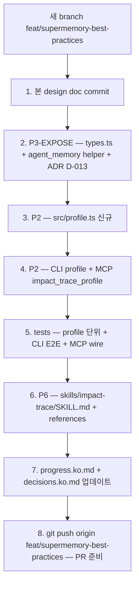

# Supermemory Patterns — Selective Adoption Design

> **상태:** 2026-04-30 작성 · branch `feat/supermemory-best-practices`
> **선행:** [phase4-handoff.ko.md](phase4-handoff.ko.md), [decisions.ko.md](decisions.ko.md), [phase3-design.ko.md](phase3-design.ko.md) (ADR-disciplined design template)
> **이 문서의 목적:** [supermemoryai/supermemory](https://github.com/supermemoryai/supermemory) 분석 후 *우리에게 가져올 만한* 패턴을 4-perspective 합의로 골라낸 결과 + 구현 design.
> **English pair:** [supermemory-adoption.en.md](supermemory-adoption.en.md).

---

## 0. 한 줄 요약

> "supermemory의 6개 후보 중 *3개만* 채택 (P2 Profile, P3-Expose, P6 Skills). P1 (kind enum 확장)과 P4 (pipeline state)는 우리 ADR D-002/D-005/D-010과 충돌해서 REJECT. P5 (MemoryBench)는 별도 branch."

---

## 1. 4-perspective 평가 (architect / typescript-reviewer / code-explorer / security)

### P1: `fact_provenance.kind` enum 확장 → ❌ DEFER

**합의:** 데이터 모델에 *새로운 의미공간*을 추가하지 않음. supermemory의 "Updates"는 우리 `op='retract'+'assert'` 패턴으로 *이미 표현됨*. "Derives"는 우리 reflection의 `kind='summary'`로 *이미 표현됨*. "Extends" 한 가지만 진짜 신규지만, 그것을 *required로 만드는 query*가 안 보임.

**REJECT 근거:** D-002 (content-addressable id — 같은 fact를 mutate 못 함, 새 fact가 *항상* 새 id), D-010 (preserve + summary edge로 supersession을 한 path에 통합).

**다시 고려할 조건:** 새 ADR + Extends edge 없이는 답할 수 없는 query.

### P2: User Profile API → ✅ ADOPT (modified)

**합의:** "agent prompt에 entity 컨텍스트를 한 호출로 주입"이 진짜 가치. 하지만:
- TypeScript reserved word 회피: `staticFacts` / `dynamicFacts` (not `static` / `dynamic`)
- branch-scoped (cross-branch leak 차단)
- async-outside-tx 패턴 준수
- redacted facts는 `[REDACTED]` 그대로 surface (privacy 일관성)

### P3: `is_static` flag → ✅ EXPOSE existing (재구현 X)

**Code-explorer 발견:** `attribute_defs.is_code_relation`이 *직접적 analog*. 코드 추출 attribute (imports, calls, affects, depends_on)는 `is_code_relation=1` (static), agent decision attribute (observed, verified, reflection, ...)는 `is_code_relation=0` (dynamic).

**작업:** 새 컬럼 추가하지 않음. lifecycle 분류를 *문서/CLI/Profile*에 노출만.

### P4: pipeline status state machine → ❌ REJECT

**Architect 강조:** `index_runs`는 *코드 추출* pipeline이지 *메모리 ingestion* pipeline이 아님. supermemory의 `queued→extracting→...→done`은 *그들의 cloud worker* 비동기 처리를 모델링한 것. 우리 `remember()`는 D-005에 따라 *async outside, sync tx inside*로 의도적 stateless. 두 pipeline 혼동.

### P5: MemoryBench → 🟡 별도 branch (Phase 5 후보)

**Architect HIGH:** 우리는 *regression signal이 없음*. 하지만 ETA 1주 이상. 본 branch 범위 밖.

### P6: Skills packaging → ✅ ADOPT

**합의:** `skills/impact-trace/SKILL.md`는 *문서/배포 layer*라서 schema/code 의존 없음. 위험 0. 마켓 진입 비용 결정적으로 낮춤.

---

## 2. 본 branch에서 ship할 것 (3가지)

### A. P3-EXPOSE: lifecycle 분류를 1급 시민으로

**스키마 변경:** 없음. `attribute_defs.is_code_relation`은 v4부터 존재.

**코드 변경:**
- `src/types.ts`: `AttributeDef.lifecycle: 'static' | 'dynamic'` getter (derived from `isCodeRelation`).
- `src/agent_memory.ts`: 헬퍼 `factLifecycle(attribute)` 추가 — attribute 이름으로 `'static' | 'dynamic'` 반환.
- 문서: `docs/decisions.ko.md`에 D-013 추가 (lifecycle binary는 `is_code_relation`로 이미 표현됨).

**왜:** Profile API의 building block. 단독으로 ship 가능.

### B. P2: Profile API

**스키마 변경:** 없음.

**새 export (`src/profile.ts`):**

```typescript
export interface ProfileOptions {
  entity: string;
  branch?: string;        // default 'main'
  k?: number;             // default 50 per side
  asOfTx?: string;        // optional time-travel
}

export interface ProfileResult {
  readonly entity: string;
  readonly branch: string;
  readonly staticFacts: ReadonlyArray<RecalledFact>;   // attribute_defs.is_code_relation = 1
  readonly dynamicFacts: ReadonlyArray<RecalledFact>;  // attribute_defs.is_code_relation = 0
  readonly summaryFacts: ReadonlyArray<RecalledFact>;  // attribute = 'reflection' (Phase 3 추가물)
}

export async function profileEntity(
  repoRoot: string,
  options: ProfileOptions
): Promise<ProfileResult>;
```

**핵심 디자인:**
- *3개 카테고리*: static (코드 구조) / dynamic (agent 활동) / summary (reflection 결과). supermemory는 2개지만 우리는 reflection을 1급 시민으로 갖고 있음.
- branch-scoped (branch 옵션 누락 시 'main'). cross-branch leak 차단.
- archived tx 자동 제외 (recall이 이미 함).
- redacted facts는 `[REDACTED]`로 surface (privacy 일관성, recall과 동일).
- async-outside-tx 패턴: SQLite 작업 모두 `withAgentMemoryDb` 안에서.

**CLI:**
```bash
impact-trace profile --entity file:src/auth/session.ts [--branch main] [--k 50]
```

**MCP tool:**
- `impact_trace_profile` (readOnlyHint=true)

### C. P6: Skills packaging

**`skills/impact-trace/SKILL.md`:**
- frontmatter: `name`, `description`, `slash-commands` 등 (Claude Code skill 표준)
- 사용 가이드: install, init/index/analyze, agent memory commands, profile/reflect/branch GC 워크플로우
- 우리 invariants와 ADR 요약

**`skills/impact-trace/references/architecture.md`:** schema/recall/reflection/branch GC 깊은 설명. supermemory의 architecture.md 패턴 참고.

**효과:** `npx skills add YouSangSon/Impact-trace` 한 줄로 사용자 install. Claude Code가 자동으로 skill로 invoke.

---

## 3. 신규 ADR 후보

### D-013: lifecycle binary는 `is_code_relation`로 이미 표현됨

**결정:** 새 `is_static`/`lifecycle` 컬럼 추가 *안 함*. 기존 `attribute_defs.is_code_relation`이 1:1 매핑.

**맥락:** supermemory가 `isStatic` 플래그를 메모리의 lifetime 결정에 사용. 우리는 이미 같은 정보를 *attribute level*에서 갖고 있음 (코드 추출 attribute는 영구, agent decision attribute는 동적).

**대안:**
- 새 `is_static` 컬럼 추가 — 데이터 중복.
- `is_code_relation`을 `lifecycle TEXT` 로 rename — schema migration 비파괴적이지만 backward compat 깨짐.

**결과:** Profile API가 lifecycle 분류를 query-time에 derive. 새 column 없음.

### D-014: Profile API는 단독 export, recall 통합 안 함

**결정:** `profileEntity()` 새 함수, `recall()`을 *modify 안 함*.

**맥락:** supermemory는 `recall + profile`을 한 함수에 합쳤음. 우리는 분리 — recall은 *raw history*, profile은 *aggregated view*.

**대안:**
- `recall({ profile: true })` 옵션 — 한 함수가 두 가지 mode를 가지면 인터페이스 부풀어짐.
- `recall`이 항상 profile 형식 반환 — backward compat 깨짐.

**결과:** profile은 *built on top of recall*. 명확한 책임 분리.

---

## 4. 실행 순서



ETA: ~1일.

---

## 5. NOT in scope (이번 branch)

- ❌ P1 kind enum 확장 (REJECTED, ADR 충돌)
- ❌ P4 pipeline state machine (REJECTED, wrong table)
- 🟡 P5 MemoryBench harness (Phase 5 후보, 별도 branch)
- 🟡 supermemory connectors (Notion, Gmail) — local-first 정체성 위반
- 🟡 multi-modal extractors (PDF, image, video) — code-focused scope 외

---

## 6. 검증 기준

- [ ] `npm run check` 통과 (typecheck)
- [ ] `npm test` — 78 tests + 신규 P2/P6 테스트 통과
- [ ] `npm run lint` clean
- [ ] CLI `impact-trace profile --entity X` 실제 작동 (E2E test)
- [ ] MCP `impact_trace_profile` tool wire 작동 (mcp.test 추가)
- [ ] `skills/impact-trace/SKILL.md` Claude Code skill 표준 준수
